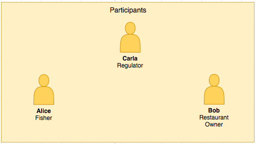
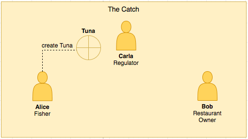
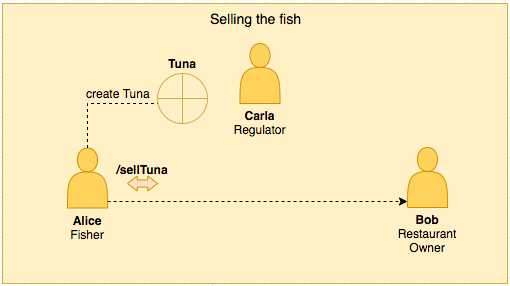

# Scenario

## Introduction to the Tuna fish example using Hyperledger Composer

Hyperledger Composer provides a level of abstraction to build technical blockchain solutions over real use cases.

To best show what we can do with Hyperledger Composer, we will guide you through the steps to build a real case scenario. 

It will be based on the Tuna-fish tracking system.

## Participants

There are three main participants:

- **Alice** is a Fisher who catches tuna.
- **Bob** is a Restaurant Owner who buys tuna from Alice.
- **Carla** is a Regulator monitoring that tuna has been legally and sustainably caught and resold.

## The Catch

When Alice catches a fish, she will create a record of the fish on the Hyperledger Fabric blockchain.

## The sale

When Alice sells the fish to Bob, the transaction will be recorded on the Hyperledger Fabric.

## Monitoring and queries

Alice, Bob or other participants like Carla can query the blockchain to retrieve specific information, such as the list transactions or the Tuna owned by specific Participants.

## Key benefits of using Hyperledger Composer

**Focusing on the problem** 
Develop blockchain application starting from the business requirements.

**Prototyping** 
Hyperledger Composer provides a smart tool  to revise and rearrange model and logic to build simple Proof of Concepts or MVPs.

**Analytics and Privacy** 
Rich queries on the data can be easily set up and performed. Access Control Rules help to preserve a layer of confidentiality for the business operations.

**Integration to existing systems** 
A REST server exposes your Blockchain to a Web or Mobile Application to be integrated in existing systems.

**Communication** 
Finally, Hyperledger Composer can be used to enhance the communication between business and technical teams to facilitate prototyping and development of the blockchain application.
