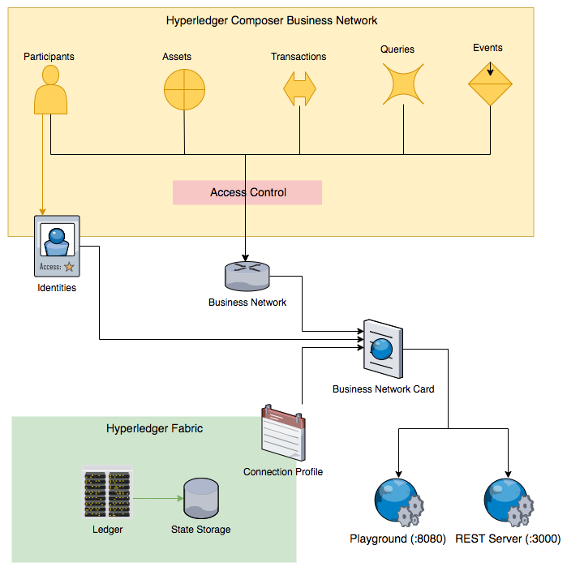
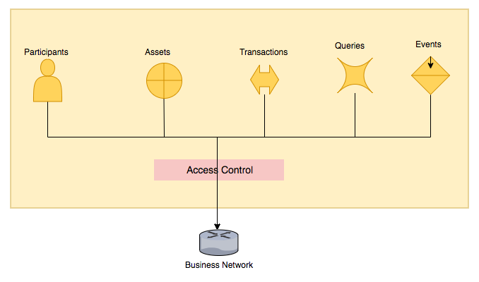
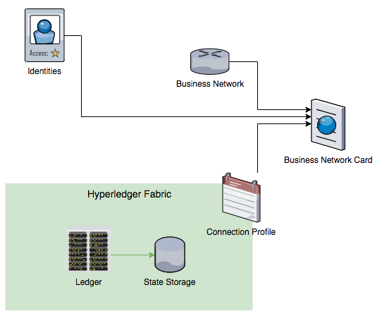
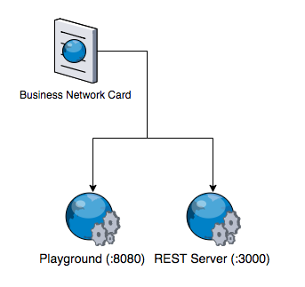

# Hyperledger Composer Architecture

<!-- TAB 1 -->
## Hyperledger Composer Key Components
  


<!-- TAB 2 -->
## Business Network



A **Business Network** includes:
- *Modeling language files (`models/*.cto`)* to define models for Participants, Assets, Transactions and Events.
- *Transaction Logic (`lib/*.js`)* to implement the logic of the transactions defined
- *Query file (`queries.qry`)* to design and enable complex queries on the Blockchain Data
- *Access Control File (`permissions.acl`)* to control visibility and actions on resources


<!-- TAB 3 -->
## Business Network - Modeling language


Hyperledger Composer includes an object-oriented modeling language that is used to define the domain model for a business network definition.

This is used inside the `*.cto` files and allows users to define resources, such as network participants, assets and transactions.

```
asset Tuna identified by tunaId {
  o String tunaId
  o Integer weight range=[500, 1000000]
  o FishStatus status default="CAUGHT"
  o DateTime catchTime
  --> Individual owner
}
```

It also features data validation of fields, simplifying and standardising their implementation:
```
o String firstName default 'NoName'
o String lastName optional
o String postcode regex=/(GIR 0AA)|((([A-Z-[QVf]][0-9][0-9]?)|(([A-Z-[QVf]][A-Z-[IJZ]][0-9][0-9]?)|(([A-Z-[QVf]][0-9][A-HJKPSTUW])|([A-Z-[QVf]][A-Z-[IJZ]][0-9][ABEHMNPRVWfY])))) [0-9][A-Z-[CIKMOV]]{2})/
```

> You can find a complete guide of the Modeling Language on the [documentation](https://hyperledger.github.io/composer/latest/reference/cto_language).
<!-- TAB 4 -->
## Business Network - Transaction Logic


The transactions are encoded under `lib/*.js` with *JavaScript (JS)*, one of the most popular programming languages.
 
These  files define the actual logic to execute the transactions defined in the `*.cto` files.

They can interact with *Participant Registries* and *Asset Registries* to create, update or delete instances of participants and assets.

```
async function sellTuna(tx) {
    // Get asset registry for Tuna
    const tunaRegistry = await getAssetRegistry(NS + '.Tuna');
    [...]
    await tunaRegistry.update(tx.tuna);
}
```

<!-- TAB 5 -->
## Business Network - Queries


The *Query language* helps to define queries to retrieve information on the Blockchain using a *Structured Query Language (SQL)* type interface.

For instance, the snippet below can retrieve tuna owned by a specific participant:

```
query getTunaByParticipant {
   description: "List tuna owned by specific 'owner'"
   statement:
       SELECT org.tuna.Tuna
           WHERE (owner == _$owner)
               ORDER BY [catchTime ASC]
}
```

<!-- TAB 6 -->
## Business Network - Access Control Rules


The *Access Control language* enables rule definition for accessing assets and transactions by different types of participants and identities.

For example, a rule may allow the owner only to transfer his own assets.

```
rule OnlyOwnerCanTransferTuna {
    description: "Allow only Tuna owners to transfer the fish"
    participant(p): "org.tuna.*"
    operation: CREATE
    resource(r): "org.tuna.SellTuna"
    condition: (r.tuna.owner.getIdentifier() != p.getIdentifier())
    action: DENY
}
```

<!-- TAB 7 -->
## Fabric Integration and Deployment



####  Identities
Composer also integrates a system for managing identities through the use of ID cards, which are mapped to a participants of the Business Network.
Using the *Identity*, the user of the Business Network can operate as that participant.

####  Connection Profile
The *connection profile* is a JSON Document that provides the information necessary to connect to a system (e.g. *Hyperledger Fabric* instance, including *CA*, *Orderers* and *Peers*).

####  Business Network Cards
*Business Network Cards* map all the above, combining identities, connection profiles and business network metadata.
They simplify the process of connecting to a business network.

<!-- TAB 8 -->
## Deployment and test

There are two ways to access to the Business Network on Hyperledger Composer.

- **Composer Playground** provides a web-based test environment.
- **Composer REST Server** provides programmatic access to the Blockchain.



###  Composer Playground

Composer Playground is a web application that provides a simple development and test environment for the Business Network.


###  REST Server
The *REST server* provided by Hyperledger Composer allows exposing the blockchain’s participants, assets, transactions and queries with a transparent *Application Programming Interface (API)*.

This makes it easy to integrate programmatic access to the Blockchain and to connect it to web or mobile application.


<!-- TAB 9 -->
## Summary of Hyperledger Composer Key Components

