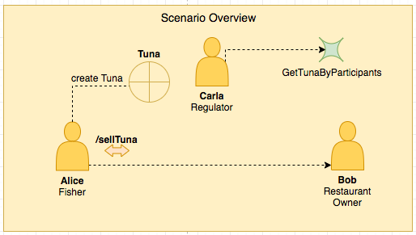

# Writing and Deploying a Business Network

## Overview of the Tuna Business Network
As shown previously, we will implement a simple network to track the movement of Tuna fish.

The network we will build maintains a single system where fishers, restaurant owners and regulators interact.



Each participant is able to access and work upon information about Tuna fish.

Importantly, the blockchain enables this to happen in a way that is immutable and distributed, while enabling a degree of transparency and oversight not easily implementable in a centralised database.

### Steps

In order to create and use the `tuna-network` business network, we will cover the following steps:

1) Creating an empty network
2) Defining Participants
3) Defining Assets and Transactions
4) Developing Transaction (Smart Contract) Logic
5) Developing Queries
6) Defining Access Control Rules
7) Building and starting the Business Network
8) Deploying onto Hyperledger Fabric
9) Testing on the Composer Playground
10) Running the Composer REST Server

> The `tuna-network` Business Network can be downloaded at this repository: https://github.com/hyperledger/education/composer-material


## 1) Creating an empty network

We can use [Yeoman](http://yeoman.io/) to create an empty network, by running:

```
yo hyperledger-composer:businessnetwork
```

And then answering the questions that are posed.

```
? Business network name: tuna-network
? Description: Hyperledger Composer network for Tuna tracking
? Author name:  Alejandro (Sasha) Vicente Grabovetsky & Nicola Paoli
? Author email: sasha@aid.technology, nicola@aid.technology
? License: Apache-2.0
? Namespace: org.tuna
? Do you want to generate an empty template network? Yes: generate an empty template network
```

## 2) Defining  Participants

Participants are defined under the `models/org.tuna.cto` file.

We start by defining a `namespace`.
```
namespace org.tuna
```

Then we create an abstract `Participant` for an `Individual`.
All participants will inherit the properties from it.
```
abstract participant Individual identified by id {
  o String id
  o String name
  o Address address
}
```

To fill the property `Address` of the individual, we can create a `Concept`.<br>
Note that `postCode` should have a specific format that can be validated using a regular expression.
```
concept Address {
  o String addressLine
  o String locality
  o String postCode regex=/\d{4}[ ]?[A-Z]{2}/
}
```

Finally, we define the `Fisher`, `RestaurantOwner` and `Regulator`, which extend the Individual:

```
participant Fisher extends Individual {}
participant RestaurantOwner extends Individual {}
participant Regulator identified by id {
  o String id
  o String name
}
```

## 3) Defining Assets and Transactions
Assets and Transactions are also defined under the `models/org.tuna.cto` file.
In `tuna-network` the asset is represented by the `Tuna`, which is defined as follow:

```
asset Tuna identified by tunaId {
  o String tunaId
  o Integer weight range=[500, 1000000]
  o FishStatus status default=CAUGHT
  o DateTime catchTime
  --> Individual owner
}
```

The `Tuna` asset is uniquely identified by an id.
It also has a weight, which is limited between 500 grams and 1 million grams (a tonne).
The largest tuna rarely exceed 800 kg.

To specify the `Status` of the Tuna, that can be either `CAUGHT` or `PURCHASED`, we can define an enumerated type `Enum`, which specifies a type that can assume a limited number of values.

```
enum FishStatus {
  o CAUGHT
  o PURCHASED
}
```

Finally, we define the `Transaction`, to change the ownership of the Tuna from a `Fisher` to a `RestaurantOwner`.
```
transaction SellTuna {
  --> Tuna tuna
  --> RestaurantOwner newOwner
}
```

## 4) Developing Transaction (Smart Contract) Logic
The transaction logic is specified in the file `lib/logic.js`.

We start by defining the same namespace specified in the modeling language file.

```
'use strict';
/**
 * Defining the namespace for the business network
 */
const NS = 'org.tuna';
```

The transaction logic is defined in a function that accepts the Transaction `SellTuna` as input parameter.
```
/**
* Transfer tuna from one owner to another
* @param {org.tuna.SellTuna} tx - The transferTuna transaction
* @transaction
*/
async function sellTuna(tx) {
```

Next, the registries related to the Asset `Tuna` and the Participant `Restaurant Owner` are instantiated:
```
    // Get asset registry for Tuna
    const tunaRegistry = await getAssetRegistry(NS + '.Tuna');

    // Get participant registry for Individuals
    const restaurantOwnerRegistry = await getParticipantRegistry(NS + '.RestaurantOwner');
```

Next, we have to verify that the `status` of the Tuna is `CAUGHT`.
This is to make sure that a `Tuna` already sold cannot be sold again.
```
    // Make sure the tuna status is CAUGHT and not PURCHASED
    if (tx.tuna.status !== 'CAUGHT') {
       throw new Error(`Tuna with id ${tx.tuna.getIdentifier()} is not in CAUGHT status`);
    }
```

Retrieve the id of the `RestaurantOwner` from the Transaction.
```
    // Get newOwner
    const newOwnerID = tx.newOwner.getIdentifier();
```

Retrieve the id of the current Owner of the tuna from the Tuna Object.
```
    // Get current Owner
    const oldOwnerID = tx.tuna.owner.getIdentifier();
```

Next, we have to verify that old and new owners are actually two different participants:
``` 
    // Check that newOwner is not same as current owner
    if (newOwnerID === oldOwnerID) {
        throw new Error(`Tuna with id ${tx.tuna.getIdentifier()} is already owned by ${oldOwnerID}`);
    }
```

Next, we verify that the `RestaurantOwner` exists
```
    // Make sure that new owner exists
    const newOwner = await restaurantOwnerRegistry.get(newOwnerID);
    if (!newOwner) {
        throw new Error(`RestaurantOwner with id ${newOwnerID} does not exist`);
    }
```

Now we can update the `owner` of the Tuna:
```
    // Update tuna with new owner
    tx.tuna.owner = tx.newOwner;
```

Update the `status` of the Tuna:
```
    tx.tuna.status = 'PURCHASED';
```

Finally, update the record of the Tuna in the asset registry
```
   // Update the asset in the asset registry.
   await tunaRegistry.update(tx.tuna);
}
```

## 5) Developing Queries
The queries can be specified under the `queries.qry` file.

The query `getTunaByParticipant` will return all the fishes owned by a specific participant in the format of an array of Assets of type `Tuna`.
```
query getTunaByParticipant {
    description: "List tuna owned by specific 'owner'"
    statement:
        SELECT org.tuna.Tuna
            WHERE (owner == _$owner)
                ORDER BY [catchTime ASC]
}
```

## 6) Defining Access Control Rules
 
## 7) Building and starting the Business Network
Once we have created the network, we create a `Business Network Archive (BNA)` running the following command from the directory that you ran the Yeoman generator:

```
composer archive create -t dir -n .
```

This creates the file `tuna-network@0.0.1.bna`.

## 8) Deploying onto Hyperledger Fabric
We start by installing the network onto the Hyperledger Fabric peers:
```
composer network install --card PeerAdmin@hlfv1 --archiveFile tuna-network@0.0.1.bna
```

Then we initialise the chaincode on the Hyperledger Fabric peers:
```
composer network start --card PeerAdmin@hlfv1 --networkAdmin admin --networkAdminEnrollSecret adminpw --networkName tuna-network --networkVersion 0.0.1
```

This creates a card that we can import:
```
composer card import --file admin@tuna-network.card
```

And use to access the business network:
```
composer network ping --card admin@tuna-network
```

This should show that we can connect to the network.

## 9) Playing on the Composer Playground
Once we have the network deployed, we can access the `Composer Playground` started in the previous section by accessing `http://localhost:8080` (or the port `:8080` of the Ubuntu Virtual Machine) in a web browser.

We can also import the `.bna` files directly in Composer Playground to test the business network.

[Video Composer Playground to create participants, create tuna and to sell tuna]

## 10) Running REST Server
We can also run the REST server to connect to the deployed business network and expose its functionalities and smart contracts.

```
composer-rest-server -c admin@tuna-network -n never -w true
```

We can now access http://localhost:3000/ to explore the Composer REST API.

[VIDEO to show how to use queries on the REST Server]

Summary of Business Network (VIDEO)  

