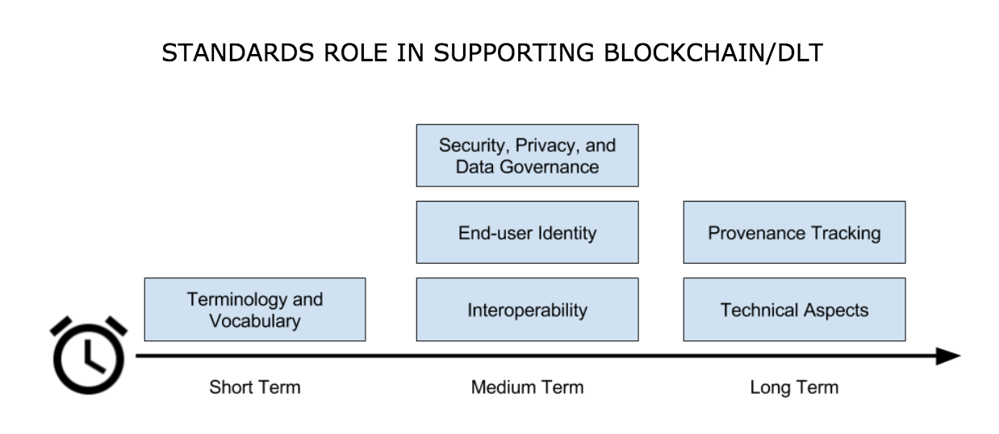

<!-- TOC depthFrom:1 depthTo:6 withLinks:1 updateOnSave:1 orderedList:0 -->

- [Introduction and Learning Objectives](#introduction-and-learning-objectives)
	- [Introduction](#introduction)
	- [Learning Objectives](#learning-objectives)
- [Distributed Ledger Technology (DLT)](#distributed-ledger-technology-dlt)
	- [Background - The Rising Interest in Distributed Ledger Technologies](#background-the-rising-interest-in-distributed-ledger-technologies)
	- [Distributed Ledger Technology (DLT)](#distributed-ledger-technology-dlt)
	- [Video: Blockchain Technology (Robert Schwentker)](#video-blockchain-technology-robert-schwentker)
	- [Blockchains](#blockchains)
	- [Video: The Difference between DLT and Blockchains (Brian Behlendorf)](#video-the-difference-between-dlt-and-blockchains-brian-behlendorf)
	- [Blockchains (Continued)](#blockchains-continued)
	- [Merkle Tree](#merkle-tree)
	- [Video: What Is a Blockchain? (Dave Huseby)](#video-what-is-a-blockchain-dave-huseby)
	- [Transactions](#transactions)
	- [Differences between Blockchains and Databases](#differences-between-blockchains-and-databases)
	- [Types of Blockchains](#types-of-blockchains)
	- [Peer-to-Peer Network Architecture](#peer-to-peer-network-architecture)
	- [Video: Peer-to-Peer Networks (Robert Schwentker)](#video-peer-to-peer-networks-robert-schwentker)
	- [Immutability of Data](#immutability-of-data)
	- [Blockchain Applications](#blockchain-applications)
	- [Smart Contracts](#smart-contracts)
	- [Video: Smart Contracts (Robert Schwentker)](#video-smart-contracts-robert-schwentker)
- [Bitcoin and Ethereum Blockchains](#bitcoin-and-ethereum-blockchains)
	- [Bitcoin - A Popular Blockchain Deployment](#bitcoin-a-popular-blockchain-deployment)
	- [Video: Bitcoin and Ethereum (Robert Schwentker)](#video-bitcoin-and-ethereum-robert-schwentker)
	- [Bitcoin and Cryptoeconomics](#bitcoin-and-cryptoeconomics)
	- [Ethereum - An Alternative to Bitcoin](#ethereum-an-alternative-to-bitcoin)
	- [Video: Ethereum (Robert Schwentker)](#video-ethereum-robert-schwentker)
	- [Dapps](#dapps)
	- [Ethereum Smart Contracts](#ethereum-smart-contracts)
- [Exploring Permissionless Blockchains](#exploring-permissionless-blockchains)
	- [Video: Exploring Bitcoin and Ethereum Blockchains](#video-exploring-bitcoin-and-ethereum-blockchains)
	- ['Certifying' a Document](#certifying-a-document)
	- [Video: 'Certifying' a Document onto Blockchains Using stamp.io](#video-certifying-a-document-onto-blockchains-using-stampio)
- [Consensus Algorithms](#consensus-algorithms)
	- [Proof of Work (PoW)](#proof-of-work-pow)
	- [Proof of Stake (PoS)](#proof-of-stake-pos)
	- [Proof of Elapsed Time (PoET)](#proof-of-elapsed-time-poet)
	- [Simplified Byzantine Fault Tolerance (SBFT)](#simplified-byzantine-fault-tolerance-sbft)
	- [Proof of Authority (PoA)](#proof-of-authority-poa)
	- [Comparing Permissioned Consensus Approaches and Standard PoW](#comparing-permissioned-consensus-approaches-and-standard-pow)
- [Hyperledger](#hyperledger)
	- [Video: Hyperledger (Robert Schwentker)](#video-hyperledger-robert-schwentker)
	- [Hyperledger Blockchains: Permissioned or Permissionless?](#hyperledger-blockchains-permissioned-or-permissionless)
	- [Advantages of Using a Permissioned Blockchain over a Permissionless Blockchain](#advantages-of-using-a-permissioned-blockchain-over-a-permissionless-blockchain)
	- [Video: Hyperledger vs. Other Permissioned Ledgers (Brian Behlendorf)](#video-hyperledger-vs-other-permissioned-ledgers-brian-behlendorf)
- [Other Open Source Permissioned Distributed Ledgers](#other-open-source-permissioned-distributed-ledgers)
	- [Video: Other Distributed Ledger Technologies (Robert Schwentker)](#video-other-distributed-ledger-technologies-robert-schwentker)
	- [Chain Core](#chain-core)
	- [Corda](#corda)
	- [Quorum](#quorum)
	- [IOTA](#iota)
- [Challenges in the Adoption/Deployment of Distributed Ledger Technologies](#challenges-in-the-adoptiondeployment-of-distributed-ledger-technologies)
	- [Standards](#standards)
	- [Regulation](#regulation)
	- [Lack of Know-How](#lack-of-know-how)
- [Knowledge Check](#knowledge-check)
	- [Knowledge Check 1.1](#knowledge-check-11)
	- [Knowledge Check 1.2](#knowledge-check-12)
	- [Knowledge Check 1.3](#knowledge-check-13)
	- [Knowledge Check 1.4](#knowledge-check-14)
	- [Knowledge Check 1.5](#knowledge-check-15)
- [Conclusions & Learning Objectives (Review)](#conclusions-learning-objectives-review)
	- [Learning Objectives (Review)](#learning-objectives-review)
	- [Conclusions](#conclusions)

<!-- /TOC -->

# Introduction and Learning Objectives

## Introduction
Chapter 1 introduces the building blocks of distributed ledger technologies, including blockchains. It lays the foundation for an in-depth understanding of the content that follows in the course. You should engage with the content in this chapter both to learn, as well as brush up your blockchain knowledge.

## Learning Objectives
By the end of this chapter you should be able to:

* Discuss blockchain and distributed ledger technologies (DLT).
* Explore permissioned and permissionless blockchains and their key characteristics.
* Discuss various components of distributed ledger technologies, including consensus algorithms and smart contracts.
* Provide a high-level explanation of what Hyperledger is.

# Distributed Ledger Technology (DLT)

## Background - The Rising Interest in Distributed Ledger Technologies

Looking back to the last half century of computer technologies and architectures, one may observe a trend of fluctuation between the centralization and subsequent decentralization of computing power, storage, infrastructure, protocols, and code.

Mainframe computers are largely centralized. They typically house all computing power, memory, data storage, and code. Access to mainframes is mainly by 'dumb terminals', which only take inputs and outputs, and do not store or process data.

With the advent of personal computers and private networks, similar computational capabilities were now housed both on the clients, as well as the servers. This, in part, gave rise to the 'client-server' architecture, which supported the development of relational database systems. Massive data sets, which are housed on mainframes, could move onto a distributed architecture. This data could replicate from server to server, and subsets of the data could be accessed and processed on clients, and then, synced back to the server.

Over time, Internet and cloud computing architectures enabled global access from a variety of computing devices; whereas mainframes were largely designed to address the needs of large corporations and governments. Even though this 'cloud architecture' is decentralized in terms of hardware, it has given rise to application-level centralization (e.g. Facebook, Twitter, Google, etc).

Currently, we are witnessing the transition from centralized computing, storage, and processing to decentralized architectures and systems. According to [Muneeb Ali](https://medium.com/@muneeb/the-next-wave-of-computing-743295b4bc73), these systems aim to

> "give explicit control of digital assets to end-users and remove the need to trust any third-party servers and infrastructure".

Distributed ledger technology is one of the key innovations making this shift possible.

## Distributed Ledger Technology (DLT)

A **distributed ledger** is a type of data structure which resides across multiple computer devices, generally spread across locations or regions.

**Distributed Ledger Technology** includes blockchain technologies and smart contracts. While distributed ledgers existed prior to Bitcoin, the Bitcoin blockchain marks the convergence of a host of technologies, including timestamping of transactions, Peer-to-Peer (P2P) networks, cryptography, and shared computational power, along with a new consensus algorithm.

In summary, distributed ledger technology generally consists of [three basic components](https://intelledger.github.io/introduction.html):

* A **data model** that captures the current state of the ledger
* A **language of transactions** that changes the ledger state
* A **protocol** used to build consensus among participants around which transactions will be accepted, and in what order, by the ledger.

## Video: Blockchain Technology (Robert Schwentker)

## Blockchains
According to [hyperledger.org](https://www.hyperledger.org),

> "A blockchain is a peer-to-peer distributed ledger forged by consensus, combined with a system for "smart contracts" and other assistive technologies."

**Smart contracts** are simply computer programs that execute predefined actions when certain conditions within the system are met.

**Consensus** refers to a system of ensuring that parties agree to a certain state of the system as the true state.

## Video: The Difference between DLT and Blockchains (Brian Behlendorf)

## Blockchains (Continued)

**Blockchain** is a specific form or subset of distributed ledger technologies, which constructs a chronological chain of blocks, hence the name 'block-chain'. A **block** refers to a set of transactions that are bundled together and added to the chain at the same time. In the Bitcoin blockchain, the miner nodes bundle unconfirmed and valid transactions into a block. Each block contains a given number of transactions. In the Bitcoin network, miners must solve a cryptographic challenge to propose the next block. This process is known as '**proof of work**', and requires significant computing power. We shall discuss proof of work in more detail in the Consensus Algorithms section. For a brief history of blockchain technology, please click here.

Timestamping is another key feature of blockchain technology. Each block is timestamped, with each new block referring to the previous block. Combined with **cryptographic hashes**, this timestamped chain of blocks provides an immutable record of all transactions in the network, from the very first (or genesis) block.

A block commonly consists of four pieces of metadata:

* The reference to the previous block
* The proof of work, also known as a nonce
* The timestamp
* The Merkle tree root for the transactions included in this block.

## Merkle Tree

The Merkle tree, also known as a binary hash tree, is a data structure that is used to store hashes of the individual data in large datasets in a way to make the verification of the dataset efficient. It is an anti-tamper mechanism to ensure that the large dataset has not been changed. The word 'tree' is used to refer to a branching data structure in computer science, as seen in the image below. According to Andreas M. Antonopoulos, in the Bitcoin protocol,

> "Merkle trees are used to summarize all the transactions in a block, producing an overall digital fingerprint of the entire set of transactions, providing a very efficient process to verify whether a transaction is included in a block."

||
|:--:|
| *Bitcoin Block Data (licensed under [Creative Commons Attribution-Share-Alike 3.0 Unported](https://creativecommons.org/licenses/by-sa/3.0/deed.en), retrieved from [Wikipedia](https://commons.wikimedia.org/wiki/File:Bitcoin_Block_Data.png)* |

For an in-depth discussion on Merkle trees, see: http://chimera.labs.oreilly.com/books/1234000001802/ch07.html#_structure_of_a_block.

## Video: What Is a Blockchain? (Dave Huseby)

To learn more about blockchain, you can watch Bettina Warburg's video,  [How the Blockchain will radically transform the economy](https://www.ted.com/talks/bettina_warburg_how_the_blockchain_will_radically_transform_the_economy).

## Transactions
The record of an event, cryptographically secured with a digital signature, that is verified, ordered, and bundled together into blocks, form the **transactions** in the blockchain. In the Bitcoin blockchain, transactions involve the transfer of bitcoins, while in other blockchains, transactions may involve the transfer of any asset or a record of some service being rendered. Furthermore, a smart contract within the blockchain may allow automatic execution of transactions upon meeting predefined criteria.

**Cryptography** has a key role to play both in the security, as well as in the immutability of the transactions recorded on blockchains. Cryptography is the study of the techniques used to allow secure communication between different parties and to ensure the authenticity and immutability of the data being communicated. For blockchain technologies, cryptography is used to prove that a transaction was created by the right person. It is also used to link transactions into a block in a tamper-proof way, as well as create the links between blocks, to form a blockchain.

## Differences between Blockchains and Databases

Blockchain technology has some key differentiators from databases.

A blockchain is a write-only data structure, where new entries get appended onto the end of the ledger. Every new block gets appended to the block chain by linking to the previous block's 'hash' (you can check the Glossary tab for a refresher on hash functions). There are no administrator permissions within a blockchain that allow editing or deleting of data.

In a relational database, data can be easily modified or deleted. Typically, there are database administrators who may make changes to any part of the data and/or its structure. Additionally, blockchains were designed for decentralized applications, whereas relational databases, in general, were originally designed for centralized applications, where a single entity controls the data.

||
|:--:|
|*Licensed under [CC By 4.0](https://creativecommons.org/licenses/by/4.0/)*|

## Types of Blockchains

||
|:--:|
|*Licensed under [CC By 4.0](https://creativecommons.org/licenses/by/4.0/)*|

A blockchain can be both **permissionless** (like Bitcoin or Ethereum) or **permissioned** (like the different Hyperledger blockchain frameworks). A permissionless blockchain is also known as a public blockchain, because anyone can join the network. A permissioned blockchain, or private blockchain, requires pre-verification of the participating parties within the network, and these parties are usually known to each other.

The choice between permissionless versus permissioned blockchains should be driven by the particular application at hand (or use case). Most enterprise use cases involve extensive vetting before parties agree to do business with each other. An example where a number of businesses exchange information is the supply chain management. The supply chain management is an ideal use case for permissioned blockchains. You would not want non-vetted companies participating in the network. Each participant that is involved in the supply chain would require permissions to execute transactions on the blockchain. These transactions would allow other companies to understand where in the supply chain a particular item is.

On the contrary, when a network can 'commoditize' trust, facilitating parties to transact without necessarily having to verify each other's identity, like the Bitcoin blockchain, a permissionless blockchain is more suitable. Many of these instances involve the sale or distribution to the public. Cryptocurrencies and Initial Coin Offerings (which are not backed by national governments) usually involve implementations of permissionless blockchains.

You will learn about a variety of use cases in *Chapter 3, The Promise of Business Blockchain Technologies*.

## Peer-to-Peer Network Architecture

Historically, most applications utilize a central server (or servers). For one user/client to send a message to another user/client in the network, the request has to be sent to the hub or a central server, which then directs it to the right computer.

**Peer-to-peer** (P2P) networks were first made popular by Napster (and later BitTorrent) and consist of computer systems which are directly connected to each other via the Internet, without a central server. Peers contribute to the computing power and storage that is required for the upkeep of the network. P2P networks are generally considered to be more secure than centralized networks, as they do not have a single point of attack, as in the case of a server-based network, where the security of the entire network can be compromised if the central server is successfully attacked. As a result, large corporations invest significant amounts of financial resources to fortify their central servers, and yet, a total cost of $445 billion to the global economy in cyberspace crimes was estimated by the World Economic Forum's 2016 Global Risk Report.

Permissionless P2P systems do not require a set amount of peers to be online and are generally slower. Permissioned P2P networks have to guarantee uptime and require a high level of quality of service on the communication links.

||
|:--:|
|*Licensed under [CC By 4.0](https://creativecommons.org/licenses/by/4.0/)*|

## Video: Peer-to-Peer Networks (Robert Schwentker)

## Immutability of Data

The immutability of the data which sits on the blockchain is perhaps the most powerful and convincing reason to deploy blockchain-based solutions for a variety of socio-economic processes which are currently recorded on centralized servers. This **immutability**, or '**unchanging over time**' feature makes the blockchain useful for accounting, financial transactions, identity management, and asset ownership, management and transfer, just to name a few examples. Once a transaction is written onto the blockchain, no one can change it, or, at least, it would be extremely difficult to change it.

According to [Antony Lewis](https://www.linkedin.com/pulse/gentle-introduction-immutability-blockchains-antony-lewis/), the Director of Research at R3,

> "When people say that blockchains are immutable, they don't mean that the data can't be changed, they mean it is extremely hard to change without collusion, and if you try, it's extremely easy to detect the attempt."

Let's dig into this statement a bit further. It is extremely hard to change the transactions in a blockchain, because each block is linked to the previous block by including the previous block's hash. This hash includes the Merkle root hash of all the transactions in the previous block. If a single transaction were to change, not only would the Merkle root hash change, but so too would the hash contained in the changed block. In addition, each subsequent block would need to be updated to reflect this change. In the case of proof of work, the amount of energy required to recalculate the nonce for this block and each subsequent block would be prohibitive. On the other hand, if someone did modify a transaction in a block without going through the necessary steps to update the subsequent blocks, it would be easy to recalculate the hashes used in the blocks and determine that something is amiss.

Let's look at an example of how this works. In the following diagram, we see the original blocks and the transactions for Block 11. Specifically, we see that the Merkle root for the transactions in Block 11 is `Hash #ABCD`, which is the combined hash for the four transactions in this block. Now, let's say that someone comes in and attempts to change Transaction A to Transaction A'. This, in turn, modifies the hashes that are stored in the Merkle tree, and the Merkle root changes to `Hash #A'BCD`. In addition, the Previous Block hash stored in Block 12 also needs to be modified to reflect the overall change in the hash for Block 11.

||
|:--:|
|*Licensed under [CC By 4.0](https://creativecommons.org/licenses/by/4.0/)*|
<!-- Original Source: https://docs.google.com/drawings/d/1TLIVHVXbp7NoCO3ZvSRzQjvjpRgPHhPJa0KhWkhJ0VI/edit -->

## Blockchain Applications

Since blockchain is a new form of digital infrastructure, applications built on top of a blockchain provide a gateway to accessing information that sits on that blockchain. In other words, clients/users interact with the blockchain through applications. Starting from the simple wallets that hold bitcoins, sophisticated applications which encompass applications addressing digital identity (e.g. UPort, KYC-Chain, Netki, etc.), and complex financial transactions are being built on the blockchain.

A more exhaustive list of companies using blockchain technology for identity management and authentication can be found [here](https://letstalkpayments.com/22-companies-leveraging-blockchain-for-identity-management-and-authentication/).

For more details about blockchain applications, you can refer to Daniel Palmer's article at [coindesk.com](https://www.coindesk.com/7-cool-decentralized-apps-built-ethereum/).

## Smart Contracts

**Smart contracts** are simply computer programs that execute predefined actions when certain conditions within the system are met. Smart contracts provide the **language of transactions** that allow the ledger state to be modified. They can facilitate the exchange and transfer of anything of value (e.g. shares, money, content, property).

||
|:--:|
|*Licensed under [CC By 4.0](https://creativecommons.org/licenses/by/4.0/)*|

## Video: Smart Contracts (Robert Schwentker)

# Bitcoin and Ethereum Blockchains

## Bitcoin - A Popular Blockchain Deployment

With the invention of the peer-to-peer (P2P) cash system known as Bitcoin in 2008, we have an example of a global decentralized payment network with a distributed and publicly-owned infrastructure, operating as a 'permissionless' system. There is a persuasive case that Bitcoin is the first 'killer application' of decentralized computing. One can send and receive bitcoins anywhere in the world in a completely P2P manner, *without having to intermediate through a trusted third party, such as a bank*.

According to the [Coin Market Capitalizations website](https://coinmarketcap.com/currencies/bitcoin/), as of October 2017, bitcoin's market capitalization (market cap) was nearly $100 billion.

||
|:--:|
| *Bitcoin Charts (Source: https://coinmarketcap.com/currencies/bitcoin/)* |

According to [AngelList](https://angel.co/blockchains), more than one thousand startups have been created to leverage Bitcoin and blockchain-related technologies since the inception of the Bitcoin payment system. Hundreds of large companies, and dozens of governments and universities have become actively involved in researching, testing, and prototyping blockchain protocols, platforms, and applications. In particular, the financial services sector has been actively investing in exploring wider applications of distributed ledger technologies (of which, blockchain is a subset) since late 2015.

## Video: Bitcoin and Ethereum (Robert Schwentker)

## Bitcoin and Cryptoeconomics

Bitcoin has also ushered in tremendous academic and research interest in the area of Cryptoeconomics and Cryptoeconomic security.

According to [Vitalik Buterin](https://www.youtube.com/watch?v=pKqdjaH1dRo),

> "Cryptoeconomics is about building systems that have certain desired properties using cryptography to prove properties about messages that happened in the past while using economic incentives defined inside the system to encourage desired properties to hold into the future."

In other words, the field of Cryptoeconomics explores the intersection of cryptography and economic incentives. While cryptography is used for ensuring network security at various levels and functions, the built-in economic incentives provided to the participating nodes in the network ensures that, at any given point, the majority of players in the network operate in a desirable way.

Rather than imposing barriers to entry, permissionless blockchains are public and open for anyone to join. Since such networks can reasonably expect all kind of agents - including malicious actors - the key lies in incentivizing good behavior in a critical majority of the network, such that:
* The malicious actors cannot take over the network through an **escalated attack**.
* The malicious actors cannot **collude** to undertake an organized majority attack on the network.
* The **payoffs** of securing the network are consistently higher than the cost of attacking the network.
* The **cost** of attacking the network is prohibitively high.
You can find more about Cryptoeceonomics [here](https://medium.com/@cryptoeconomics/the-blockchain-economy-a-beginners-guide-to-institutional-cryptoeconomics-64bf2f2beec4).

## Ethereum - An Alternative to Bitcoin

According to [Ethereum's official documentation](http://ethdocs.org/en/latest/introduction/what-is-ethereum.html),

> "Ethereum is an open blockchain platform that lets anyone build and use decentralized applications that run on blockchain technology".

The Ethereum blockchain platform facilitates **scripting functionality**, or '**smart contracts**', which are run through the nodes in the network. As a result, unlike the Bitcoin blockchain, it does not just track transactions, it also programs them. Technically, Ethereum is a Turing-complete virtual machine with its native cryptocurrency called 'ether'. The platform was proposed in 2013 in a white paper by the then 19-year old Vitalik Buterin.

As of October 2017, Ethereum had a [market cap](https://coinmarketcap.com/currencies/ethereum/) of over $28 billion, making ether the second most valuable cryptocurrency after Bitcoin.

||
|:--:|
| *Ether Historical Market Capitalization Chart (Source: https://etherscan.io/chart/marketcap)* |

As the second best known public blockchain after the Bitcoin blockchain, Ethereum has ushered in an era of unprecedented activity around blockchain and distributed ledger technology.

## Video: Ethereum (Robert Schwentker)

## Dapps

As [Stephan Tual](https://www.youtube.com/watch?v=Clw-qf1sUZg) explains, Ethereum applications do not have a middleman; instead, users interact in a P2P fashion with other users through a variety of interfaces - social, financial, gaming, etc. Since the applications are developed on the decentralized consensus-based network itself, third-party censorship is virtually impossible. Malicious actors cannot secretly tamper with the application by changing the code and compromise all application users (or nodes that are actively interacting with it). These Decentralized Applications have come to be known as **Dapps**.

Since they are cryptographically secured, Dapps are referred to as 'secure applications'. Some of the [high profile Dapps](http://www.ethdocs.org/en/latest/introduction/web3.html) built on the Ethereum platform include:
* **Augur**, which is a Decentralized Prediction Market. Learn more at https://augur.net/.
* **Digix**, which tokenizes gold on Ethereum. Learn more at: https://digix.global/.
* **Maker**, which is a Decentralized Autonomous Organization (DAO). Learn more at: https://makerdao.com/.

The Ethereum network is a distributed global public network, which means it is not run on central servers in a certain geographical location. Instead, the computing power that runs the network is contributed by nodes that are spread across the globe. In other words, Dapps have 'zero downtime' - they never go down and, in general, cannot be switched off.

## Ethereum Smart Contracts

A hypothetical example of an Ethereum-based smart contract may involve the following transaction: in an equity raise, transfer amount X from the investor to the company upon receiving the given shares from the company. The monetary amount X, which was pre-validated by the company for the transaction (much like in a credit card purchase), is held in escrow by the smart contract, until the shares have been received by the investor. Any kind of arbitrary sophisticated business logic can be committed to the blockchain. The Ethereum blockchain only encodes these 'rules of the games'. The actual payoffs occur by interacting with the blockchain.

The illustration below describes this process. The smart contract encodes the agreement between the company raising funds and its investors (Panel 1). The smart contract sits on the Ethereum public blockchain, and is run on the Ethereum Virtual Machine (EVM). Once hitting a triggering event, like an expiration date or a strike price that has been pre-coded, the smart contract automatically executes as per the business logic (Panel 2). As an added benefit, regulators are able to scrutinize the market activity on an ongoing basis, without compromising the identity of specific players in a permissionless public blockchain, as Ethereum (Panel 3).

||
|:--:|
|*Licensed under [CC By 4.0](https://creativecommons.org/licenses/by/4.0/)*|

**Note**: With the advent of the Ethereum blockchain platform and the scripting functionality or smart contracts that it enables, there are ongoing attempts to do the same for the Bitcoin blockchain, which does not allow for this, due to security reasons. [RSK](http://www.rsk.co/) is one such smart contract platform that seeks to achieve this "*with a 2-way peg to Bitcoin*". The added functionality can go a long way in making the Bitcoin blockchain useful for use cases other than cash transfers.

# Exploring Permissionless Blockchains

Let's start by examining the Bitcoin and Ethereum blockchains, both of which are permissionless, public blockchains. We will examine several large transactions, and the genesis block for each blockchain. We will look at block heights, transaction times, mining pools, timestamps, and block rewards.

## Video: Exploring Bitcoin and Ethereum Blockchains

## 'Certifying' a Document

We have just examined the Bitcoin and Ethereum blockchains, and the key variables to pay attention to. Next, let's examine how we can 'certify' a document on both the Bitcoin and Ethereum blockchains simultaneously, using Stamp.io, which is a certification tool. We will show you how to easily certify various types of files on Stamp.io, obtaining a 'Stampery Certificate'. We will also show you how to cross-check the hash of the transactions on the Bitcoin and the Ethereum blockchains.

## Video: 'Certifying' a Document onto Blockchains Using stamp.io

# Consensus Algorithms

**Consensus** in the network refers to the process of achieving agreement among the network participants as to the correct state of data on the system. Consensus leads to all nodes sharing the exact same data. A **consensus algorithm**, hence, does two things: it ensures that the data on the ledger is the same for all the nodes in the network, and, in turn, prevents malicious actors from manipulating the data. The consensus algorithm varies with different blockchain implementations.

While the Bitcoin blockchain uses Proof of Work as the consensus algorithm, other blockchains and distributed ledgers are deploying a variety of consensus algorithms, like the Proof of Stake, Proof of Burn, Proof of Capacity, Proof of Elapsed Time, and many others, depending on their unique requirements.

Next, we will briefly explain some of these algorithms.

## Proof of Work (PoW)

The Proof of Work consensus algorithm involves solving a computational challenging puzzle in order to create new blocks in the Bitcoin blockchain. Colloquially, the process is known as 'mining', and the nodes in the network that engage in mining are known as 'miners'. The incentive for mining transactions lies in economic payoffs, where competing miners are rewarded with 12.5 bitcoins and a small transaction fee.

As described in the [2016 Kudelski Security report](https://www.kudelskisecurity.com/sites/default/files/files/kudelski_Security_blockchain_20161213.pdf),

> "Proof-of-work (PoW) is the outcome of a successful mining process and, although the proof is hard to create, [it] is easy to verify."

For better understanding, please consider the following example provided by [Ofir Beigel](https://99bitcoins.com/proof-of-work-proof-of-stake/):

> "(...) guessing a combination to a lock is a proof to a challenge. It is very hard to produce this since you will need to guess many different combinations; but once produced, it is easy to validate. Just enter the combination and see if the lock opens".

Multiple criticisms exist for the PoW consensus algorithm. PoW requires a huge amount of energy to be expended, given the computationally heavy algorithm. In addition, PoW has a high latency of transaction validation, and the concentration of mining power is located in countries where electricity is cheap. In terms of the network security, PoW is susceptible to the '51% attack', which refers to an attack on a blockchain by a group of miners controlling more than 50% of the network's computing power.

## Proof of Stake (PoS)

The Proof of Stake algorithm is a generalization of the Proof of Work algorithm. In PoS, the nodes are known as the 'validators' and, rather than mining the blockchain, they validate the transactions to earn a transaction fee. There is no mining to be done, as all coins exist from day one. Simply put, nodes are randomly selected to validate blocks, and the probability of this random selection depends on the amount of stake held. So, if node X owns 2 coins and node Y owns 1 coin, node X is twice as likely to be called upon to validate a block of transactions. The specific implementation of PoS can vary, depending on the use case, or as a matter of software design. Instances include [Proof of Deposit](https://www.linkedin.com/pulse/blockchain-consensus-algorithm-proof-of-work-satyakam-chakravarty/) and [Proof of Burn](https://en.bitcoin.it/wiki/Proof_of_burn). The PoS algorithm saves expensive computational resources that are spent in mining under a PoW consensus regime.

## Proof of Elapsed Time (PoET)

Developed by Intel, the Proof of Elapsed Time consensus algorithm emulates the Bitcoin-style Proof of Work. Hyperledger's Sawtooth implementation is an example of PoET at work. Instead of competing to solve the cryptographic challenge and mine the next block, as in the Bitcoin blockchain, the PoET consensus algorithm is a hybrid of a random lottery and first-come-first-serve basis. In PoET, each validator is given a random wait time.

> "The validator with the shortest wait time for a particular transaction block is elected the leader."

-[sawtooth.hyperledger.org](sawtooth.hyperledger.org)

This "leader" gets to create the next block on the chain.

## Simplified Byzantine Fault Tolerance (SBFT)

The Simplified Byzantine Fault Tolerant consensus algorithm implements an adopted version of the [Practical Byzantine Fault Tolerant](https://blog.acolyer.org/2015/05/18/practical-byzantine-fault-tolerance/) (PBFT) algorithm, and seeks to provide significant improvements over Bitcoin's Proof of Work consensus protocol. The basic idea involves a single validator who bundles proposed transactions and forms a new block. Note that, unlike the Bitcoin blockchain, the validator is a known party, given the permissioned nature of the ledger. Consensus is achieved as a result of a minimum number of *other nodes* in the network ratifying the new block. In order to be tolerant of a Byzantine fault, the number of nodes that must reach consensus is `2f+1` in a system containing `3f+1` nodes, where `f` is the number of faults in the system. For example, if we have 7 nodes in the system, then 5 of those nodes must agree if 2 of the nodes are acting in a faulty manner.

The practical example would be that of [ByzCoin](http://hackingdistributed.com/2016/08/04/byzcoin/), which seeks to make key improvements over the original Bitcoin protocol. Addressing the challenge around scalability due to high latency, ByzCoin transactions are irreversibly committed to the blockchain within seconds. The added advantage is the communication trees to "*(...) optimize transaction commitments and verification under normal operations.*" ([2016 Kudelski Security report](https://www.kudelskisecurity.com/sites/default/files/files/kudelski_Security_blockchain_20161213.pdf)).

## Proof of Authority (PoA)

Proof-of-Authority (PoA) is a consensus algorithm which can be used for permissioned ledgers. It uses a set of 'authorities', which are designated nodes that are allowed to create new blocks and secure the ledger. Ledgers using PoA require sign-off by a majority of authorities in order for a block to be created.

## Comparing Permissioned Consensus Approaches and Standard PoW

[Consensus](https://www.hyperledger.org/wp-content/uploads/2017/08/HyperLedger_Arch_WG_Paper_1_Consensus.pdf) can be implemented in different ways, such as through the use of lottery-based algorithms (PoET or PoW), or through the use of voting-based methods (SBFT), each targeting different network requirements and fault tolerance models.

Lottery-based algorithms are advantageous in that they can scale to a large number of nodes. Voting-based algorithms provide low-latency finality.

The following table offers an at-a-glance view of the main considerations and pros and cons of different business blockchain approaches to reaching consensus.

|             | Permissioned Lottery-Based | Permissioned Voting-Based | Standard Proof of Work (Bitcoin) |
|-------------|----------------------------|---------------------------|------------------------|
| Speed       | `*****` GOOD              | `*****` GOOD             | `*` POOR                  |
| Scalability | `*****` GOOD              | `***` MODERATE         | `*****` GOOD          |
| Finality    | `***` MODERATE         | `*****` GOOD             | `*` POOR                  |

# Hyperledger

Hyperledger is an open source effort created to advance cross-industry blockchain technologies. Hosted by The Linux Foundation, it is a global collaboration of members from various industries and organizations. Hyperledger boasts a host of enterprise-ready solutions. Hyperledger is about communities of software developers building blockchain frameworks and platforms. We will take a closer look at some of the current Hyperledger projects in the coming chapters.

## Video: Hyperledger (Robert Schwentker)

## Hyperledger Blockchains: Permissioned or Permissionless?

Hyperledger blockchains are generally permissioned blockchains, which means that the parties that join the network are authenticated and authorized to participate on the network. Hyperledger’s main goal is to create enterprise grade, open source, distributed ledger frameworks and code bases to support business use cases.

## Advantages of Using a Permissioned Blockchain over a Permissionless Blockchain

If you look at permissionless blockchains, like the Bitcoin blockchain or the Ethereum blockchain, anyone can join the network, as well as write and read transactions. The actors in the system are not known, which means there could be some malicious actors within the network.

Hyperledger reduces these security risks and ensures that only the parties that want to transact are the ones that are part of the transaction and, rather than displaying the record of the transactions to the whole network, they remain visible only to the parties involved. So, Hyperledger provides all the capabilities of the blockchain architecture - data privacy, information sharing, immutability, with a full stack of security protocols - all for the enterprise.

## Video: Hyperledger vs. Other Permissioned Ledgers (Brian Behlendorf)

# Other Open Source Permissioned Distributed Ledgers

## Video: Other Distributed Ledger Technologies (Robert Schwentker)

## Chain Core

Chain Core is an enterprise permissioned blockchain system that is mostly focused on financial services, like currencies, securities, derivatives, gift cards, and loyalty points. The company partners with clients to launch and operate a network under the client's brand. Thanks to its strategic partnerships with companies such as Capital One, Citigroup, Fiserv, Nasdaq, Orange, Visa, etc., the company raised over $40 million in funding since 2014.

Within the Chain Core network, the creation and transfer of assets is decentralized. However, as stated in the [2016 Kudelski Security report](https://www.kudelskisecurity.com/sites/default/files/files/kudelski_Security_blockchain_20161213.pdf),

> "the operation of the network is governed by a designated set of entities known as a federation".

The platform features the Chain Testnet, which allows decentralized application development on Chain Core, operated by Chain, Microsoft, and the Initiative for Cryptocurrencies and Contracts (IC3).

For more information, please refer to https://chain.com/technology/.

## Corda

As of September 2017, R3 is a consortium of over one hundred large global financial institutions, that seeks to leverage distributed ledger technologies to record, manage, and automate legal agreements between businesses through its software solution, called Corda.

Corda is a distributed ledger platform, which features a blockchain-style P2P network; however, it is not a blockchain platform. Unlike blockchains, which involve global availability of data across the network and third party validators, Corda only allows information access and validation functions to parties actually involved in the transaction. Featuring a different software architecture, "*Corda achieves consensus between firms at the level of individual deals, not the level of the system*" ([Richard Gendal Brown](http://www.r3cev.com/blog/2016/4/4/introducing-r3-corda-a-distributed-ledger-designed-for-financial-services), 2016), while supporting a variety of consensus mechanisms.

For more information, please refer to https://www.corda.net/.

## Quorum

Created by JPMorgan, Quorum is, in fact, a fork of the Ethereum public blockchain, which uses a voting-based consensus algorithm to facilitate an enterprise-focused distributed ledger and smart contract platform. Data privacy is achieved within the network by allowing data visibility on a need-to-know basis. The platform is designed to support "*both transaction-level privacy and network-wide transparency*" ([jpmorgan.com](https://www.jpmorgan.com/country/US/EN/Quorum)). The network validates all smart contracts and overall system state through the involvement of all running nodes. As with other permissioned ledgers, regulatory compliance is front and center in the Quorum platform.

## IOTA

The cryptocurrency IOTA has been around since 2015. According to [Martin Rosulek](https://medium.com/@MartinRosulek/how-iota-makes-future-for-internet-of-things-af14fd77d2a3), "*It is the first cryptocurrency that provides the whole ecosystem based on blockless blockchain*" to enable machine-to-machine (M2M) transactions.

IOTA, however, is more than just a cryptocurrency. Essentially, the platform entails a generalization of the blockchain protocol (the technology called Tangle) that sits at the backend of the IOTA platform.

Instead of paying miners to validate the transactions, the architecture of the network involves peer-based validation. We can think of a simple analogy, that of a teacher grading students' homework: the students are the clients/users in the Bitcoin protocol, and the teacher is the miner/validator. Tangle technology asks students (users) to grade each other's homework, making the need for a teacher (external validator) redundant, and avoiding expenses related to the teacher's/validator's work. This allows the platform to be completely free of cost, without facing the scaling challenges that are inherent in the first generation of blockchains.

Additionally, the use of the platform with connected devices or the Internet of Things

> "enables companies to explore new business-to-business models by making every technological resource a potential service to be traded on an open market in real time, with no fees".

-[Roger Aitken](https://www.forbes.com/sites/rogeraitken/2017/06/15/iotas-bitfinex-listing-surges-to-1-5b-record-breaking-crypto-capitalization-on-market-debut/#7e4170e275a5), 2017

# Challenges in the Adoption/Deployment of Distributed Ledger Technologies

There are a number of challenges to the widespread use of permissioned distributed ledger technologies. Key among them are challenges around the lack of standards, regulatory challenges, and the lack of knowledge about distributed ledger technologies. These challenges are inherent to any new technological infrastructure that replaces an older infrastructure.

We hope you go on to address some of these challenges and contribute to building a secure digital future!

## Standards

Since we are still witnessing the early days of blockchain technology, there is no agreement on standards in the developer and business community, as of yet. Standards are key in ensuring interoperability and avoiding risks associated with a fragmented ecosystem. Standards are critical not just for the distributed ledger itself, but also for supporting services, like identity, privacy, and data governance. Furthermore, the management of keys, as well as protocols and standards around key loss and theft, will be critical ([Deshpande, Stewart, Lepetit, & Gunashekar](https://www.bsigroup.com/PageFiles/508003/BSI_Blockchain_DLT_Web.pdf), 2017).

As a result, the International Organization for Standardization for Blockchain and Distributed Ledger Technologies was established in 2016 and has defined areas for future standardization work ([Clare Naden](https://www.iso.org/news/Ref2188.htm), 2017). More about the ISO/TC 307 technical committee can be found at https://www.iso.org/committee/6266604.html.

||
|:--:|
|*Licensed under [CC By 4.0](https://creativecommons.org/licenses/by/4.0/)*|
<!-- Original Source: https://docs.google.com/drawings/d/1_H0RB3s9weyr-ybPO27z_xfuN5McVq2LoCFzEmNowZk/edit -->

## Regulation

The lack of regulation around transactions on the blockchain creates an environment of uncertainty for all players. Highly regulated industries like financial services are treading carefully in the DLT space. The Securities and Exchange Commission of the United States has recently clarified its stance ([sec.gov](https://www.sec.gov/oiea/investor-alerts-and-bulletins/ib_coinofferings)) on Initial Coin Offerings (ICOs). The Chinese government has, in fact, banned all ICOs, while 60 major ICO platforms are being investigated ([Saheli Roy Choudhury](https://www.cnbc.com/2017/09/04/chinese-icos-china-bans-fundraising-through-initial-coin-offerings-report-says.html), 2017).

Similarly, there are no regulatory guidelines governing smart contracts, causing much anxiety among various players like lawyers, regulators, programmers, and businesses. The lack of regulatory guidelines, along with a lack of industry standards, exacerbates hindrances to rapid adoption of DLT.

## Lack of Know-How

The lack of know-how (and know-whom and know-where) around distributed ledger technologies and the availability of experts in the area is a major challenge in the adoption of distributed ledger technologies. While there has been an exponential increase in the interest around 'blockchain', as indicated in the figure below, there is a huge lag of technical talent in the space. In fact, the origin of this course stems from the need to address this gap in know-how, both for the business and technical audiences.

||
|:--:|
| *Source: https://coin.dance/stats/blockchain Retrieved: October 9, 2017 (updated weekly)* |

# Knowledge Check

## Knowledge Check 1.1
<!-- D -->
What is a blockchain?

<ol type="A">
  <li>A distributed ledger</li>
  <li>A system that is maintained on a peer-to-peer network</li>
  <li>A system that uses cryptography to secure transactions</li>
  <li>All of the above</li>
</ol>

## Knowledge Check 1.2
<!-- False -->
Hyperledger is a blockchain. True or False?

<ol type="A">
  <li>True</li>
  <li>False</li>
</ol>

## Knowledge Check 1.3
<!-- D -->
What is a key characteristic of blockchain technology?

<ol type="A">
  <li>Blockchains have a native identity system</li>
  <li>Blockchains have a set of existing international standards</li>
  <li>Blockchains are synonymous with bitcoin</li>
  <li>Blockchains are peer-to-peer distributed ledgers forged by consensus, combined with a system for 'smart contracts'</li>
</ol>

## Knowledge Check 1.4
<!-- C -->
What is a smart contract?

<ol type="A">
  <li>Smart contracts specify legal agreements that are built into blockchain protocols</li>
  <li>Smart contracts allow developers to adjust DLT protocols within applications</li>
  <li>Smart contracts are computer programs that execute predefined actions when certain conditions within the system are met</li>
  <li>Smart contracts combine program logic with legal prose to create new blockchains</li>
</ol>

## Knowledge Check 1.5
<!-- A -->
What are consensus algorithms?

<ol type="A">
  <li>Consensus algorithms are a key function of DLTs to form agreement as to the state of the network</li>
  <li>Proof of Elapsed Time is the only consensus algorithm supported by Hyperledger</li>
  <li>Consensus algorithms like Proof of Work measure for how long a blockchain application will run</li>
  <li>All of the above</li>
</ol>

# Conclusions & Learning Objectives (Review)  

## Learning Objectives (Review)
You should now be able to:
* Discuss blockchain and distributed ledger technologies (DLT).
* Explore permissioned and permissionless blockchains and their key characteristics.
* Discuss various components of distributed ledger technologies, including consensus algorithms and smart contracts.
* Provide a high-level explanation of what Hyperledger is.

## Conclusions

For a new technology to realize its full potential, a lot of pieces need to exist before network effects can be realized. Moreover, in order for the technology to bring in systemic efficiencies, a critical mass needs to be attained. As an infrastructure technology, all major players in the market need to collaborate to define standards in a democratic manner. The blockchain community is indeed witnessing unprecedented levels of industry collaboration between players who are otherwise competitors in the space. Because of the cost of moving from one infrastructure technology to the next, an open source collaborative approach is the most promising way forward. As you will learn in *Chapter 2, Introduction to Hyperledger*, Hyperledger's mandate is to develop and nurture this ecosystem to develop the future of business blockchain technologies.
