# Introduction to Hyperledger Fabric
<!-- TOC depthFrom:1 depthTo:6 withLinks:1 updateOnSave:1 orderedList:0 -->
- [Introduction to Hyperledger Fabric](#introduction-to-hyperledger-fabric)
    - [Introduction and Learning Objectives](#introduction-and-learning-objectives)
        - [Video: Introduction to Hyperledger Fabric (Alexandra & Arianna Groetsema)](#video-introduction-to-hyperledger-fabric-alexandra--arianna-groetsema)
        - [Learning Objectives](#learning-objectives)
    - [Addressing Illegal, Unregulated, and Unreported Tuna Fishing (Demonstrated Scenario)](#addressing-illegal-unregulated-and-unreported-tuna-fishing-demonstrated-scenario)
        - [Video: About the Demonstrated Scenario (Alexandra & Arianna Groetsema)](#video-about-the-demonstrated-scenario-alexandra--arianna-groetsema)
        - [Defining Our Actors](#defining-our-actors)
        - [Featured Hyperledger Fabric Elements](#featured-hyperledger-fabric-elements)
        - [The Catch](#the-catch)
        - [The Incentives](#the-incentives)
        - [The Sale](#the-sale)
        - [The Regulators](#the-regulators)
        - [Gaining Network Membership](#gaining-network-membership)
        - [Summary of Demonstrated Scenario](#summary-of-demonstrated-scenario)
    - [Key Components and Transaction Flow](#key-components-and-transaction-flow)
        - [Video: Introduction to Hyperledger Fabric Architecture (Arianna Groetsema)](#video-introduction-to-hyperledger-fabric-architecture-arianna-groetsema)
        - [Roles within a Hyperledger Fabric Network](#roles-within-a-hyperledger-fabric-network)
        - [How to Reach Consensus](#how-to-reach-consensus)
        - [Transaction Flow (Step 1)](#transaction-flow-step-1)
        - [Transaction Flow (Step 2)](#transaction-flow-step-2)
        - [Transaction Endorsement](#transaction-endorsement)
        - [Transaction Flow (Step 3)](#transaction-flow-step-3)
        - [Transaction Flow (Step 4)](#transaction-flow-step-4)
        - [Video: Ordering Service (Chris Ferris)](#video-ordering-service-chris-ferris)
        - [Ordering (Part I)](#ordering-part-i)
        - [Ordering (Part II)](#ordering-part-ii)
        - [Transaction Flow (Step 5)](#transaction-flow-step-5)
        - [Transaction Flow (Step 6)](#transaction-flow-step-6)
        - [Identity Verification](#identity-verification)
        - [Transaction Flow Summary](#transaction-flow-summary)
        - [Channels](#channels)
        - [State Database](#state-database)
        - [Smart Contracts](#smart-contracts)
        - [Membership Service Provider (MSP)](#membership-service-provider-msp)
        - [What Does the MSP Do?](#what-does-the-msp-do)
        - [Fabric-Certificate Authority](#fabric-certificate-authority)
    - [Installing Hyperledger Fabric](#installing-hyperledger-fabric)
        - [Technical Prerequisites](#technical-prerequisites)
        - [Installing Hyperledger Fabric Docker Images and Binaries](#installing-hyperledger-fabric-docker-images-and-binaries)
        - [Installing Hyperledger Fabric](#installing-hyperledger-fabric)
        - [Starting a Test Hyperledger Fabric Network](#starting-a-test-hyperledger-fabric-network)
        - [Getting Started with Your First Network](#getting-started-with-your-first-network)
        - [Finishing Up and Shutting Down the Network](#finishing-up-and-shutting-down-the-network)
        - [Video: Installing Hyperledger Fabric (Demo)](#video-installing-hyperledger-fabric-demo)
    - [Understanding Chaincode](#understanding-chaincode)
        - [Chaincode](#chaincode)
        - [Chaincode Key APIs](#chaincode-key-apis)
        - [Overview of a Chaincode Program](#overview-of-a-chaincode-program)
        - [Sample Chaincode Decomposed - Dependencies](#sample-chaincode-decomposed---dependencies)
        - [Sample Chaincode Decomposed - Struct](#sample-chaincode-decomposed---struct)
        - [Sample Chaincode Decomposed - Init Method](#sample-chaincode-decomposed---init-method)
        - [Sample Chaincode Decomposed - Invoke Method](#sample-chaincode-decomposed---invoke-method)
        - [Sample Chaincode Decomposed - Main Function](#sample-chaincode-decomposed---main-function)
    - [Chaincode Walkthrough (Demonstrated Scenario)](#chaincode-walkthrough-demonstrated-scenario)
        - [Setting the Stage](#setting-the-stage)
        - [Defining the Asset Attributes](#defining-the-asset-attributes)
        - [Invoke Method (Part I)](#invoke-method-part-i)
        - [Invoke Method (Part II)](#invoke-method-part-ii)
        - [Chaincode Methods - queryTuna](#chaincode-methods---querytuna)
        - [Chaincode Methods - initLedger](#chaincode-methods---initledger)
        - [Chaincode Methods - recordTuna](#chaincode-methods---recordtuna)
    - [Writing an Application](#writing-an-application)
        - [What Is a Blockchain Application?](#what-is-a-blockchain-application)
        - [How Applications Interact with the Network](#how-applications-interact-with-the-network)
        - [Fabric Node.js SDK](#fabric-nodejs-sdk)
        - [Video: Hyperledger Fabric Tuna Application (Alexandra Groetsema)](#video-hyperledger-fabric-tuna-application-alexandra-groetsema)
        - [Getting Started (Part I)](#getting-started-part-i)
        - [Getting Started (Part II)](#getting-started-part-ii)
        - [File Structure of Application](#file-structure-of-application)
        - [Query All Tuna Recorded](#query-all-tuna-recorded)
        - [Query a Specific Tuna Recorded](#query-a-specific-tuna-recorded)
        - [Change Tuna Holder](#change-tuna-holder)
        - [Record a Tuna Catch](#record-a-tuna-catch)
        - [Finishing Up](#finishing-up)
        - [Application Flow Basics](#application-flow-basics)
        - [Application Flow Example](#application-flow-example)
    - [Joining the Hyperledger Fabric Community](#joining-the-hyperledger-fabric-community)
        - [Becoming Involved with the Hyperledger Fabric Project](#becoming-involved-with-the-hyperledger-fabric-project)
        - [Video: The Future of Hyperledger Fabric (Chris Ferris)](#video-the-future-of-hyperledger-fabric-chris-ferris)
        - [Community Meetings and Mailing Lists](#community-meetings-and-mailing-lists)
        - [JIRA and Gerrit](#jira-and-gerrit)
        - [Rocket.Chat](#rocketchat)
    - [Knowledge Check](#knowledge-check)
        - [Knowledge Check 7.1](#knowledge-check-71)
        - [Knowledge Check 7.2](#knowledge-check-72)
        - [Knowledge Check 7.3](#knowledge-check-73)
        - [Knowledge Check 7.4](#knowledge-check-74)
        - [Knowledge Check 7.5](#knowledge-check-75)
        - [Knowledge Check 7.6](#knowledge-check-76)
        - [Knowledge Check 7.7](#knowledge-check-77)
        - [Knowledge Check 7.8](#knowledge-check-78)
        - [Knowledge Check 7.9](#knowledge-check-79)
        - [Knowledge Check 7.10](#knowledge-check-710)
    - [Conclusions & Learning Objectives (Review)](#conclusions--learning-objectives-review)
        - [Learning Objectives (Review)](#learning-objectives-revie)
        - [Video: Conclusions (Alexandra Groetsema)](#video-conclusions-alexandra-groetsema)
<!-- /TOC -->

## Introduction and Learning Objectives

### Video: Introduction to Hyperledger Fabric (Alexandra & Arianna Groetsema)

#### Introduction to Hyperledger Fabric (Alexandra & Arianna Groetsema)

[](https://youtu.be/0B2VYDZn9dA)

### Learning Objectives

By the end of this chapter you should be able to:

* Understand the basics of Hyperledger Fabric v1.0.
* Walk through and analyze a demonstrated scenario on Hyperledger Fabric.
* Discuss crucial components of the Hyperledger Fabric architecture, including clients, peers, ordering service and membership service provider.
* Set up a sample network and simple application with a Javascript SDK.
* Discuss Chaincode (Hyperledger Fabric smart contract) and review an example.
* Get involved in the framework discussion and development.

## Addressing Illegal, Unregulated, and Unreported Tuna Fishing (Demonstrated Scenario)

### Video: About the Demonstrated Scenario (Alexandra & Arianna Groetsema)

According to the [World Economic Forum](https://www.weforum.org/agenda/2017/05/can-technology-help-tackle-illegal-fishing/),

_"Illegal, unreported, and unregulated (IUU) fishing represents a theft of around 26 million tonnes, or close to $24 billion value of seafood a year."_

---

#### About the Demonstrated Scenario (Alexandra & Arianna Groetsema)

[](https://youtu.be/nwKgqJBWtac)

### Defining Our Actors

**Sarah** is the tuna fisher who sustainably and legally catches tuna.

**Regulators** verify that the tuna has been legally and sustainably caught.

**Miriam** is a restaurant owner who will serve as the recipient in this situation.

**Carl** is another restaurant owner fisherman Sarah can sell tuna to.

|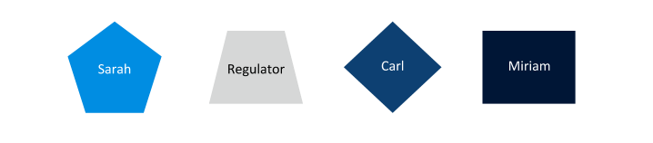|
|:--:|
| *Licensed under [CC By 4.0](https://creativecommons.org/licenses/by/4.0/)* |

Using Hyperledger Fabric, we will be demonstrating how tuna fishing can be improved starting from the source, fisherman Sarah, and the process by which she sells her tuna to Miriam's restaurant.

### Featured Hyperledger Fabric Elements

**Channels** are data partitioning mechanisms that allow transaction visibility for stakeholders only. Each channel is an independent chain of transaction blocks containing only transactions for that particular channel.

The **chaincode** (Smart Contracts) encapsulates both the asset definitions and the business logic (or transactions) for modifying those assets. Transaction invocations result in changes to the ledger.

The **ledger** contains the current world state of the network and a chain of transaction invocations. A shared, permissioned ledger is an append-only system of records and serves as a single source of truth.

The **network** is the collection of data processing peers that form a blockchain network. The network is responsible for maintaining a consistently replicated ledger.

The **ordering service** is a collection of nodes that orders transactions into a block.

The **world state** reflects the current data about all the assets in the network. This data is stored in a database for efficient access. Current supported databases are LevelDB and CouchDB.

The **membership service provider** (MSP) manages identity and permissioned access for clients and peers.

### The Catch

We will start with Sarah, our licensed tuna fisher, who makes a living selling her tuna to multiple restaurants. Sarah operates as a private business, in which her company frequently makes international deals. Through a client application, Sarah is able to gain entry to a Hyperledger Fabric blockchain network comprised of other fishermen, as well as regulators and restaurant owners. Sarah has the ability to add to and update information in the blockchain network's  ledger as tuna pass through the supply chain, while regulators and restaurants have read access to the ledger.

After each catch, Sarah records information about each individual tuna, including: a unique ID number, the location and time of the catch, its weight, the vessel type, and who caught the fish. For the sake of simplicity, we will stick with these six data attributes. However, in an actual application, many more details would be recorded, from toxicology, to other physical characteristics.

These details are saved in the world state as a key/value pair based on the specifications of a chaincode contract, allowing Sarah’s application to effectively create a transaction on the ledger. You can see the example below:

```
$ var tuna = { id: ‘0001’, holder: ‘Sarah’, location: { latitude: '41.40238', longitude: '2.170328'}, when: '20170630123546', weight: ‘58lbs’, vessel : ‘9548E’ }
```

### The Incentives

Miriam is a restaurant owner looking to source low cost, yet high quality tuna that have been responsibly caught. Whenever Miriam buys tuna, she is always uncertain whether she can trust that the tuna she is purchasing is legally and sustainably caught, given the prominence of illegal and unreported tuna fishing.

At the same time, as a legitimate and experienced fisherman, Sarah strives to make a living selling her tuna at a reasonable price. She would also like autonomy over who she sells to and at what price.

Luckily for both Sarah and Miriam, Hyperledger Fabric can help!

### The Sale

Normally, Sarah sells her tuna to restaurateurs, such as Carl, for $80 per pound. However, Sarah agrees to give Miriam a special price of $50 per pound of tuna, rather than her usual rate. In a traditional public blockchain, once Sarah and Miriam have completed their transaction, the entire network is able to view the details of this agreement, especially the fact that Sarah gave Miriam a special price. As you can imagine, having other restaurateurs, such as Carl, aware of this deal is not economically advantageous for Sarah.

|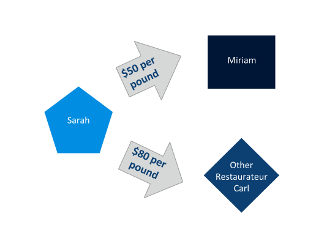|
|:--:|
| *Licensed under [CC By 4.0](https://creativecommons.org/licenses/by/4.0/)* |

To remedy this, Sarah wants the specifics of her deal to not be available to everyone on the network, but still have every actor in the network be able to view the details of the fish she is selling. Using Hyperledger Fabric's feature of **channels**, Sarah can privately agree on the terms with Miriam, such that only the two of them can see them, without anyone else knowing the specifics.

Additionally, other fishermen, who are not part of Sarah and Miriam’s transaction, will not see this transaction on their ledger. This ensures that another fisherman cannot undercut the bid by having information about the prices that Sarah is charging different restaurateurs.

### The Regulators

Regulators will also gain entry to this Hyperledger Fabric blockchain network to confirm, verify, and view details from the ledger. Their application will allow these actors to query the ledger and see the details of each of Sarah’s catches to confirm that she is legally catching her fish. Regulators only need to have query access, and do not need to add entries to the ledger. With that being said, they may be able to adjust who can gain entry to the network and/or be able to remove fishermen from the network, if found to be partaking in illegal activities.

### Gaining Network Membership

Hyperledger Fabric is a permissioned network, meaning that only participants who have been approved can gain entry to the network. To handle network membership and identity, **membership service providers** (MSP) manage user IDs, and authenticate all the participants in the network. A Hyperledger Fabric blockchain network can be governed by one or more MSPs. This provides modularity of membership operations, and interoperability across different membership standards and architectures.

In our scenario, the regulator, the approved fishermen, and the approved restaurateurs should be the only ones allowed to join the network. To achieve this, a membership service provider (MSP) is defined to accommodate membership for all members of this supply chain. In configuring this MSP, certificates and membership identities are created. Policies are then defined to dictate the read/write policies of a channel, or the endorsement policies of a chaincode.

Our scenario has two separate chaincodes, which are run on three separate channels. The two chaincodes are: one for the price agreement between the fisherman and the restaurateur, and one for the transfer of tuna. The three channels are: one for the price agreement between Sarah and Miriam; one for the price agreement between Sarah and Carl; and one for the transfer of tuna. Each member of this network knows about each other and their identity. The channels provide privacy and confidentiality of transactions.

In Hyperledger Fabric, MSPs also allow for dynamic membership to add or remove members to maintain integrity and operation of the supply chain. For example, if Sarah was found to be catching her fish illegally, she can have her membership revoked, without compromising the rest of the network. This feature is critical, especially for enterprise applications, where business relationships change over time.

### Summary of Demonstrated Scenario

Below is a summary of the tuna catch scenario presented in this section:

 1. Sarah catches a tuna and uses the supply chain application’s user interface to record all the details about the catch to the ledger. Before it reaches the ledger, the transaction is passed to the endorsing peers on the network, where it is then endorsed. The endorsed transaction is sent to the ordering service, to be ordered into a block. This block is then sent to the committing peers in the network, where it is committed after being validated.
 2. As the tuna is passed along the supply chain, regulators may use their own application to query the ledger for details about specific catches (excluding price, since they do not have access to the price-related chaincode).
 3. Sarah may enter into an agreement with a restaurateur Carl, and agree on a price of $80 per pound. They use the blue channel for the chaincode contract stipulating $80/lb. The blue channel's ledger is updated with a block containing this transaction.
 4. In a separate business agreement, Sarah and Miriam agree on a special price of $50 per pound. They use the red channel's chaincode contract stipulating $50/lb. The red channel's ledger is updated with a block containing this transaction.

|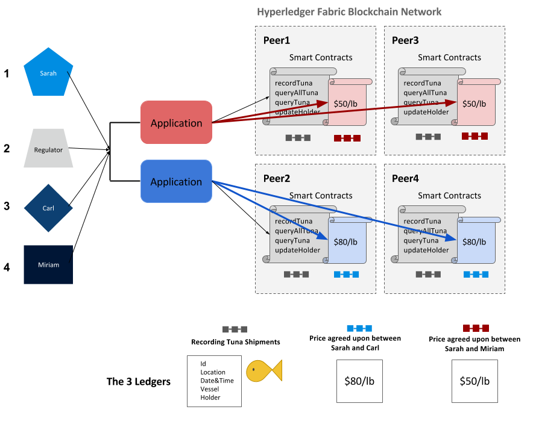|
|:--:|
| *Licensed under [CC By 4.0](https://creativecommons.org/licenses/by/4.0/)* |

## Key Components and Transaction Flow

### Video: Introduction to Hyperledger Fabric Architecture (Arianna Groetsema)

#### Introduction to Hyperledger Fabric (Alexandra & Arianna Groetsema)

[](https://youtu.be/nyNUvtsmZNE)

### Roles within a Hyperledger Fabric Network

There are three different types of roles within a Hyperledger Fabric network:

 - **Clients**
 <br />Clients are applications that act on behalf of a person to propose transactions on the network.
 - **Peers**
 <br />Peers maintain the state of the network and a copy of the ledger. There are two different types of peers: endorsing and committing peers. However, there is an overlap between endorsing and committing peers, in that endorsing peers are a special kind of committing peers. All peers commit blocks to the distributed ledger.
 <br />\- _Endorsers_ simulate and endorse transactions
 <br />\- _Committers_ verify endorsements and validate transaction results, prior to committing transactions to the blockchain.
 - **Ordering Service**
 <br />The ordering service accepts endorsed transactions, orders them into a block, and delivers the blocks to the committing peers.

### How to Reach Consensus

In a distributed ledger system, **consensus** is the process of reaching agreement on the next set of transactions to be added to the ledger. In Hyperledger Fabric, consensus is made up of three distinct steps:

 - Transaction endorsement
 - Ordering
 - Validation and commitment.

These three steps ensure the policies of a network are upheld. We will explore how these steps are implemented by exploring the transaction flow.

### Transaction Flow (Step 1)

Within a Hyperledger Fabric network, transactions start out with client applications sending transaction proposals, or, in other words, proposing a transaction to endorsing peers.

|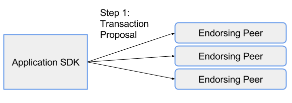|
|:--:|
| *Licensed under [CC By 4.0](https://creativecommons.org/licenses/by/4.0/)* |

**Client applications** are commonly referred to as **applications** or **clients**, and allow people to communicate with the blockchain network. Application developers can leverage the Hyperledger Fabric network through the application SDK.

### Transaction Flow (Step 2)

Each endorsing peer simulates the proposed transaction, without updating the ledger. The endorsing peers will capture the set of **R**ead and **W**ritten data, called **RW Sets**. These RW sets capture what was read from the current world state while simulating the transaction, as well as what would have been written to the world state had the transaction been executed. These RW sets are then signed by the endorsing peer, and returned to the client application to be used in future steps of the transaction flow.

|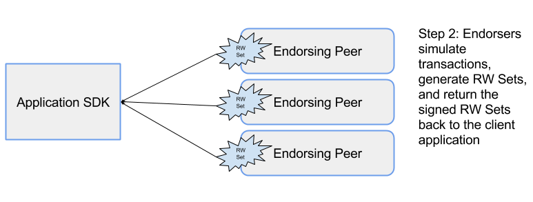|
|:--:|
| *Licensed under [CC By 4.0](https://creativecommons.org/licenses/by/4.0/)* |

Endorsing peers must hold smart contracts in order to simulate the transaction proposals.

### Transaction Endorsement

A transaction endorsement is a signed response to the results of the simulated transaction. The method of transaction endorsements depends on the endorsement policy which is specified when the chaincode is deployed. An example of an endorsement policy would be "the majority of the endorsing peers must endorse the transaction". Since an endorsement policy is specified for a specific chaincode, different channels can have different endorsement policies.

### Transaction Flow (Step 3)

The application then submits the endorsed transaction and the RW sets to the ordering service. Ordering happens across the network, in parallel with endorsed transactions and RW sets submitted by other applications.

|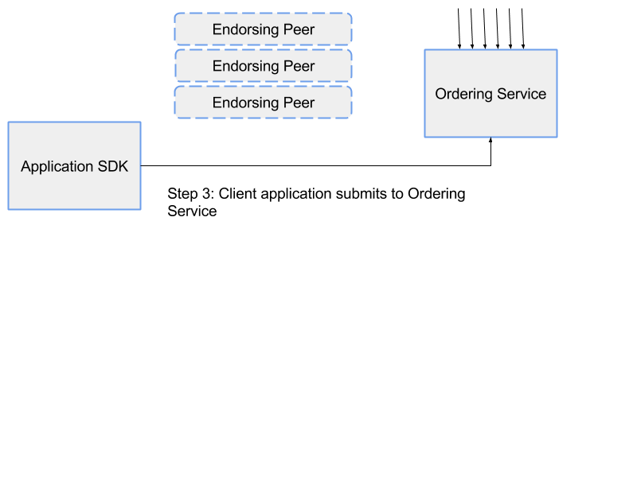|
|:--:|
| *Licensed under [CC By 4.0](https://creativecommons.org/licenses/by/4.0/)* |

### Transaction Flow (Step 4)

The ordering service takes the endorsed transactions and RW sets, orders this information into a block, and delivers the block to all committing peers.

|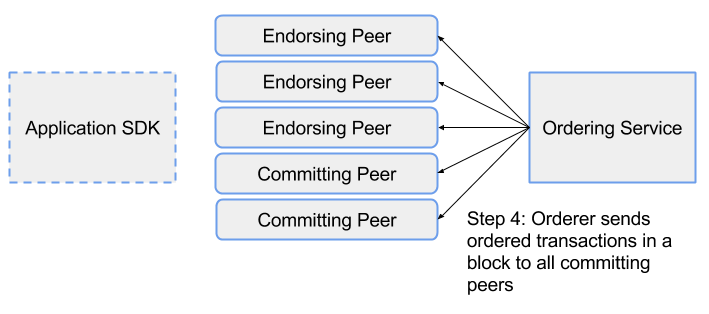|
|:--:|
| *Licensed under [CC By 4.0](https://creativecommons.org/licenses/by/4.0/)* |

The **ordering service**, which is made up of a cluster of orderers, does not process transactions, smart contracts, or maintain the shared ledger. The ordering service accepts the endorsed transactions and specifies the order in which those transactions will be committed to the ledger. The Fabric v1.0 architecture has been designed such that the specific implementation of 'ordering' (Solo, Kafka, BFT) becomes a pluggable component. The default ordering service for Hyperledger Fabric is Kafka. Therefore, the ordering service is a modular component of Hyperledger Fabric.

### Video: Ordering Service (Chris Ferris)

#### Ordering Service (Chris Ferris)

[](https://youtu.be/mwIMxMRZFL4)

### Ordering (Part I)

_Transactions within a timeframe are sorted into a block and are committed in sequential order._

In a blockchain network, transactions have to be written to the shared ledger in a consistent order. The order of transactions has to be established to ensure that the updates to the world state are valid when they are committed to the network. Unlike the Bitcoin blockchain, where ordering occurs through the solving of a cryptographic puzzle, or _mining_, Hyperledger Fabric allows the organizations running the network to choose the ordering mechanism that best suits that network. This modularity and flexibility makes Hyperledger Fabric incredibly advantageous for enterprise applications.

### Ordering (Part II)

Hyperledger Fabric provides three ordering mechanisms: SOLO, Kafka, and Simplified Byzantine Fault Tolerance (SBFT), the latter of which has not yet been implemented in Fabric v1.0.

 - **SOLO** is the Hyperledger Fabric ordering mechanism most typically used by developers experimenting with Hyperledger Fabric networks. SOLO involves a single ordering node.
 - **Kafka** is the Hyperledger Fabric ordering mechanism that is recommended for production use. This ordering mechanism utilizes Apache Kafka, an open source stream processing platform that provides a unified, high-throughput, low-latency platform for handling real-time data feeds. In this case, the data consists of endorsed transactions and RW sets. The Kafka mechanism provides a crash fault-tolerant solution to ordering.
 - **SBFT** stands for Simplified Byzantine Fault Tolerance. This ordering mechanism is both crash fault-tolerant and byzantine fault-tolerant, meaning that it can reach agreement even in the presence of malicious or faulty nodes. The Hyperledger Fabric community has not yet implemented this mechanism, but it is on their roadmap.

These three ordering mechanisms provide alternate methodologies for agreeing on the order of transactions.

### Transaction Flow (Step 5)

The committing peer validates the transaction by checking to make sure that the RW sets still match the current world state. Specifically, that the Read data that existed when the endorsers simulated the transaction is identical to the current world state. When the committing peer validates the transaction, the transaction is written to the ledger, and the world state is updated with the Write data from the RW Set.

|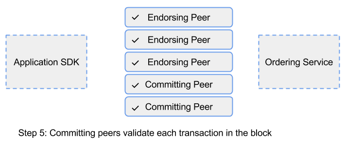|
|:--:|
| *Licensed under [CC By 4.0](https://creativecommons.org/licenses/by/4.0/)* |

If the transaction fails, that is, if the committing peer finds that the RW set does not match the current world state, the transaction ordered into a block will still be included in that block, but it will be marked as invalid, and the world state will not be updated.

Committing peers are responsible for adding blocks of transactions to the shared ledger and updating the world state. They may hold smart contracts, but it is not a requirement.

### Transaction Flow (Step 6)

Lastly, the committing peers asynchronously notify the client application of the success or failure of the transaction. Applications will be notified by each committing peer.

|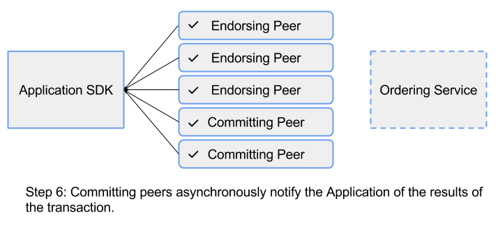|
|:--:|
| *Licensed under [CC By 4.0](https://creativecommons.org/licenses/by/4.0/)* |

### Identity Verification

In addition to the multitude of endorsement, validity, and versioning checks that take place, there are also ongoing identity verifications happening during each step of the transaction flow. Access control lists are implemented on the hierarchical layers of the network (from the ordering service down to channels), and payloads are repeatedly signed, verified, and authenticated as a transaction proposal passes through the different architectural components.

### Transaction Flow Summary

It is important to note that the state of the network is maintained by peers, and not by the ordering service or the client. Normally, you will design your system such that different machines in the network play different roles. That is, machines that are part of the ordering service should not be set up to also endorse or commit transactions, and vice versa. However, there is an overlap between endorsing and committing peers on the system. Endorsing peers must have access to and hold smart contracts, in addition to fulfilling the role of a committing peer. Endorsing peers do commit blocks, but committing peers do not endorse transactions.

Endorsing peers verify the client signature, and execute a chaincode function to simulate the transaction. The output is the chaincode results, a set of key/value versions that were read in the chaincode (Read set), and the set of keys/values that were written by the chaincode. The proposal response gets sent back to the client, along with an endorsement signature. These proposal responses are sent to the orderer to be ordered. The orderer then orders the transactions into a block, which it forwards to the endorsing and committing peers. The RW sets are used to verify that the transactions are still valid before the content of the ledger and world state is updated. Finally, the peers asynchronously notify the client application of the success or failure of the transaction.

### Channels

Channels allow organizations to utilize the same network, while maintaining separation between multiple blockchains. Only the members of the channel on which the transaction was performed can see the specifics of the transaction. In other words, channels partition the network in order to allow transaction visibility for stakeholders only. This mechanism works by delegating transactions to different ledgers. Only the members of the channel are involved in consensus, while other members of the network do not see the transactions on the channel.

|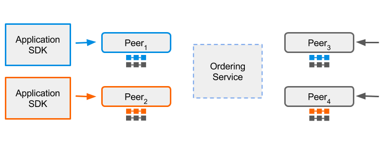|
|:--:|
| *Licensed under [CC By 4.0](https://creativecommons.org/licenses/by/4.0/)* |

The diagram above shows three distinct channels -- blue, orange, and grey. Each channel has its own application, ledger, and peers.

Peers can belong to multiple networks or channels. Peers that do participate in multiple channels simulate and commit transactions to different ledgers. The ordering service is the same across any network or channel.

A few things to remember:

 - The network setup allows for the creation of channels.
 - The same chaincode logic can be applied to multiple channels.
 - A given user can participate in multiple channels.

### State Database

The current state data represents the latest values for all assets in the ledger. Since the current state represents all the committed transactions on the channel, it is sometimes referred to as world state.

Chaincode invocations execute transactions against the current state data. To make these chaincode interactions extremely efficient, the latest key/value pairs for each asset are stored in a state database. The state database is simply an indexed view into the chain’s committed transactions. It can therefore be regenerated from the chain at any time. The state database will automatically get recovered (or generated, if needed) upon peer startup, before new transactions are accepted. The default state database, **LevelDB**, can be replaced with **CouchDB**.

 - LevelDB is the default key/value state database for Hyperledger Fabric, and simply stores key/value pairs.
 - CouchDB is an alternative to LevelDB. Unlike LevelDB, CouchDB stores JSON objects. CouchDB is unique in that it supports keyed, composite, key range, and full data-rich queries.

Hyperledger Fabric’s LevelDB and CouchDB are very similar in their structure and function. Both LevelDB and CouchDB support core chaincode operations, such as getting and setting key assets, and querying based on these keys. With both, keys can be queried by range, and composite keys can be modeled to enable equivalence queries against multiple parameters. But, as a JSON document store, CouchDB additionally enables rich query against the chaincode data, when chaincode values (e.g. assets) are modeled as JSON data.

|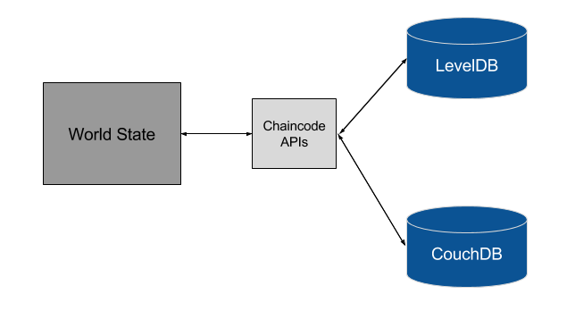|
|:--:|
| *Licensed under [CC By 4.0](https://creativecommons.org/licenses/by/4.0/)* |

### Smart Contracts

As a reminder, smart contracts are computer programs that contain logic to execute transactions and modify the state of the assets stored within the ledger. Hyperledger Fabric smart contracts are called **chaincode** and are written in Go. The chaincode serves as the business logic for a Hyperledger Fabric network, in that the chaincode directs how you manipulate assets within the network. We will discuss more about chaincode in the _Understanding Chaincode_ section.

### Membership Service Provider (MSP)

The membership service provider, or MSP, is a component that defines the rules in which identities are validated, authenticated, and allowed access to a network. The MSP manages user IDs and authenticates clients who want to join the network. This includes providing credentials for these clients to propose transactions. The MSP makes use of a _Certificate Authority_, which is a pluggable interface that verifies and revokes user certificates upon confirmed identity. The default interface used for the MSP is the **Fabric-CA API**, however, organizations can implement an External Certificate Authority of their choice. This is another feature of Hyperledger Fabric that is modular. Hyperledger Fabric supports many credential architectures, which allows for many types of External Certificate Authority interfaces to be used. As a result, a single Hyperledger Fabric network can be controlled by multiple MSPs, where each organization brings their favorite.

|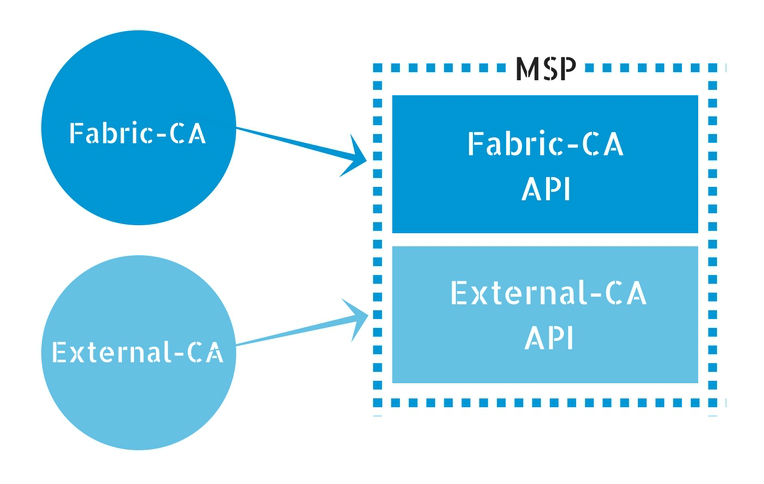|
|:--:|
| *Licensed under [CC By 4.0](https://creativecommons.org/licenses/by/4.0/)* |

### What Does the MSP Do?

To start, users are authenticated using a certificate authority. The certificate authority identifies the application, peer, endorser, and orderer identities, and verifies these credentials. A signature is generated through the use of a _Signing Algorithm_ and a _Signature Verification Algorithm_.

Specifically, generating a signature starts with a _Signing Algorithm_, which utilizes the credentials of the entities associated with their respective identities, and outputs an endorsement. A signature is generated, which is a byte array that is bound to a specific identity. Next, the _Signature Verification Algorithm_ takes the identity, endorsement, and signature as inputs, and outputs 'accept' if the signature byte array corresponds with a valid signature for the inputted endorsement, or outputs 'reject' if not. If the output is 'accept', the user can see the transactions in the network and perform transactions with other actors in the network. If the output is 'reject', the user has not been properly authenticated, and is not able to submit transactions to the network, or view any previous transactions.

### Fabric-Certificate Authority

In general, _Certificate Authorities_ manage enrollment certificates for a permissioned blockchain. **Fabric-CA** is the default certificate authority for Hyperledger Fabric, and handles the registration of user identities. The Fabric-CA certificate authority is in charge of issuing and revoking Enrollment Certificates (E-Certs). The current implementation of Fabric-CA only issues E-Certs, which supply long term identity certificates. E-Certs, which are issued by the Enrollment Certificate Authority (E-CA), assign peers their identity and give them permission to join the network and submit transactions.

## Installing Hyperledger Fabric

### Technical Prerequisites

In order to successfully install Hyperledger Fabric, you should be familiar with Go and Node.js programming languages, and have the following features installed on your computer: cURL, Node.js, npm package manager, Go language, Docker, and Docker Compose.

If you need further details on these prerequisites, visit Chapter 4, _Technical Requirements_.

### Installing Hyperledger Fabric Docker Images and Binaries

Next, we will download the latest released Docker images for Hyperledger Fabric, and tag them with the **latest** tag. Execute the command from within the directory into which you will extract the platform-specific binaries:

```
$ curl -sSL https://goo.gl/6wtTN5 | bash -s 1.2.0
```

__**NOTE:**__ Check [http://hyperledger-fabric.readthedocs.io/en/release-1.1/samples.html#binaries](http://hyperledger-fabric.readthedocs.io/en/release-1.1/samples.html#binaries) for the latest URL (the blue portion in the above curl command) to pull in binaries.

This command downloads binaries for **cryptogen**, **configtxgen**, **configxlator**, **peer** AND downloads the Hyperledger Fabric Docker images. These assets are placed in a **bin** subdirectory of the current working directory.

To confirm and see the list of Docker images you’ve just downloaded, run:

```
$ docker images
```

The expected response is:

|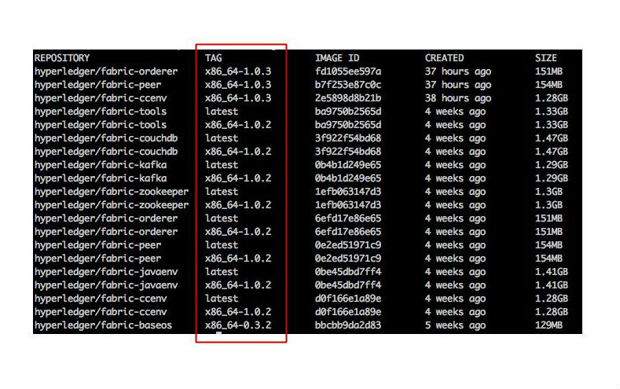|
|:--:|
| *Licensed under [CC By 4.0](https://creativecommons.org/licenses/by/4.0/)* |

**Note** the tags for each of the repositories above boxed in red. If the Docker images are not already tagged with the **latest** tag, perform the following command for each of the Docker images:

```
$ docker tag hyperledger/fabric-tools:x86_64-1.0.2 hyperledger/fabric-tools:latest
```

Swap out the <span style="color:blue">blue</span> portion with the tags you see in your list of repositories. Also, swap out the <span style="color:red">red</span> portion with the name of the Docker image you are switching the tag for (e.g.: **fabric-tools**, **fabric-ccenv**, **fabric-orderer**, etc.). Repeat this step for all Docker images you see in the list.

In the screenshot above, the Docker images are already tagged. If this is the case for you, you do not need to do this extra step.

### Installing Hyperledger Fabric

As an additional measure, you may want to add the bin subdirectory to your PATH environment variable, so these can be picked up without needing to qualify the PATH to each binary. You can do this by running the following:

```
$ export PATH=$PWD/bin:$PATH
```

To install the Hyperledger Fabric sample code which will be used in the tutorials, do:

```
$ git clone https://github.com/hyperledger/fabric-samples.git

$ cd fabric-samples/first-network
```

### Starting a Test Hyperledger Fabric Network

Now that we have successfully installed Hyperledger Fabric, we can walk through setting up a simple network that has two members. To refer back to our demonstrated scenario, the network includes asset management of each tuna verified, transferred, and purchased between Sarah, the fisherman, and Miriam, the restaurateur. We’ll create a simple two member network consisting of two organizations (effectively, Sarah and Miriam), each maintaining two peers and an ordering service.

We will use Docker images to bootstrap our first Hyperledger Fabric network. It will also launch a container to run a scripted execution that will join peers to a channel, deploy, and instantiate the chaincode, and execute transactions against the chaincode.

### Getting Started with Your First Network

Are you ready to get started? Run this command ( within the **first-network** folder ):

```
$ ./byfn.sh -m generate
```

A brief description will appear, along with a **Y/N** command line prompt. Respond with a **Y \<Enter>** to continue.

This step generates all of the certificates and keys for all our various network entities, including the genesis block used to bootstrap the ordering service and a collection of configuration transactions required to create a channel.

Next, you can start the network with the following command:

```
$ ./byfn.sh -m up
```

Another command line will appear, reply with **Y \<Enter>** to continue.

Logs will appear in the command line, showing containers being launched, channels being created and joined, chaincode being installed, instantiated, and invoked on all the peers, as well as various transaction logs.

**Troubleshooting Note:**
If you have difficulties with the two previous commands and you suspect that your Docker images may be at fault, you can start back from scratch, which will delete and untag the Docker images.

```
$ docker rmi -f $(docker images -q)
```

Once you run this command, return to the _Installing Hyperledger Fabric Docker Images and Binaries_ page, at the beginning of this section.

### Finishing Up and Shutting Down the Network

Finally, let’s test bringing down this network.

Within the same terminal, do **Control+C** to exit the current execution.

Then, run the following command:

```
$ ./byfn.sh -m down
```

Another command line will appear, reply with **Y \<Enter>** to continue.

This command will kill your containers, remove the crypto material and four artifacts, and delete the chaincode images from your Docker Registry.

And that’s it for a simple demonstration!

These simple steps show how we can easily spin up and bring down a Hyperledger Fabric network, given the code we have. In the next section, we will learn more about chaincode.

### Video: Installing Hyperledger Fabric (Demo)

#### Installing Hyperledger Fabric (Demo)

[](https://youtu.be/eM6HIOpexGE)

## Understanding Chaincode

### Chaincode

In Hyperledger Fabric, **chaincode** is the 'smart contract' that runs on the peers and creates transactions. More broadly, it enables users to create transactions in the Hyperledger Fabric network's shared ledger and update the world state of the assets.

Chaincode is programmable code, written in Go, and instantiated on a channel. Developers use chaincode to develop business contracts, asset definitions, and collectively-managed decentralized applications. The chaincode manages the ledger state through transactions invoked by applications. Assets are created and updated by a specific chaincode, and cannot be accessed by another chaincode.

Applications interact with the blockchain ledger through the chaincode. Therefore, the chaincode needs to be installed on every peer that will endorse a transaction and instantiated on the channel.

There are two ways to develop smart contracts with Hyperledger Fabric:

 - Code individual contracts into standalone instances of chaincode
 - (More efficient way) Use chaincode to create decentralized applications that manage the lifecycle of one or multiple types of business contracts, and let the end users instantiate instances of contracts within these applications.

### Chaincode Key APIs

An important interface that you can use when writing your chaincode is defined by Hyperledger Fabric - <span style="color:cyan">_ChaincodeStub_</span> and <span style="color:cyan">_ChaincodeStubInterface_</span>. The ChaincodeStub provides functions that allow you to interact with the underlying ledger to query, update, and delete assets. The key APIs for chaincode include:

 - **func (stub \*<span style="color:cyan">ChaincodeStub</span>) GetState(key <span style="color:cyan">string</span>) ([]<span style="color:cyan">byte, error</span>)**
 <br />Returns the value of the specified _key_ from the ledger. Note that **GetState** doesn't read data from the Write set, which has not been committed to the ledger. In other words, **GetState** doesn't consider data modified by **PutState** that has not been committed. If the key does not exist in the state database,
 **\(nil, nil)** is returned.
 - **func (stub \*<span style="color:cyan">ChaincodeStub</span>) PutState(key <span style="color:cyan">string</span>, value []<span style="color:cyan">byte</span>) <span style="color:cyan">error</span>**
 <br />Puts the specified _key_ and _value_ into the transaction's Write set as a data-write proposal. **PutState** doesn't affect the ledger until the transaction is validated and successfully committed.
 - **func (stub \*<span style="color:cyan">ChaincodeStub)</span> DelState(key <span style="color:cyan">string</span>) <span style="color:cyan">error</span>**
 <br />Records the specified key to be deleted in the Write set of the transaction proposal. The _key_ and its _value_ will be deleted from the ledger when the transaction is validated and successfully committed.

### Overview of a Chaincode Program

When creating a chaincode, there are two methods that you will need to implement:

 - **Init**
 <br />Called when a chaincode receives an **_instantiate_** or **_upgrade_** transaction. This is where you will initialize any application state.
 - **Invoke**
 <br />Called when the **_invoke_** transaction is received to process any transaction proposals.

As a developer, you must create both an **Init** and an **Invoke** method within your chaincode. The chaincode must be installed using the **peer chaincode install** command, and instantiated using the **peer chaincode instantiate** command before the chaincode can be invoked. Then, transactions can be created using the **peer chaincode invoke** or peer **chaincode query commands**.

### Sample Chaincode Decomposed - Dependencies

Let’s now walk through a sample chaincode written in Go, piece by piece:

```golang
package main

import (

"fmt"

"github.com/hyperledger/fabric/core/chaincode/shim"

"github.com/hyperledger/fabric/protos/peer"

)
```

The **import** statement lists a few dependencies that you will need for your chaincode to build successfully.

 - **fmt** - contains **Println** for debugging/logging
 - **github.com/hyperledger/fabric/core/chaincode/shim** - contains the definition for the chaincode interface and the chaincode stub, which you will need to interact with the ledger, as we described in the _Chaincode Key APIs_ section
 - **github.com/hyperledger/fabric/protos/peer** - contains the peer protobuf package.

### Sample Chaincode Decomposed - Struct

```golang
type SampleChaincode struct {

}
```

This might not look like much, but this is the statement that begins the definition of an object/class in Go. **SampleChaincode** implements a simple chaincode to manage an asset.

### Sample Chaincode Decomposed - Init Method

Next, we’ll implement the **Init** method. **Init** is called during the chaincode instantiation to initialize data required by the application. In our sample, we will create the initial key/value pair for an asset, as specified on the command line:

```golang
func (t *SampleChaincode) Init(stub shim.ChainCodeStubInterface) peer.Response {

// Get the args from the transaction proposal

   args := stub.GetStringArgs()

if len(args) != 2 {

return shim.Error("Incorrect arguments. Expecting a key and a value")

}

// We store the key and the value on the ledger

err := stub.PutState(args[0], []byte(args[1]))

if err != nil {

return shim.Error(fmt.Sprintf("Failed to create asset: %s", args[0]))

}

return shim.Success(nil)

}
```

The Init implementation accepts two parameters as inputs, and proposes to write a key/value pair to the ledger by using the **stub.PutState** function. **GetStringArgs** retrieves and checks the validity of arguments which we expect to be a key/value pair. Therefore, we check to ensure that there are two arguments specified. If not, we return an error from the **Init** method, to indicate that something went wrong. Once we have verified the correct number of arguments, we can store the initial state in the ledger. In order to accomplish this, we call the **stub.PutState** function, specifying the first argument as the key, and the second argument as the value for that key. If no errors are returned, we will return success from the **Init** method.

### Sample Chaincode Decomposed - Invoke Method

Now, we’ll explore the **Invoke** method, which gets called when a transaction is proposed by a client application. In our sample, we will either get the value for a given asset, or propose to update the value for a specific asset.

```golang
func (t *SampleChaincode) Invoke(stub shim.ChaincodeStubInterface) peer.Response {

// Extract the function and args from the transaction proposal

fn, args := stub.GetFunctionAndParameters()

var result string

var err error

if fn == "set" {

result, err = set(stub, args)

} else { // assume 'get' even if fn is nil

result, err = get(stub, args)

}

if err != nil { //Failed to get function and/or arguments from transaction proposal

return shim.Error(err.Error())

}

// Return the result as success payload

return shim.Success([]byte(result))

}
```

There are two basic actions a client can invoke: _get_ and _set_.

 - The _get_ method will be used to query and return the value of an existing asset.
 - The _set_ method will be used to create a new asset or update the value of an existing asset.

To start, we’ll call **GetFunctionandParameters** to isolate the function name and parameter variables. Each transaction is either a set or a get. Let's first look at how the set method is implemented:

```golang
func set(stub shim.ChaincodeStubInterface, args []string) (string, error) {

if len(args) != 2 {

return "", fmt.Errorf("Incorrect arguments. Expecting a key and a value")

}

err := stub.PutState(args[0], []byte(args[1]))

if err != nil {

return "", fmt.Errorf("Failed to set asset: %s", args[0])

}

return args[1], nil

}
```

The set method will create or modify an asset identified by a key with the specified value. The set method will modify the world state to include the key/value pair specified. If the key exists, it will override the value with the new one, using the **PutState** method; otherwise, a new asset will be created with the specified value.

Next, let's look at how the _get_ method is implemented:

```golang
func get(stub shim.ChaincodeStubInterface, args []string) (string, error) {

if len(args) != 1 {

return "", fmt.Errorf("Incorrect arguments. Expecting a key")

}

value, err := stub.GetState(args[0])

if err != nil {

return "", fmt.Errorf("Failed to get asset: %s with error: %s", args[0], err)

}

if value == nil {

return "", fmt.Errorf("Asset not found: %s", args[0])

}

return string(value), nil

}
```

The _get_ method will attempt to retrieve the value for the specified key. If the application does not pass in a single key, an error will be returned; otherwise, the **GetState** method will be used to query the world state for the specified key. If the key has not yet been added to the ledger (and world state), then an error will be returned; otherwise, the value that was set for the specified key is returned from the method.

### Sample Chaincode Decomposed - Main Function

The last piece of code in this sample is the **main** function, which will call the **Start** function. The **main** function starts the chaincode in the container during instantiation.

```golang
func main() {

err := shim.Start(new(SampleChaincode))

if err != nil {

fmt.Println("Could not start SampleChaincode")

} else {

fmt.Println("SampleChaincode successfully started")

}

}
```

## Chaincode Walkthrough (Demonstrated Scenario)

### Setting the Stage

Now that we have a general idea of how chaincode is coded, we will walk through a simple chaincode that creates assets on a ledger, based on our demonstrated scenario of creating records for tuna fish.

Sometimes, code snippets can get lost in translation, especially if the context doesn’t make much sense. In hopes of avoiding this, we have adjusted our example chaincode to address our demonstration scenario. The chaincode we will be examining in this section will record a tuna catch by storing it to the ledger, as well as allow for queries and updates to tuna catch records.

### Defining the Asset Attributes

Here are the four example attributes of tuna fish that we will be recording on the ledger:

 - Vessel (string)
 - Location (string)
 - Date and Time (datetime)
 - Holder (string)

We create a Tuna Structure that has four properties. Structure tags are used by the **encoding/json** library.

```golang
type Tuna struct {

Vessel string ‘json:"vessel"’

Datetime string ‘json:"datetime"’

Location string ‘json:"location"’

Holder string ‘json:"holder"’

}
```

### Invoke Method (Part I)

As described earlier, the **Invoke** method is the one which gets called when a transaction is proposed by a client application. Within this method, we have three different types of transactions -- _recordTuna_, _queryTuna_, and _changeTunaHolder_, which we will look at a little later.

As a reminder, Sarah, the fisherman, will invoke the _recordTuna_ when she catches each tuna.

|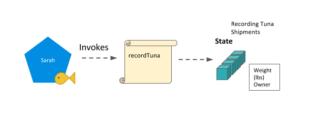|
|:--:|
| *Licensed under [CC By 4.0](https://creativecommons.org/licenses/by/4.0/)* |

_changeTunaHolder_ can be invoked by Miriam, the restaurateur, when she confirms receiving and passing on a particular tuna fish as it passes through the supply chain. _queryTuna_ can be invoked by Miriam, the restaurateur, to view the state of a particular tuna.

|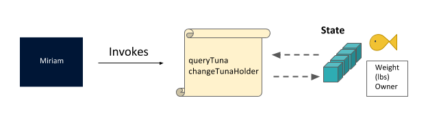|
|:--:|
| *Licensed under [CC By 4.0](https://creativecommons.org/licenses/by/4.0/)* |

Regulators will invoke _queryTuna_ and _queryAllTuna_ based on their need to verify and check for sustainability of the supply chain.

|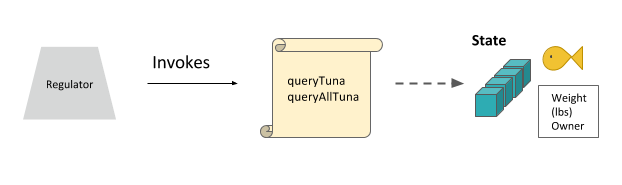|
|:--:|
| *Licensed under [CC By 4.0](https://creativecommons.org/licenses/by/4.0/)* |

### Invoke Method (Part II)

We’ll be getting into the different tuna chaincode methods in the following sections. But here is the **Invoke** method. As you can see, this method will look at the first parameter to determine which function should be called, and invoke the appropriate tuna chaincode method.

```golang
func (s *SmartContract) Invoke(APIstub shim.ChaincodeStubInterface) sc.Response {

// Retrieve the requested Smart Contract function and arguments

function, args := APIstub.GetFunctionAndParameters()

// Route to the appropriate handler function to interact with the ledger appropriately

if function == "queryTuna" {

return s.queryTuna(APIstub, args)

} else if function == "initLedger" {

return s.initLedger(APIstub)

} else if function == "recordTuna" {

return s.recordTuna(APIstub, args)

} else if function == "queryAllTuna" {

return s.queryAllTuna(APIstub)

} else if function == "changeTunaHolder" {

return s.changeTunaHolder(APIstub, args)

}

return shim.Error("Invalid Smart Contract function name.")

}
```

### Chaincode Methods - queryTuna

The _queryTuna_ method would be used by a fisherman, regulator, or restaurateur to view the record of one particular tuna. It takes one argument - the key for the tuna in question.

```golang
func (s *SmartContract) queryTuna(APIstub shim.ChaincodeStubInterface, args []string) sc.Response {

if len(args) != 1 {

return shim.Error("Incorrect number of arguments. Expecting 1")

}

tunaAsBytes, _ := APIstub.GetState(args[0])

if tunaAsBytes == nil {

return shim.Error(“Could not locate tuna”)

}

return shim.Success(tunaAsBytes)

}
```

### Chaincode Methods - initLedger

The initLedger method will add test data to our network.

```golang
func (s *SmartContract) initLedger(APIstub shim.ChaincodeStubInterface) sc.Response {

tuna := []Tuna{

Tuna{Vessel: "923F", Location: "67.0006, -70.5476", Timestamp: "1504054225", Holder: "Miriam"},

Tuna{Vessel: "M83T", Location: "91.2395, -49.4594", Timestamp: "1504057825", Holder: "Dave"},

Tuna{Vessel: "T012", Location: "58.0148, 59.01391", Timestamp: "1493517025", Holder: "Igor"},

Tuna{Vessel: "P490", Location: "-45.0945, 0.7949", Timestamp: "1496105425", Holder: "Amalea"},

Tuna{Vessel: "S439", Location: "-107.6043, 19.5003", Timestamp: "1493512301", Holder: "Rafa"},

Tuna{Vessel: "J205", Location: "-155.2304, -15.8723", Timestamp: "1494117101", Holder: "Shen"},

Tuna{Vessel: "S22L", Location: "103.8842, 22.1277", Timestamp: "1496104301", Holder: "Leila"},

Tuna{Vessel: "EI89", Location: "-132.3207, -34.0983", Timestamp: "1485066691", Holder: "Yuan"},

Tuna{Vessel: "129R", Location: "153.0054, 12.6429", Timestamp: "1485153091", Holder: "Carlo"},

Tuna{Vessel: "49W4", Location: "51.9435, 8.2735", Timestamp: "1487745091", Holder: "Fatima"},

}

i := 0

for i < len(tuna) {

fmt.Println("i is ", i)

tunaAsBytes, _ := json.Marshal(tuna[i])

APIstub.PutState(strconv.Itoa(i+1), tunaAsBytes)

fmt.Println("Added", tuna[i])

i = i + 1

}

return shim.Success(nil)

}
```

### Chaincode Methods - recordTuna

The _recordTuna_ method is the method a fisherman like Sarah would use to record each of her tuna catches. This method takes in five arguments (attributes to be saved in the ledger).

```golang
func (s *SmartContract) recordTuna(APIstub shim.ChaincodeStubInterface, args []string) sc.Response {

if len(args) != 5 {

return shim.Error("Incorrect number of arguments. Expecting 5")

}

var tuna = Tuna{ Vessel: args[1], Location: args[2], Timestamp: args[3], Holder: args[4]}

tunaAsBytes, _ := json.Marshal(tuna)

err := APIstub.PutState(args[0], tunaAsBytes)

if err != nil {

return shim.Error(fmt.Sprintf("Failed to record tuna catch: %s", args[0]))

}

return shim.Success(nil)

}
```

### Chaincode Methods - queryAllTuna

The _queryAllTuna_ method allows for assessing all the records; in this case, all the Tuna records added to the ledger. This method does not take any arguments. It will return a JSON string containing the results.

```golang
func (s *SmartContract) queryAllTuna(APIstub shim.ChaincodeStubInterface) sc.Response {

startKey := "0"

endKey := "999"

resultsIterator, err := APIstub.GetStateByRange(startKey, endKey)

if err != nil {

return shim.Error(err.Error())

}

defer resultsIterator.Close()

// buffer is a JSON array containing QueryResults

var buffer bytes.Buffer

buffer.WriteString("[")

bArrayMemberAlreadyWritten := false

for resultsIterator.HasNext() {

queryResponse, err := resultsIterator.Next()

if err != nil {

return shim.Error(err.Error())

}

// Add a comma before array members, suppress it for the first array member

if bArrayMemberAlreadyWritten == true {

buffer.WriteString(",")

}

buffer.WriteString("{\"Key\":")

buffer.WriteString("\"")

buffer.WriteString(queryResponse.Key)

buffer.WriteString("\"")

buffer.WriteString(", \"Record\":")

// Record is a JSON object, so we write as-is

buffer.WriteString(string(queryResponse.Value))

buffer.WriteString("}")

bArrayMemberAlreadyWritten = true

}

buffer.WriteString("]")

fmt.Printf("- queryAllTuna:\n%s\n", buffer.String())

return shim.Success(buffer.Bytes())

}
```

### Chaincode Methods - changeTunaHolder

As the tuna fish is passed to different parties in the supply chain, the data in the world state can be updated with who has possession. The _changeTunaHolder_ method takes in 2 arguments, **tuna id** and **new holder name**.

```golang
func (s *SmartContract) changeTunaHolder(APIstub shim.ChaincodeStubInterface, args []string) sc.Response {

if len(args) != 2 {

return shim.Error("Incorrect number of arguments. Expecting 2")

}

tunaAsBytes, _ := APIstub.GetState(args[0])

if tunaAsBytes != nil {

return shim.Error("Could not locate tuna")

}

tuna := Tuna{}

json.Unmarshal(tunaAsBytes, &tuna)

// Normally check that the specified argument is a valid holder of tuna but here we are skipping this check for this example.

tuna.Holder = args[1]

tunaAsBytes, _ = json.Marshal(tuna)

err := APIstub.PutState(args[0], tunaAsBytes)

if err != nil {

return shim.Error(fmt.Sprintf("Failed to change tuna holder: %s", args[0]))

}

return shim.Success(nil)

}
```

### Conclusion

We hope you now have a better idea of how chaincode is constructed and written, especially when applied to a simple example. To see all the code snippets, visit the educational GitHub repository: [https://github.com/hyperledger/education/blob/master/LFS171x/fabric-material/chaincode/tuna-app/tuna-chaincode.go.](https://github.com/hyperledger/education/blob/master/LFS171x/fabric-material/chaincode/tuna-app/tuna-chaincode.go.)

## Writing an Application

### What Is a Blockchain Application?

In a blockchain application, the blockchain will store the state of the system, in addition to the immutable record of transactions that created that state. A client application will be used to send transactions to the blockchain. The smart contracts will encode some (if not all) of the business logic.

### How Applications Interact with the Network

Applications use APIs to run smart contracts. In Hyperledger Fabric, these smart contracts are called chaincode. These contracts are hosted on the network, and identified by name and version. APIs are accessible with a software development kit, or SDK. Currently, Hyperledger Fabric has three options for developers: Node.js SDK, Java SDK, and CLI.

### Fabric Node.js SDK

In this exercise, we will be using the Node.js SDK ([https://fabric-sdk-node.github.io/](https://fabric-sdk-node.github.io/) to interact with the network, and, therefore, the ledger. The Hyperledger Fabric Client SDK makes it easy to use APIs to interact with a Hyperledger Fabric blockchain. This section will help you write your first application, starting with a test Hyperledger Fabric network, then learning the parameters of the sample smart contract, and lastly, developing the application to query and update ledger records.

For additional information, visit the Hyperledger Fabric Node SDK  documentation: [https://fabric-sdk-node.github.io/tutorial-app-dev-env-setup.html](https://fabric-sdk-node.github.io/tutorial-app-dev-env-setup.html).

### Video: Hyperledger Fabric Tuna Application (Alexandra Groetsema)

The tuna application is going to demonstrate the creation and transfer of tuna fish shipments between actors leveraging Hyperledger Fabric in the supply chain.

The application will be written in Node.js. The chaincode that we will be using is the demonstrated scenario chaincode that we walked through in the previous section. Interacting with the chaincode is done by using the gRPC protocol to a peer on the network. The details of the gRPC protocol are taken care of by the Hyperledger Fabric Client Node.js SDK.

#### Hyperledger Fabric Tuna Application (Alexandra Groetsema)

[](https://youtu.be/rXuwfAl7EkA)

### Getting Started (Part I)

In case you haven’t downloaded the **education** repository for this course, follow the below directions in your terminal window:

```
$ git clone https://github.com/hyperledger/education.git

$ cd education/LFS171x/fabric-material/tuna-app
```

Make sure you have Docker running on your machine before you run the next command. If you do not have Docker installed, return to Chapter 4, _Technical Requirements_.

Also, make sure that you have completed the _Installing Hyperledger Fabric_ section in this chapter before moving on to this application section, as you will likely experience errors.

First, remove any pre-existing containers, as it may conflict with commands in this tutorial:

```
$ docker rm -f $(docker ps -aq)
```

Then, let’s start the Hyperledger Fabric network with the following command:

```
$ ./startFabric.sh
```

**Troubleshooting**: If, after running the above you are getting an error similar to the following:

```
ERROR: failed to register layer: rename
/var/lib/docker/image/overlay2/layerdb/tmp/write-set-091347846 /var/lib/docker/image/overlay2/layerdb/sha256/9d3227c1793b7494e598caafd0a5013900e17dcdf1d7bdd31d39c82be04fcf28: file exists
```

try running the following command:

```
$ rm -rf ~/Library/Containers/com.docker.docker/Data/*

```

### Getting Started (Part II)

Install the required libraries from the **package.json** file, register the **Admin** and **User** components of our network, and start the client application with the following commands:

```
$ npm install

$ node registerAdmin.js

$ node registerUser.js

$ node server.js
```

Load the client simply by opening **localhost:8000** in any browser window of your choice, and you should see the user interface for our simple application at this URL (as in the screenshot below).

|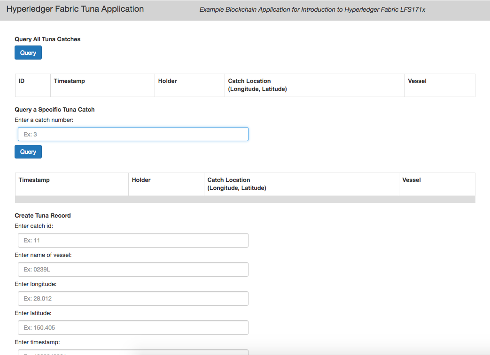|
|:--:|
| *Licensed under [CC By 4.0](https://creativecommons.org/licenses/by/4.0/)* |

**Troubleshooting**: If you are getting an error similar to the one below while attempting to perform any of the functions on the application:

```
Error: [client-utils.js]: sendPeersProposal - Promise is rejected: Error: Connect Failed

error from query =  { Error: Connect Failed

   at /Desktop/prj/education/LFS171x/fabric-material/tuna-app/node_modules/grpc/src/node/src/client.js:554:15 code: 14, metadata: Metadata { _internal_repr: {} } }
```

try running the following commands:

```
$ cd ~

$ rm -rf .hfc-key-store/
```

Then, run the commands above starting with:

```
$ node registerAdmin.js
```

### File Structure of Application

Here you can see the file structure of the Fabric application:

|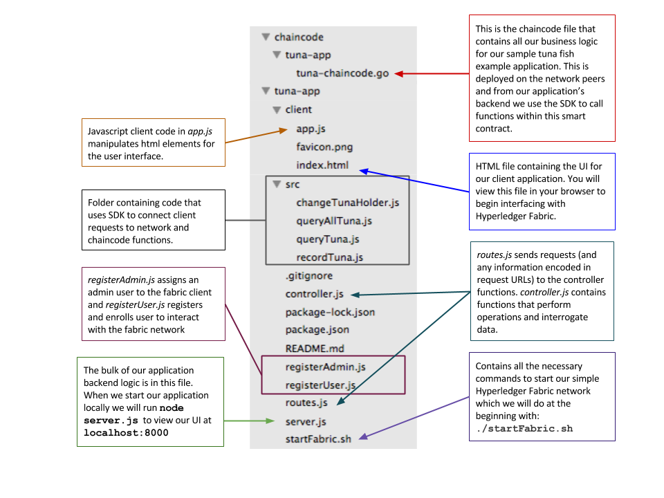|
|:--:|
| *Licensed under [CC By 4.0](https://creativecommons.org/licenses/by/4.0/)* |

### Query All Tuna Recorded

```
 1. // queryAllTuna - requires no arguments
 2. const request = {
 3.     chaincodeId:’tuna-app’,
 4.     txId: tx_id,
 5.     fcn: 'queryAllTuna',
 6.     args: ['']
 7.     };
 8. return channel.queryByChaincode(request);
```

(Reference: The code comes from **..src/queryAllTuna.js**)

Now, let’s query our database, where there should be some sample entries already, since our chaincode smart contract initiated the ledger with 10 previous catches. This function takes no arguments, as we see on line 6. Instead, it takes an empty array.

The query response you should see in the user interface is 10 pre-populated entries with the attributes for each catch.

|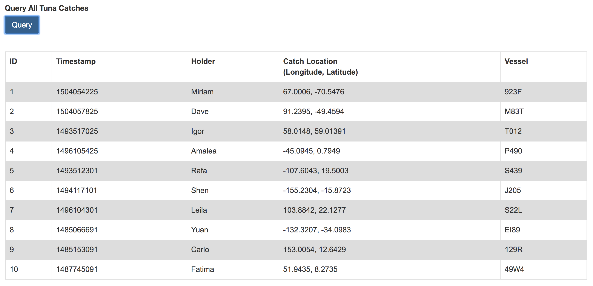|
|:--:|
| *Licensed under [CC By 4.0](https://creativecommons.org/licenses/by/4.0/)* |

### Query a Specific Tuna Recorded

```
 1. // queryTuna - requires 1 argument
 2. const request = {
 3.     chaincodeId:’tuna-app’,
 4.     txId: tx_id,
 5.     fcn: 'queryTuna',
 6.     args: ['1']
 7.     };
 8. return channel.queryByChaincode(request);
```

(Reference: The code comes from **..src/queryTuna.js**)

Now, let’s query for a specific tuna catch. This function takes 1 argument, as you can see on line 6 above, an example would be ['1']. In this example, we are using the key to query for catches.

You should see the following query response detailing the attributes recorded for one particular catch.

|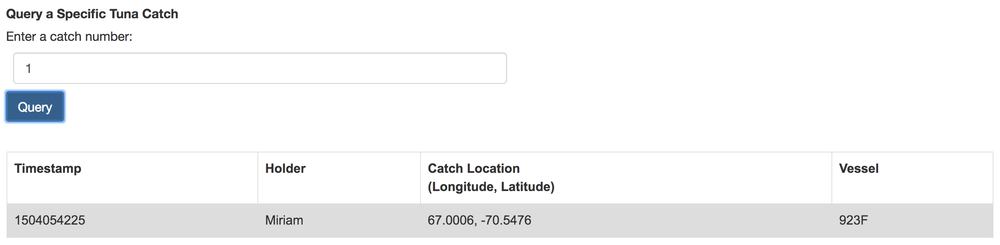|
|:--:|
| *Licensed under [CC By 4.0](https://creativecommons.org/licenses/by/4.0/)* |  

### Change Tuna Holder

```
 1. // changeTunaHolder - requires 2 argument
 2. var request = {
 3.     chaincodeId:’tuna-app’,
 4.     fcn: 'changeTunaHolder',
 5.     args: ['1', 'Alex'],
 6.     chainId: 'mychannel',
 7.     txId: tx_id
 8.     };
 9. return channel.sendTransactionProposal(request);
```

(Reference: The code comes from **..src/changeHolder.js**)

Now, let’s change the name of the person in possession of a given tuna. This function takes 2 arguments: the key for the particular catch, and the new holder, as we can see on line 5 in the example above. Ex: **args: ['1', 'Alex']**.

You may be able to see a similar success response in your terminal window:

```
The transaction has been committed on peer localhost:7053
 event promise all complete and testing complete

Successfully sent transaction to the orderer.
Successfully sent Proposal and received ProposalResponse: Status - 200, message - "OK", metadata - "", endorsement signature: 0D 9
```

This indicates we have sent a proposal from our application via the SDK, and the peer has been endorsed, committed, and the ledger has been updated.

|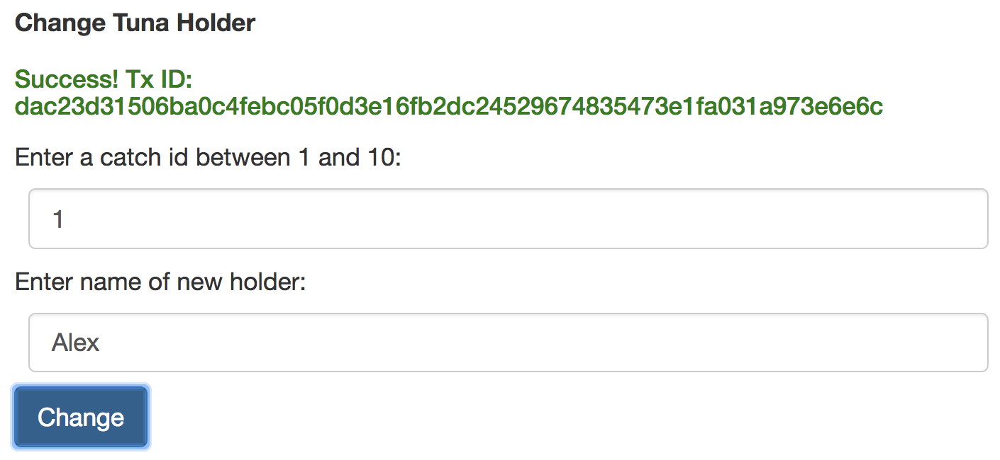|
|:--:|
| *Licensed under [CC By 4.0](https://creativecommons.org/licenses/by/4.0/)* |

You should see that the holder has indeed been changed by querying for key **['1']** again. Now, the **holder** attribute has been changed from **Miriam** to **Alex**, for example.

|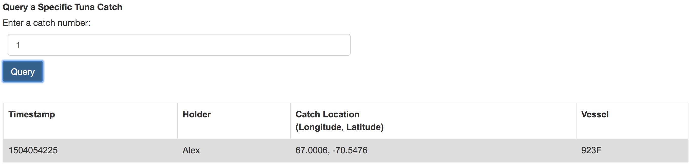|
|:--:|
| *Licensed under [CC By 4.0](https://creativecommons.org/licenses/by/4.0/)* |

### Record a Tuna Catch

```
 1. // recordTuna - requires 5 argument
 2. var request = {
 3.     chaincodeId:’tuna-app’,
 4.     fcn: 'recordTuna',
 5.     args: ['11', '239482392', '28.012, 150.225', '0923T', "Hansel"],
 6.     chainId: 'mychannel',
 7.     txId: tx_id
 8.     };
 9. return channel.sendTransactionProposal(request);
```

(Reference: The code comes from **..src/recordTuna.js**)

Lastly, we will practice recording a new tuna catch, and adding it to the ledger by invoking the **recordTuna** function. This function takes 5 arguments, itemizing each of the attributes of a new catch. You can see an example submission on line 5: **args: ['11','239482392', '28.012, 150.225', '0923T', "Hansel"]**.

|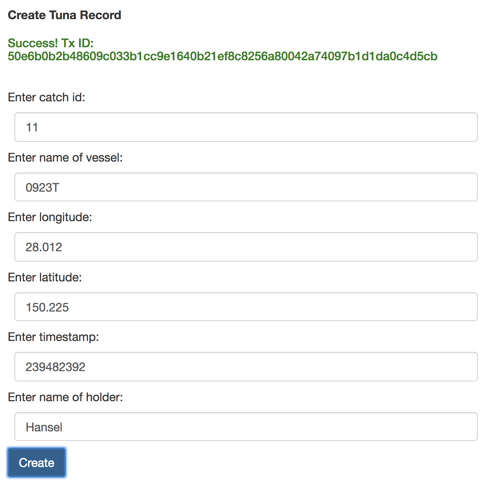|
|:--:|
| *Licensed under [CC By 4.0](https://creativecommons.org/licenses/by/4.0/)* |

Check and you should see that the holder has indeed been changed by querying all the tuna catches. Now, you should see an additional entry at the bottom of the table:

|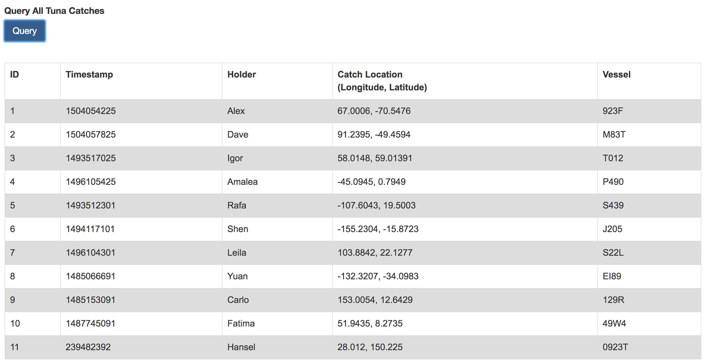|
|:--:|
| *Licensed under [CC By 4.0](https://creativecommons.org/licenses/by/4.0/)* |

### Finishing Up

Remove all Docker containers and images that we created in this tutorial with the following command in the **tuna-app** folder:

```
$ docker rm -f $(docker ps -aq)

$ docker rmi -f $(docker images -a -q)
```

### Application Flow Basics

|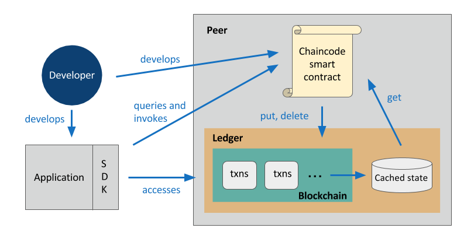|
|:--:|
| *Licensed under [CC By 4.0](https://creativecommons.org/licenses/by/4.0/)* |

 1. A developer creates an application and smart contract.
 2. The application will invoke calls within the smart contract via the Hyperledger Fabric Client SDK.
 3. These calls are processed by the business logic within the chaincode smart contract.
 4. A **put** or **delete** command will go through the consensus process and will be added to the blockchain within the ledger.
 5. A **get** command can only read from the world state, but it is not recorded on the blockchain.
 6. The application can access blockchain information via APIs.

### Application Flow Example

|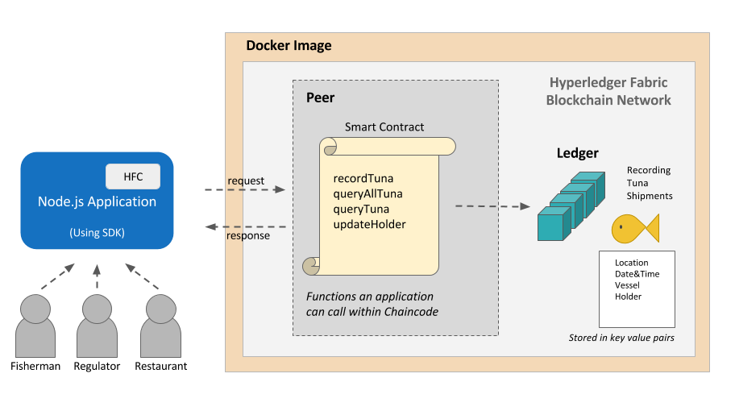|
|:--:|
| *Licensed under [CC By 4.0](https://creativecommons.org/licenses/by/4.0/)* |

 1. Various users (fisherman, regulators, or restaurateurs etc.) will interact with the Node.js application.
 2. The client JS will send messages to the backend when the user interacts with the application.
 3. Reading or writing the ledger is known as a proposal (for example, querying a specific Tuna catch - **queryTuna**-  or recording a tuna catch - **recordTuna**). This proposal is built by our application via the SDK, and then sent to the endorsing peers.
 4. The endorsing peers will use the application-specific chaincode smart contract to simulate the transaction. If there are no issues, the transaction will be endorsed, and sent back to our application.
 5. Our application will then send the endorsed proposal to the ordering service via the SDK. The orderer will package many proposals from the whole network into a block. Then, it will broadcast the new block to the committing peers in the network.
 6. Finally, each committing peer will validate the block and write it to its ledger (shown in teal above). The transaction has now been committed, and any reads will reflect this change.

## Joining the Hyperledger Fabric Community

### Becoming Involved with the Hyperledger Fabric Project

Hyperledger Fabric is an open source project, where ideas and code can be publicly discussed, created, and reviewed. There are many ways to join the Hyperledger Fabric community. Next, we will highlight some of the ways to get involved, either from a technical standpoint, or from an ideas/issues creation perspective.

### Video: The Future of Hyperledger Fabric (Chris Ferris)

#### The Future of Hyperledger Fabric (Chris Ferris)

[](https://youtu.be/SAhiVfOa6tA)

### Community Meetings and Mailing Lists

You can join the the weekly meeting on Fabric Documentation, or other Hyperledger Fabric-related meetings. The [Hyperledger Community Meetings Calendar](https://calendar.google.com/calendar/embed?src=linuxfoundation.org_nf9u64g9k9rvd9f8vp4vur23b0@group.calendar.google.com&ctz=America/SanFrancisco&pli=1) is a great resource to learn the timing for these meetings.

You can join the Hyperledger Fabric mailing lists for technical discussions and announcements:  [https://lists.hyperledger.org/mailman/listinfo/hyperledger-fabric](https://lists.hyperledger.org/mailman/listinfo/hyperledger-fabric).

### JIRA and Gerrit

If you have a bug to report, you can submit an issue using JIRA (you must have a Linux Foundation ID to access JIRA): [https://jira.hyperledger.org/secure/Dashboard.jspa?selectPageId=10104](https://jira.hyperledger.org/secure/Dashboard.jspa?selectPageId=10104). You can also find and review a list of existing issues, and can pick one that interests you and start working on it: [https://jira.hyperledger.org/browse/FAB-5491?filter=10580](https://jira.hyperledger.org/browse/FAB-5491?filter=10580). You can learn how to use the JIRA documentation at [https://wiki.hyperledger.org/community/jira-navigation](https://wiki.hyperledger.org/community/jira-navigation).

Gerrit is used for submitting PRs and managing code reviews and checkins. All code is forkable and viewable: [https://gerrit.hyperledger.org/r/#/admin/projects/](https://gerrit.hyperledger.org/r/#/admin/projects/). You can get a primer on working with Gerrit at [https://hyperledger-fabric.readthedocs.io/en/latest/Gerrit/gerrit.html](https://hyperledger-fabric.readthedocs.io/en/latest/Gerrit/gerrit.html).

### Rocket.Chat

You can join the live conversations on Rocket.Chat (which is an alternative to Slack), using your Linux Foundation ID: [https://chat.hyperledger.org/home](https://chat.hyperledger.org/home). There are over 24 channels specific to the Hyperledger Fabric project. The [#fabric](https://chat.hyperledger.org/channel/fabric) channel is used to discuss the Hyperlerdger Fabric project. You can find a guide for these channels here: [https://wiki.hyperledger.org/community/chat_channels](https://wiki.hyperledger.org/community/chat_channels).

## Knowledge Check

### Knowledge Check 7.1
<!-- A,B,D -->
What are some of the advantages of a platform like Hyperledger Fabric? Select all answers that apply.

<ol type="A">
<li>Modular architecture for pluggable implementations</li>
<li>Security through a membership services provider</li>
<li>Proof of Work to verify identity</li>
<li>Privacy through channels</li>
</ol>

### Knowledge Check 7.2
<!-- D -->
Which of the following options correctly describes what chaincode is in the context of Hyperledger Fabric?

<ol type="A">
<li>A smart contract</li>
<li>Executable logic written in Go that determines the state of the ledger</li>
<li>Initializes and manages the ledger state through transactions submitted by applications</li>
<li>All of the above</li>
</ol>

### Knowledge Check 7.3
<!-- A -->
Hyperledger Fabric is a framework that provides a modular architecture for consensus and membership services. True or False?

<ol type="A">
<li>True</li>
<li>False</li>
</ol>

### Knowledge Check 7.4
<!-- D -->
In the demonstrated scenario, which Hyperledger Fabric component allows Sarah, the fisherman, to have separate transactions that are only seen by the parties involved (such as restaurateurs for Tuna purchases)?

<ol type="A">
<li>Blockchain</li>
<li>Distributed ledger technology</li>
<li>Ordering service</li>
<li>Channels</li>
</ol>

### Knowledge Check 7.5
<!-- A -->
What do the membership service providers do?

<ol type="A">
<li>Create a way for issuing and validating certificates and user authentication</li>
<li>Create wallets for peers</li>
<li>Create a way for the chaincode to interact with the ledger</li>
</ol>

### Knowledge Check 7.6
<!-- C -->
What aspects of the Hyperledger Fabric application flow are built by a developer?

<ol type="A">
<li>Application and SDK</li>
<li>Application and cached state</li>
<li>Application and chaincode smart contract</li>
<li>SDK and chaincode smart contract</li>
</ol>

### Knowledge Check 7.7
<!-- B -->
Refer to the function below from the chaincode contract used in the demonstrated scenario presented earlier in this chapter. This method is used during chaincode instantiation to initialize data. True or False?

```golang
func (s *SmartContract) Invoke(APIstub shim.ChaincodeStubInterface) sc.Response {

function, args := APIstub.GetFunctionAndParameters()

if function == "queryTuna" {

return s.queryTuna(APIstub, args)

} else if function == "initLedger" {

return s.initLedger(APIstub)

} else if function == "recordTuna" {

return s.recordTuna(APIstub, args)

} else if function == "queryAllTuna" {

return s.queryAllTuna(APIstub)

} else if function == "changeTunaHolder" {

return s.changeTunaHolder(APIstub, args)

}

return shim.Error("Invalid Smart Contract function name.")

}
```

<ol type="A">
<li>True</li>
<li>False</li>
</ol>

### Knowledge Check 7.8
<!-- A,C,D -->
What are the three main roles within a Hyperledger Fabric network? Select all answers that apply.

<ol type="A">
<li>Endorser</li>
<li>Enroller</li>
<li>Orderer</li>
<li>Committer</li>
</ol>

### Knowledge Check 7.9
<!-- B,A,C -->
Using the dropdown option below, match the following types of roles in a Hyperledger Fabric network with their descriptions.
 1. Endorsing Peer
 <details><summary>Select an option</summary>
- Orders all transaction blocks into the ledger<br>
- Approves or declines transaction proposals and must hold smart contracts<br>
- Maintain ledger and state and commits transactions<br>
 </details>

 2. Ordering Service
 <details><summary>Select an option</summary>
- Orders all transaction blocks into the ledger<br>
- Approves or declines transaction proposals and must hold smart contracts<br>
- Maintain ledger and state and commits transactions<br>
 </details>

 3. Committing Peer
 <details><summary>Select an option</summary>
- Orders all transaction blocks into the ledger<br>
- Approves or declines transaction proposals and must hold smart contracts<br>
- Maintain ledger and state and commits transactions<br>
 </details>  

### Knowledge Check 7.10
<!-- B -->
What is the correct order of the four steps to consensus?

<ol type="A">
<li>Validation, Ordering, Transaction Endorsement, Commitment</li>
<li>Transaction Endorsement, Ordering, Validation, Commitment </li>
<li>Commitment, Transaction Endorsement, Validation, Ordering</li>
<li>Ordering, Transaction Endorsement, Validation, Commitment</li>
</ol>

## Conclusions & Learning Objectives (Review)

### Learning Objectives (Review)

You should now be able to:

 - Understand the basics of Hyperledger Fabric v1.0.
 - Walk through and analyze a demonstrated scenario on Hyperledger Fabric.
 - Discuss crucial components of the Hyperledger Fabric architecture, including clients, peers, ordering service and membership service provider.
 - Set up a sample network and simple application with a Javascript SDK.
 - Discuss Chaincode (Hyperledger Fabric smart contract) and review an example.
 - Get involved in the framework discussion and development.

### Video: Conclusions (Alexandra Groetsema)

#### Conclusions (Alexandra Groetsema)

[](https://youtu.be/G_WUi0FElGw)
