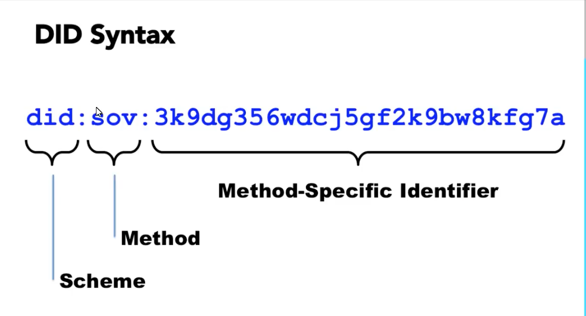
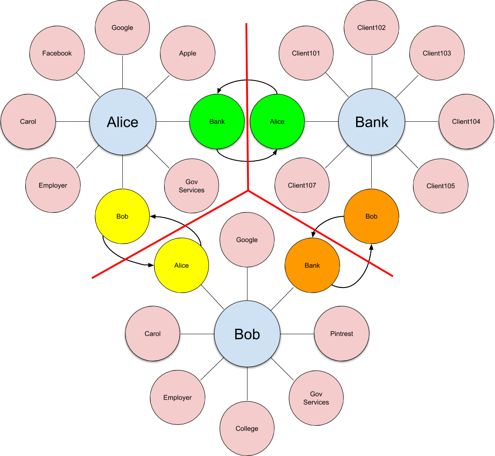
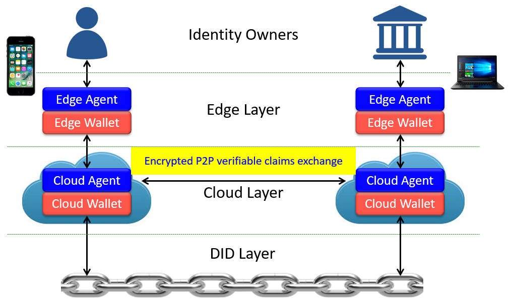
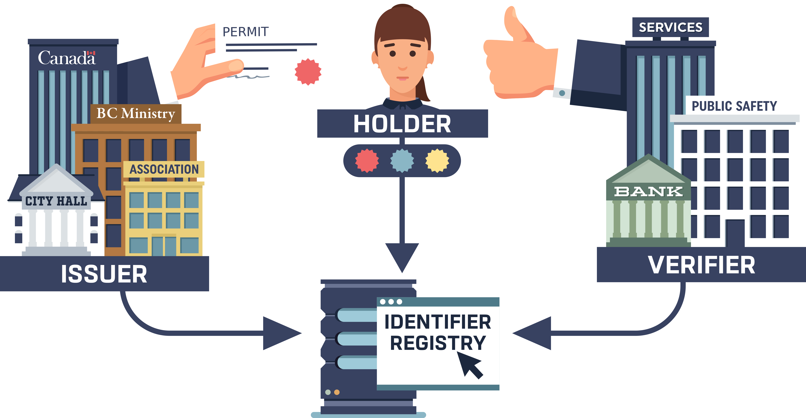
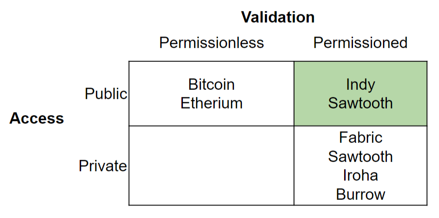
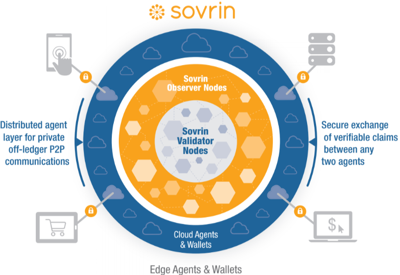
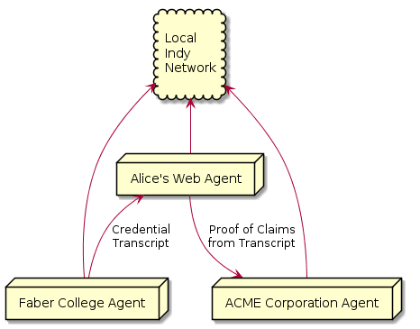

<!-- TOC depthFrom:1 depthTo:6 orderedList:false updateOnSave:false withLinks:true -->

- [Introduction and Learning Objectives](#introduction-and-learning-objectives)
  - [Introduction to Hyperledger Indy](#introduction-to-hyperledger-indy)
  - [Learning Objectives](#learning-objectives)
- [Identity on the Internet](#identity-on-the-internet)
  - [Today's Internet Identity Challenges](#todays-internet-identity-challenges)
    - [Identity in the Real World](#identity-in-the-real-world)
    - [Identifiers: User IDs and Passwords](#identifiers-user-ids-and-passwords)
    - [Identity Attributes](#identity-attributes)
  - [Additional Problems](#additional-problems)
    - [Unwanted Correlation](#unwanted-correlation)
    - [Centralized Identifiers](#centralized-identifiers)
    - [Data Breaches](#data-breaches)
  - [Summary](#summary)
- [Internet Identity with Hyperledger Indy](#internet-identity-with-hyperledger-indy)
  - [Decentralized Identifiers - DIDs](#decentralized-identifiers---dids)
    - [Creating and Using DIDs](#creating-and-using-dids)
    - [Agents and Wallets](#agents-and-wallets)
    - [Indy Public Ledger](#indy-public-ledger)
    - [How DIDs Help](#how-dids-help)
  - [Verifiable Credentials](#verifiable-credentials)
    - [Credentials and Verifiable Credentials](#credentials-and-verifiable-credentials)
    - [Selective Disclosure and Zero Knowledge Proofs (ZKP)](#selective-disclosure-and-zero-knowledge-proofs-zkp)
    - [Using Verifiable Credentials](#using-verifiable-credentials)
    - [How VCs Help](#how-vcs-help)
  - [Trying it Out](#trying-it-out)
  - [Privacy](#privacy)
  - [Self-Sovereign Identity](#self-sovereign-identity)
- [Hyperledger Indy in Context](#hyperledger-indy-in-context)
  - [Using Indy for Identity with other Blockchains](#using-indy-for-identity-with-other-blockchains)
  - [Indy's Blockchain Algorithms](#indys-blockchain-algorithms)
    - [Type of Blockchain](#type-of-blockchain)
    - [Blockchain Consensus Algorithm](#blockchain-consensus-algorithm)
  - [Hyperledger Indy and Sovrin](#hyperledger-indy-and-sovrin)
    - [Elements of the Sovrin Foundation](#elements-of-the-sovrin-foundation)
- [Running Hyperledger Indy](#running-hyperledger-indy)
  - [Demonstration Overview](#demonstration-overview)
  - [Running the Demonstration](#running-the-demonstration)
  - [What goes on the Blockchain](#what-goes-on-the-blockchain)
  - [The Indy Code Base](#the-indy-code-base)
    - [The Hyperledger Indy GitHub Repos](#the-hyperledger-indy-github-repos)
      - [indy-node](#indy-node)
      - [indy-sdk](#indy-sdk)
      - [indy-plenum, indy-crypto](#indy-plenum-indy-crypto)
      - [Indy-agent](#indy-agent)
      - [indy-hipe](#indy-hipe)
    - [Related Project - The Verifiable Organizations Network (VON)](#related-project---the-verifiable-organizations-network-von)
- [Joining the Hyperledger Indy Community](#joining-the-hyperledger-indy-community)
  - [Becoming Involved with the Hyperledger Indy Project](#becoming-involved-with-the-hyperledger-indy-project)
    - [Getting Started](#getting-started)
  - [Community Resources](#community-resources)
    - [Weekly Meetings](#weekly-meetings)
    - [Chat](#chat)
    - [Mailing List](#mailing-list)
    - [GitHub Repos](#github-repos)
    - [Indy Meetups](#indy-meetups)
- [Knowledge Check](#knowledge-check)
  - [Knowledge Check 8.1](#knowledge-check-81)
  - [Knowledge Check 8.2](#knowledge-check-82)
  - [Knowledge Check 8.3](#knowledge-check-83)
  - [Knowledge Check 8.4](#knowledge-check-84)
  - [Knowledge Check 8.5](#knowledge-check-85)
  - [Knowledge Check 8.6](#knowledge-check-86)
  - [Knowledge Check 8.7](#knowledge-check-87)
  - [Knowledge Check 8.8](#knowledge-check-88)
  - [Knowledge Check 8.9](#knowledge-check-89)
  - [Knowledge Check 8.10](#knowledge-check-810)
- [Hyperledger Indy - References](#hyperledger-indy---references)

<!-- /TOC -->

<!----- Conversion time: 0.612 seconds.

Using this Markdown file:

1. Cut and paste this output into your source file.
2. See the notes and action items below regarding this conversion run.
3. Check the rendered output (headings, lists, code blocks, tables) for proper
   formatting and use a linkchecker before you publish this page.

Conversion notes:

* GD2md-html version 1.0β11
* Sun Sep 16 2018 11:35:09 GMT-0700 (PDT)
* Source doc: https://docs.google.com/a/cloudcompass.ca/open?id=1nn7T2j24-3QsCVW4cAhUMWcHDXu1VEfn0T5cm_hauBw
----->

# Introduction and Learning Objectives

## Introduction to Hyperledger Indy

Welcome to the Hyperledger Indy section of Blockchain for Business!  In this chapter, you will learn about Hyperledger Indy - a blockchain-based system that is quite different from the other Hyperledger projects we've looked at so far. Where the other projects are general purpose blockchain systems (they can be used in many situations), Hyperledger Indy is used for just one purpose - and it's a big one! Indy is all about Identity on the Internet. It's about being able to prove to others who you are and you being certain who they are.

||
|:--:|
|*Licensed under [CC By 4.0](https://creativecommons.org/licenses/by/4.0/)*|

What's the big deal about Identity?  Well, when the Internet was first created, all of the computers that were connecting to one another were "trusted." The number of systems was small and the people running those systems knew each other so they didn't need mechanisms to know who was sending what data between the systems. As the number of systems on the Internet grew (and grew and grew…), that trust quickly diminished and the first of many mechanisms were added to systems to identify who is contacting whom. Unfortunately, the problem has never really been solved. The most common (and universally hated) system, that of userIDs and passwords, is fraught with problems. The resulting lack of certainty of who is on the other keyboard has led to the loss of billions from hacks, data breaches, identity theft, scams and more. Further, that same lack of certainty has made many types of business transactions on the Internet impossible - the risk is just too high.

Hyperledger Indy has been created to add an Identity layer to the Internet using a mechanism that is easy to use, enables online trust, and enhances privacy. It's a big goal that is of vital importance to everyone on the Internet. And, it's a goal that has recently become realizable with the advent of blockchain.

In this chapter, we'll look in more detail at the identity problem and how Hyperledger Indy uses Decentralized Identifiers (DIDs) and Verifiable Credentials to add Identity as a core component of the Internet. We'll look at the blockchain elements of Hyperledger Indy, comparing Indy's approach to blockchain with the other systems we've looked at in this course.

With that background, we'll go through a couple of Indy demonstrations - a video showing DIDs and Verifiable Credentials being used, and running a local instance of Indy that demonstrates Indy's software Agents communicating to prove who's who on the Internet. In doing that, we'll dig into to a question that is important to everyone that looks into Indy (and other Blockchains) - what goes on the ledger?

After covering all of that, we'll wrap up with information on how you can learn more, and possibly contribute, to the Hyperledger Indy project.

Let's get started!

## Learning Objectives

By the end of this chapter you should:

*   Understand what is Internet identity, Self-Sovereign Identity, and how Hyperledger Indy provides a powerful new approach to accomplishing the important goal of trusted online identity.
*   Understand the relationship between Hyperledger Indy, other Internet Identity systems, and the relationship between Hyperledger Indy and the Sovrin Foundation, a non-profit that operates a global instance of Hyperledger Indy.
*   Discuss crucial components of the Hyperledger Indy architecture, including the Indy blockchain elements, DIDs, Verifiable Credentials, Agents and Wallets.
*   Be able to use early-stage instances of Hyperledger Indy, and know how to start up and use a local instance of Hyperledger Indy.
*   Know how to learn more about Hyperledger Indy and how you can contribute to this important project.

<!-- GD2md-html version 1.0β11 -->

<!----- Conversion time: 0.938 seconds.

Using this Markdown file:

1. Cut and paste this output into your source file.
2. See the notes and action items below regarding this conversion run.
3. Check the rendered output (headings, lists, code blocks, tables) for proper
   formatting and use a linkchecker before you publish this page.

Conversion notes:

* GD2md-html version 1.0β11
* Sun Sep 16 2018 11:37:37 GMT-0700 (PDT)
* Source doc: https://docs.google.com/a/cloudcompass.ca/open?id=11EcEfgxwsymHugQ9cN3kTPua3pSdkXYcU1VeptjhLeA
----->

# Identity on the Internet

In this section, we'll go over what Identity is in the real world and on the Internet, and we'll look at the challenges that we all face because of the way Identity works (or doesn't work) today.

## Today's Internet Identity Challenges

The problems with Identity on the Internet today come down to a single word - **_trust_**. When you are interacting online with someone, do you trust:

*   Is the person you are connecting with online who they say they are?
*   Are the claims they are making true?

As the famous New Yorker cartoon goes - "[No one knows you are on a dog on the Internet](https://en.wikipedia.org/wiki/On_the_Internet,_nobody_knows_you%27re_a_dog)". How do we handle these challenges today?

### Identity in the Real World

When we interact in the real world and we often need to "prove" who we are. To do that, we present evidence that we have about ourselves. What we present varies based on the context of the relationship. When we meet someone socially, we introduce ourselves. When we want to open a bank account, we show documents (attributes) issued by others (driver's license, utility bill, government ID etc.) to prove things about ourselves, such as our name, address and ID number (e.g. SSN in the US).

In turn, those with whom we interact create an identifier for us and check that identifier when we connect again. A person remembers our name and face, and "verifies" them on our subsequent meetings ("Hi Stephen! Good to see you again!"). Our bank creates a card with an ID on it for us to use each time we return to access the bank's services.

The same pattern is used online, but there are a variety of problems that occur, some obvious, some a little more subtle. Let's go through them.

### Identifiers: User IDs and Passwords

The basic mechanism for knowing who you are on the Internet is the UserID/Password combination. You register at a site and get a UserID and set a secret password that only you know, and each time you return you use that to access your account. We all know the problems with User IDs and Passwords - we deal with them every day:

*   We have too many to track - I'm aware of more than 700 user IDs I have been given.
*   Because we have so many, we often use "easy to remember" passwords that are also easy for others to guess.
*   Password recovery mechanisms (question/responses, support desks) provide avenues of attack by hackers.
*   Data breaches occur that result in our IDs and passwords being exposed and used - either by the hackers or anyone that buys them.
*   We often use the same password on many sites, and once a password is exposed, our account on others sites may also be exposed.

A common approach to solving the "too many passwords" problem is the use of Identity Providers (IdPs) like Facebook and Google. Smaller sites can use an IdP for Authentication (user ID and password verification) and to get basic identity attributes like name and email address.

||
|:--:|
|*Licensed under [CC By 4.0](https://creativecommons.org/licenses/by/4.0/)*|

We also need to note that while users of websites have IDs for the site, the reverse is not the case - we don't get an "id and password" for the site that we can verify each time we connect. This has enabled the "phishing" techniques to become common in recent years, where users are tricked to click a link that takes them to a website that appears to be real, has a similar name - e.g. goog1e.com - but is actually fake, fooling us into reveal our user ID and password - and sometimes even our two-factor authentication code.

### Identity Attributes

On almost every site, we also share other identifiers to use a service - our email and name at minimum, and depending on the nature of the service, additional information (address, credit card info, etc.). With that, we can do the only common business transaction on the Internet - buying things. Buying things has a low enough risk because sellers can generally trace to whom the purchased item is delivered, which deters widespread abuse.

Conducting higher trust online transactions - such as opening a bank account - is much harder. We have to provide the same information about ourselves as we would in person. In theory, we should be able to just type in since it is private and (in theory) only we know it. However, much of the information is relatively widely known, either because it is routinely published (e.g. Name and address), or because of the many data breaches that have occurred (e.g. Government ID Number). Even non-identifiers that are used for verification - so-called "shared secrets" such as the value of "Line 150 from 2018 Tax Return" can be fraudulently acquired and used for targeting specific individuals.

An alternative is to do an online version of the in person verification - scan and send the source documents. However, scans are very easy to forge and as such are not trusted. We should also add that paper documents used in person are increasingly easy to forge as well. That issue is actually putting at risk the "real world" identity-proofing that we mentioned earlier. Verifiers, such as bank employees, have to become experts at detecting the authenticity of documents used for identity proofing.

||
|:--:|
|*Licensed under [CC By 4.0](https://creativecommons.org/licenses/by/4.0/)*|

## Additional Problems

We've talked about a few problems with the current Internet Identity approaches already - user IDs and passwords are hackable, and supposedly private information is too well known to be trusted. Here are a few more problems with the current approaches.

### Unwanted Correlation

The use of common identifiers on so many different sites creates what is known as a correlation problem. Correlation in this context means associating without consent information about a single identity across multiple systems. The proliferation of such correlation on the Internet, driven primarily by advertising, has resulted in a massive loss of privacy for Internet users (basically - everyone). A great/horrible example of this was exposed by a data breach at the relatively unknown Florida company, [Exactis](https://www.marketwatch.com/story/a-new-data-breach-may-have-exposed-personal-information-of-almost-every-american-adult-2018-06-27). The breach was massive covering almost every American and American company (340M records total). However, the content was equally shocking - over 400 data elements per record collected from a number of sites correlating details about each person - their name, age, race, religion, size of family, etc. You can be sure that no one ever agreed to allow Exactis to collect that information. They correlated the data across many "partner" sites to collect a picture each person - that they in turn sell to anyone willing to pay.

Correlation is made possible because of the common identifiers we use online daily. Our email address is the single largest factor, since we share it on almost every site, but there are others. Each time we use the same account name on a different sites creates the possibility of correlation. When we give other identifiers about ourselves - phone number, address, government IDs, etc., firms can correlate that data across sites. Tracking cookies placed by websites and ads enable the linking of IDs across websites. Some of the new GDPR protections are designed to prevent these practices in Europe, but not so in other places. Even then, it is a legal, not a technical solution, and so remains susceptible to bad actors. \
 \
The Identity Providers model is also a correlation point - although in this case one given with consent. The IdP approach trades convenience (fewer user IDs/passwords) for correlation. Since the IdP is used for each login, the IdP can track your use of other sites and thus correlate your online activities - increasing their knowledge of you.

### Centralized Identifiers

The vast majority of identifiers we use today are centralized - the identifiers are provided to us and maintained by a centralized entity. That might be the government in the case of our Tax ID and Driver's Licence, or a company for an ID we use to log into a website. A major problem with this approach is that the central authority can choose to take away that identifier at any time. This is of particular concern for those in a minority situation - a critic of a central entity, be it a government suppressing their people or a private company.

A second concern with central authorities controlling identifiers is that if they are compromised in some way, those identifiers can be used in malicious ways. For example, a [hack of a Dutch Certificate Authority](https://en.wikipedia.org/wiki/DigiNotar) (manager of SSL Encryption Certificates) allowed supposedly secure encrypted data going across the Internet to be intercepted and accessed by the hackers. Further, since the identifiers are centralized (held in a central place), if that repository is compromised, it impacts many people.

### Data Breaches

Identity-related data is currently of particularly high value, and so large data repositories of identity data are favourite targets for hackers. This includes not only User ID and password data to enable unauthorized access to accounts, but also all of the other information we use to "prove" our identity online - name, email address, government ID and so on. As noted, the availability of this supposedly private data makes the online use of such data impossible for high value interactions because of the risk that the person typing the data is not it's owner.

## Summary

So where does that leave us?

*   User IDs/Passwords are the norm, but they are a pain to use, and as a result, are very susceptible to attack. They are the best we have right now, but not a solid basis for trust. Further, IDs are one way - users don't get an ID from a Service they use.
*   Other personal information and identifiers we have that we could otherwise use to prove our identity is not trusted because it's impossible to tell if the data was actually issued to the person entering it. The many breaches of private identifiers make them impossible to completely trust (see below).
*   Since the identity attributes we could use are not trusted (they are not things only we know), we often have to resort to in person delivery of paper documents to prove things about ourselves.
*   The identifiers we use are correlated across sites, allowing inferences to be made about us, and exposing information we don't intend to be shared across sites. This is annoying at the least, and can have catastrophic results in the worst case. 
*   Centralized repositories of identifiers and data about the people associated with those identifiers are targeted by hackers because the data has high value. This exacerbates the problem of not being able to trust "personal" data presented online (see above).
*   Centralized identifiers can be abused by those that control those identifiers. For example, they can be taken away from a subject without due process.

In the next section, we'll look at the capabilities of Hyperledger Indy to reduce or eliminate these problems.

<!-- GD2md-html version 1.0β11 -->

<!----- Conversion time: 1.307 seconds.

Using this Markdown file:

1. Cut and paste this output into your source file.
2. See the notes and action items below regarding this conversion run.
3. Check the rendered output (headings, lists, code blocks, tables) for proper
   formatting and use a linkchecker before you publish this page.

Conversion notes:

* GD2md-html version 1.0β11
* Sun Sep 16 2018 13:43:36 GMT-0700 (PDT)
* Source doc: https://docs.google.com/a/cloudcompass.ca/open?id=11KkKfOv47rb98HGKD-lNV7sSr4U8L8rWjIrhl2lXcV8
----->

# Internet Identity with Hyperledger Indy

The last section introduced a number of challenges with Internet Identity as is provided today. In this section we'll show how Hyperledger Indy addresses those challenges with a new blockchain-based foundational Identity layer.

## Decentralized Identifiers - DIDs

A foundational feature of Indy is support for the emerging [W3C standard for Decentralized Identifiers](https://w3c-ccg.github.io/did-spec/) - DIDs. DIDs are globally unique identifiers that are created by their owner, independent of any central authority. Each DID has associated with it one or more public keys created by the DID owner (and the owner holds the corresponding private keys), and one or more endpoints - addresses where messages can be delivered for that identity. A DID can be uniquely resolved (like a URL) to return the the data (public keys and endpoints) associated with the DID. An example of a DID is displayed below.

||
|:--:|
|*Licensed under [CC By 4.0](https://creativecommons.org/licenses/by/4.0/)*|

Indy uses DIDs to establish connections between two identities, such as a user and a service's website, so that they can securely communicate. Further, the expectation is that an entity - e.g. you - will have many, many DIDs - one for each relationship you have with another entity. Think of each DID like a userID/password pair, but one that is backed with strong cryptography in the form of public/private keypairs. As well, note that both sides of a relationship provide a DID for the other to use to communicate with them.

The image below show three entities, Alice, Bob and a Bank that both Alice and Bob use. For each entity, we see the various DIDs they have created for their relationships. We've also highlighted the DIDs that they have exchanged with each other - Alice's for Bob, Alice's for the Bank and so on.

||
|:--:|
|*Licensed under [CC By 4.0](https://creativecommons.org/licenses/by/4.0/)*|

### Creating and Using DIDs

Here's an example of how DIDs are used: A user registers for a service's website by creating and giving the service a new, never-used-before DID, and receives back from the service the same thing - a new, never-used-before DID created by the service. Each records the "relationship" DIDs so that when one wants to communicate with the other, they have an endpoint to send the message, and a public key to end-to-end encrypt the message. Later, when the user returns to the website to login, the user and the service exchange encrypted messages to confirm that each holds the private key to decrypt the messages. On completion, the service knows it's the user because the user used their DID, and the user knows it's the service because the service used its DID. Neat - we've already addressed one of the challenges raised with today's Internet Identity - two-way verification!

### Agents and Wallets

With so many DIDs floating around, it's clear that memory and bits of paper are not enough to manage all the DIDs a person creates or receives. Indy uses the term "Agent" to mean the software that interacts with other entities (via DIDs and more, as we'll find out), and the term "Wallet" as a data store for the DIDs and related information (including private keys and more). For example, a person might have a mobile Agent app on their smart devices, while an Organization might have an enterprise Agent running on a Cloud Server. All Agents have a secure Wallet for storing identity data.

For those familiar with a [Password Manager](https://en.wikipedia.org/wiki/Password_manager) like 1Password or LastPass, a personal Agent wallet is similar - there is a name for each relationship and associated data. However, unlike Password Managers that use things like your copy/paste clipboard for User IDs and Passwords and "screen-scrape" applications and websites, Agents communicate directly with Agents to accomplish Identity-related tasks.

The picture below is an example of some communicating Indy Agents. The Edge Agents are handled by the Identity owners themselves - in this case a Consumer and an Enterprise. The Cloud Agents facilitate the messaging by, for example, providing a permanent endpoint for a device that may or may not be online at the time messages are being received.

||
|:--:|
|*Licensed under [CC By 4.0](https://creativecommons.org/licenses/by/4.0/)*|

### Indy Public Ledger

The term "decentralized" is a hint that Indy uses blockchain technology.  The image above shows how the Agents send requests to the ledger to read and write DID (and other) information. An identity (e.g. a person, organization or thing) creating a DID can publish that DID to an Indy immutable public ledger. The "DID" (a globally unique string) can then be looked up ("resolved") on the public ledger, and the information associated with the DID (called the "DID Doc") returned - the public key(s) and endpoint(s) associated with the DID. The private keys associated with the public keys are held by the owner of the DID in their Wallet. As long as the private keys are protected (a non-trivial, but manageable challenge), the DID cannot be used by anyone else. Using a decentralized system based on blockchain technology empowers users to securely publish their DIDs without a Central Authority. For the more technically inclined, the core of Indy is what is know known as a [Decentralized Key Management System](https://github.com/WebOfTrustInfo/rebooting-the-web-of-trust-spring2017/blob/master/topics-and-advance-readings/dkms-decentralized-key-mgmt-system.md) (DKMS) - a reliable way to share public keys without a central authority.

### How DIDs Help

DIDs address a whole lot of the problems we talked about in the last section with Identifiers:

*   Users define their own DIDs and give that DID to a service to use in identifying them. This addresses the problems created by centralized identifiers - DIDs are controlled by the user.
*   Agents and Wallets act like Password Managers, making it easy for users to manage their access to sites and services.
*   Since a user uses a different DID for each service, their identity cannot be correlated across services.
*   Since the user and service can communicate using the DIDs, there is no need for a user to provide an email address - the primary mechanism used today for correlating users.
*   The service gives the user a DID for the service as well as the other way around, so the user can be certain they are talking to the service.

We're part of the way through the solution - DIDs that are controlled by their owning entities and shared to establish relationships between entities. But how does each party know who it is that created and controls the DID?  That's where the next part of the Hyperledger Indy story comes in - Verifiable Credentials.

## Verifiable Credentials

Indy also supports a second exciting, emerging [W3C standard - Verifiable Credentials (VCs)](https://www.w3.org/2017/vc/WG/) - that enables a trusted way to provide identity attributes about ourselves. 

### Credentials and Verifiable Credentials

Credentials are things like driver's licenses, passports, or university degrees that are given to us from an issuing authority that we can use to show to others when needed. VCs are digital equivalents of paper credentials that are cryptographically processed such that when we show ("prove") the claims (data elements from the Credentials), the receiver ("Verifier") can be certain:

*   Who issued the claims
*   That the claims were issued to the Identity presenting them
*   That the claims have not been tampered with (forged), and
*   That the claims' Credential has not been revoked by the Issuer.

As the image below shows, the data flow for Verifiable Credentials is the same as with paper documents - Issuers give Verifiable Credentials to the Holder, and the Holder can prove them to Verifiers at any time.

||
|:--:|
|*Licensed under [CC By 4.0](https://creativecommons.org/licenses/by/4.0/)*|

The proof requests and proofs in Indy are transactions that occur between the Holder of the VC and the Verifier. The Issuer of the VC is **_not_** involved in the proof process - a very important attribute of the VC model. We don't want (for example) the government to know each time we use our Drivers Licence to prove our age!

Verifiable Credentials and their use closely mimics that of the real world. VCs take that model and put it online, in a trusted manner.

### Selective Disclosure and Zero Knowledge Proofs (ZKP)

Hyperledger Indy provides advanced features in the proving of claims. Specifically, that the claims can be selectively disclosed, meaning that just some data elements from a credential are provided in a proof. In addition, [zero-knowledge proofs](https://en.wikipedia.org/wiki/Zero-knowledge_proof) (ZKPs), a piece of cryptography magic (that we won't detail here - but it's fascinating) allow proving a piece of information without presenting the underlying data. A very useful example of both selective disclosure and a ZKP supported in Indy is a proof that a person is older than a given age based on a the Date of Birth in a VC Drivers Licence **_without disclosing any other information, including Name or Date of Birth_**. The image below demonstrates how that might look in an Indy-enabled app at a pub. The Verifier (a bartender) can confirm:

*   The Issuer was the appropriate Authority
*   The picture shows the same person presenting the Verifiable Credential
*   The person is old enough to drink in the pub (the check mark)

||
|:--:|
|*Licensed under [CC By 4.0](https://creativecommons.org/licenses/by/4.0/)*|

### Using Verifiable Credentials

The ramifications of Verifiable Credentials are dramatic, especially when combined with Indy's advanced VC features.  Here are just a few examples of how they can be used:

*   A bank trusting only an SSN (Government ID) that was issued as a VC to the holder by the appropriate government agency. Having the numbers of the ID without digital proof will have no value - reducing the value of and impact of data breaches.
*   An employer digitally confirming the Education Credentials of a potential employee. The employer can programmatically investigate the Issuer of the Credentials to determine if they are an appropriately accredited institution. Phoney degrees become useless.
*   A person connecting with a new Financial Advisor can verify the credentials of the Advisor with appropriate Government Regulator and the Better Business Bureau.
*   Rather than typing in the same information over and over at each service (e.g. Address), a person can provide a VC containing their address.
*   A Professional can prove online they have both current membership in their industry organization, and appropriate practice insurance.

All of these transactions are done today with increasingly unreliable paper transactions, frequently requiring face-to-face interactions. With VCs, the transactions are fast, secure and even more reliable. Further, since the Subject (you!) holds the VC, you only share them as necessary to support the interaction you are trying to accomplish. The Issuer of the credential has no knowledge of how and when you are using the credential. We don't want to notify the government every time our Driver's Licence is used to confirm information about us.

Blockchain plays a key role in Indy with issuing of Verified Credentials and Proofs. Since the VCs contain private information, the VCs themselves are **_NOT _** stored on the blockchain - they go in the wallet of the VC holder (see image below). However, information necessary to use the VCs - the schema, the DID of the Issuer and information for proving non-revocation are all stored on the Indy blockchain. This conveniently and securely makes the information to interpret VCs available for identities to use in exchanging credentials and claims while preserving in the private wallet of the holder the personal information.

||
|:--:|
|*Licensed under [CC By 4.0](https://creativecommons.org/licenses/by/4.0/)*|

### How VCs Help

VCs extend the capabilities of DIDs to include features needed for building trust on the Internet:

*   Personal information and identifiers provided to Verifiers as claims in VC-based proofs can be trusted - perhaps more so than paper documents.
*   Proofs extend paper documents capabilities by adding real time access to revocation status (without contacting the Issuer), selective disclosure, and zero-knowledge proofs.
*   Personal data is held by its owner (you!), not in identity repositories, reducing the number of high-value data targets. This also reduces the liability of the service currently holding that repository.
*   Plain data - strings of characters that lack proof of being issued to you - will fall in value when they are no longer accepted online. This loss of value reduces the incentive for hackers stealing private data.

## Trying it Out

IBM extended Hyperledger Indy software elements created through a collaboration between the Province of British Columbia and the Government of Canada and built a demo showing a person, Alice, using a series of Verifiable Credentials to:

*   get a transcript from her College (Faber)
*   apply for (and get!) a job at Acme Corp using her transcripts
*   get proof of employment from Acme and
*   Use her proof of employment to apply for a loan at Thrift Bank

For those that just want to see all of this in action, IBM (a Hyperledger member and contributor to Indy) has posted a video of the sequence on YouTube. Click [here to view the video](https://www.youtube.com/watch?v=cz-6BldajiA).

## Privacy

Hyperledger Indy is all about privacy. Well known in the identity community is the concept of "[Privacy by Design"](https://en.wikipedia.org/wiki/Privacy_by_design), a [series of principles](https://www.ryerson.ca/pbdce/certification/seven-foundational-principles-of-privacy-by-design/) first described by Canadian Internet researcher Dr. Ann Cavoukian and now held as a standard by privacy experts worldwide. Hyperledger Indy very much adheres to the Privacy By Design principles. We've mentioned most of the privacy enhancing features of Indy in the previous two sections, so we'll just list them here:

*   Decentralized Identifiers (DIDs) created and controlled by the owning entity
*   The use of DIDs for each relationship, preventing cross-service correlation
*   Peer-to-peer, end-to-end encryption from message creator to receiver
*   Verifiable Credentials (VC) held by their owner and used only when necessary
*   Selective disclosure of VC data - exposing only the data necessary
*   The use of VCs without the need to contact the Issuer

## Self-Sovereign Identity

A final but very important term we'll include in this introduction to Internet Identity is "Self-Sovereign Identity" (SSI). The term, [introduced by Christopher Allen in 2016](http://www.lifewithalacrity.com/2016/04/the-path-to-self-soverereign-identity.html), is the concept that people and businesses can hold their own identity data and share it as it is needed without relying on a central authority. All of the features of Hyperledger Indy we've talked about embody SSI concepts. As Drummond Reid, a guru in Internet Identity and the Chief Trust Officer of Evernym, Inc. (the company that originally created Indy) states it, SSI is:

**_Lifetime, portable identity for any person, organization or thing that does not depend on any authority and can never be taken away._** 

The creators and maintainers of Hyperledger Indy strive to ensure that the software embodies the concepts of SSI now and in the future.

<!-- GD2md-html version 1.0β11 -->

<!----- Conversion time: 0.751 seconds.

Using this Markdown file:

1. Cut and paste this output into your source file.
2. See the notes and action items below regarding this conversion run.
3. Check the rendered output (headings, lists, code blocks, tables) for proper
   formatting and use a linkchecker before you publish this page.

Conversion notes:

* GD2md-html version 1.0β11
* Sun Sep 16 2018 13:59:30 GMT-0700 (PDT)
* Source doc: https://docs.google.com/a/cloudcompass.ca/open?id=1c73kscjJRREcaDB3PWw9ImLhuYvd8GjDGIn_jcRSzrw
----->

# Hyperledger Indy in Context

As we mentioned in the Introduction to this chapter, Hyperledger Indy is a special purpose blockchain implemented specifically for Identity on the Internet — enabling certainty about who is talking to whom in a digital transaction. And, as we've found in other chapters of this course, other Hyperledger projects - Fabric, Sawtooth and Iroha - can be used for a wide variety of applications, from shared ledgers to IOT devices, to supply chains and many more. So what's the connection between the projects - other than they all share the Hyperledger name?

In this section, we'll also look at two other aspects, Indy and blockchain. First, since Indy is designed for a special purpose, how does that affect the underlying blockchain implementation? Does it still have the same components of other blockchains?  Second, unlike the other Hyperledger frameworks we've been studying, Indy is intended to be deployed in the public, for all to use. As such, there is a non-profit, the Sovrin Foundation, that is associated with Indy and has deployed a global instance of an Indy blockchain. At the end of this section we'll take a look at the Sovrin Foundation and the Indy-powered Sovrin network.

## Using Indy for Identity with other Blockchains

Each of the Hyperledger projects began independently and on reaching a certain level of maturity and definition, came under the Hyperledger umbrella. Once inside Hyperledger, each project has continued to grow independently, but has also looked across at the other projects to find synergies. Indy has the potential to add a really important component to the other Hyperledger frameworks - identity. Each of the other frameworks need trusted identity. The participants using each of the other Hyperledger frameworks are executing transactions with one another and to do that in a trusted way, each participant must know with whom they are dealing. The initial implementations leave identity up to the specific deployment, and most instances use "traditional" mechanisms for identity - mechanisms that have the same issues that Indy is solving. Wouldn't it be great if out-of-the-box they had Indy's identity capabilities? Hyperledger frameworks are looking to see how they might share some of the capabilities that exist with Hyperledger Indy.

||
|:--:|
|*Licensed under [CC By 4.0](https://creativecommons.org/licenses/by/4.0/)*|

## Indy's Blockchain Algorithms

Much of this course has focused on the underlying algorithmic components of Blockchain and the specific algorithms used by the Hyperledger framework implementations. Although Indy is designed only for Identity, it is blockchain-based and so has those same algorithmic components. Let's look at Indy from the perspective of the concepts presented in Chapter 1 of this course: the type of Blockchain it is and what Indy uses for a consensus algorithm. In a later section, we'll look more at the types of transactions that go on the Indy Ledger.

Before diving into those details, we'll quickly cover some other Blockchain attributes covered in Chapter 1. As with all Blockchain implementation, the Indy Ledger is immutable  —  write once and never update. Since Indy is focused only on Identity, it does **not **support the concept of assets being exchanged, nor any sort of Smart Contract capability. However, a related capability that is currently being added to Indy is support for a pluggable implementation of a payment token. The token won't be used to enable a general-purpose Smart Contract capability, but rather to support payments for certain network operations - for example creating an identifier or proving information about an identity. Such payments may be used to prevent Denial of Service (DOS) attacks and might serve as a mechanism for funding an instance of the network. The term "pluggable" means that Indy itself will only implement minimum reference token functionality and invoke code created for a specific running instance of Indy. Others can add their own token implementation.

### Type of Blockchain

As we covered earlier in this course, there are several different types of Blockchain systems characterized along two dimensions: **access** and **validation**. Recall that Bitcoin and Ethereum are Public Permissionless networks — anyone can access them (Public) and anyone can participate in the validation process (Permissionless). Similarly, the Hyperledger frameworks (Fabric, Sawtooth, Iroha and Burrow) are (primarily) used for Private/Permissioned networks, limited to who can access them (Private) and who can participate in the validation process (Permissioned).  As shown in chart below, Indy falls between these two models. Indy is designed to be operated such that everyone can see the contents of the Blockchain (Public), but only pre-approved participants, known as "Stewards," are permitted to participate in the validation process (Permissioned). Note that although Indy is designed to be run as a Public network, an instance of Indy (or any other public blockchain) could be run as a Private network accessible only to those using the network. Sawtooth can also be run as a Public network.

||
|:--:|
|*Licensed under [CC By 4.0](https://creativecommons.org/licenses/by/4.0/)*|

The ramification of Indy being designed to be Public puts a significant constraint on what data can be put on an Indy Blockchain. Specifically, only Public data can go on the Blockchain - **_no other data, even if it is encrypted_**. That last part about encrypted data might not be obvious. If the data is encrypted it can only be accessed by those with the decryption key, shouldn't we be able to put any data safely on a public Blockchain? Well, that might be true  —  today. However, Indy is being built to last from decades to generations. What happens if an encryption algorithm used today is broken sometime in the future? Since the data on the blockchain is open to everyone to see and is immutable, encrypted data that can be easily decrypted becomes public information. The Indy designers don't want that, hence the rule  —  **_no private data on the Blockchain_**.  Later in this chapter we'll cover "What Goes On The Ledger?"  — a favourite question from everyone getting up to speed on Indy.

Did you catch that part about **_NO PRIVATE DATA ON THE BLOCKCHAIN_**?  Good!

### Blockchain Consensus Algorithm

As with all Blockchain implementations, Hyperledger Indy uses a consensus algorithm to decide the contents of the next block added to the chain. Specifically, Indy uses "Plenum", an implementation of the Redundant Byzantine Fault Tolerance (RBFT) algorithm. Plenum achieves similar performance to other BFT algorithms in ideal conditions (no faulty participants), but its performance degrades far less than other algorithms (on the order of 3% versus up to 78% for others) when faults occur in the network. As well, underlying Indy's consensus algorithm is a secure and robust messaging system amongst the nodes of the network. This improves the overall security of Indy. The Plenum implementation has found to be useful enough to be separated out from the core Indy code base into a [separate Open Source project that is used by Hyperledger Indy](https://github.com/hyperledger/indy-plenum) - and can be used by other Blockchain implementations.

Indy also implements a novel deployment of "Stewards" - the nodes of the network that have permission to participate in the validation process. Since Indy is designed to be a global public network, an instance will have many available nodes located around the world - more nodes available than can be effectively used in the validation process. The validation process needs enough Stewards to be robust in the face of faults, but not too many as to degrade the performance in reaching consensus. Indy's solution is to have an optimal subset of Stewards as Validators nodes - actively participating in the Plenum consensus algorithm, and the rest as Observer nodes, tracking the growing Blockchain, serving reads (thus offloading that work from the Validators) and ready to called on to be Validators should they be required. The image below from Sovrin (covered in the next section) shows the division of Validator nodes (those currently participating in writing to the Ledger) and the Observer nodes (read-only nodes, but ready to become validators if needed).

||
|:--:|
||

## Hyperledger Indy and Sovrin

A name you will hear a lot in discussing Hyperledger Indy is Sovrin and the Sovrin Foundation. Hyperledger Indy is the Open Source software project -- hosted by Hyperledger and The Linux Foundation -- that implements the decentralized identity standards. The Sovrin Foundation ([sovrin.org](https://sovrin.org/)) is a global non-profit that has deployed the Hyperledger Indy code on a (growing) number of nodes to create a running Public Permissioned Hyperledger Indy Blockchain instance. To understand the goal of the Sovrin Foundation, think of the Sovrin instance of Indy as the Identity equivalent to the Domain Name System (DNS), which has enabled the global routing of data on the Internet since 1985.

||
|:--:|
||

The Sovrin Foundation provides the three foundational components of the Sovrin Network in the form of a BLT (not the sandwich):

*   **B**usiness - the Sovrin Trust Framework
*   **L**egal - a series of Legal Agreements signed by the Sovrin Network participants
*   **T**echnical - the underlying software of the Sovrin Network - Hyperledger Indy

All three parts are necessary to enable a global, trusted system for identity. The need for Legal Agreements and a sound Technical foundation are fairly obvious, but what is a "Trust Framework"?

Trust Frameworks are common in the digital identities world, but are also used in other contexts (with other names, such as "operating regulations" and "operating policies"). In all cases, they define how to govern multi-party systems where participants desire the ability to engage in a common type of transaction with any of the other participants, and to do so in a consistent and predictable manner. A trust framework enables an organization to count on

the business and/or technical processes carried out by another organization. In many cases, Trust Frameworks have been able to work and most importantly, scale. Common examples include credit card systems, electronic payment systems and the internet domain name registration system, which all rely on a set of interdependent specifications, rules, and agreements.

An Identity Trust Framework defines the rules for interactions between organizations for handling identity, authentication (who you are), and authorization (what you are allowed to do). The Sovrin Trust Framework defines those rules for the organizations using the Sovrin Network.

### Elements of the Sovrin Foundation

So what is Sovrin?  Sovrin is a single, global instance of Hyperledger Indy. Each node is operated by a Sovrin Steward, an organization (company, government, university, etc.) that has agreed to a Legal Agreement that defines how they will operate their node (minimum hardware, network access, monitoring, security, maintenance, etc.) within the rules defined in the Sovrin Trust Framework. As of August 2018, Sovrin Stewards include banks/credit unions, universities, law firms, technology companies and more, operating in 14 countries. The Sovrin Foundation, through the Trust Framework, provides governance for the network, the use of nodes and coordinating the software upgrades (including new features) to the nodes. The Foundation includes a Board of Trustees to oversee the Business and Legal aspects of the Network and a Technical Governance Board.

And of course, the Sovrin Network has users. Some users, called Trust Anchors (initially, the Trustees and the Stewards) are entrusted - through reputation, Legal Agreements, and their adherence to the Sovrin Trust Framework - to write data to the Public Ledger for themselves and others. The remainder of the participants in the system (Identities) use the Steward-operated nodes to read and (via Trust Anchors) to write to the Sovrin Public Ledger. A key capability of Trust Anchors is that they can "anoint" other Identities known to them to be Trust Anchors - provided those Identities agree to the Sovrin Legal Agreement and the Trust Framework. It is through this "Web of Trust", that the capacity of the Network scales.

With a global network in place, Sovrin can be used to solve the identity on the Internet problem. Users can create Decentralized Identifiers (DIDs), use those DIDs to communicate securely with others, and use Verifiable Credentials and Claims to prove things about themselves such that they can execute trusted digital transactions.

<!-- GD2md-html version 1.0β11 -->

<!----- Conversion time: 1.172 seconds.

Using this Markdown file:

1. Cut and paste this output into your source file.
2. See the notes and action items below regarding this conversion run.
3. Check the rendered output (headings, lists, code blocks, tables) for proper
   formatting and use a linkchecker before you publish this page.

Conversion notes:

* GD2md-html version 1.0β11
* Sun Sep 16 2018 14:02:22 GMT-0700 (PDT)
* Source doc: https://docs.google.com/a/cloudcompass.ca/open?id=1tfZopjUBTSuRAUnvUP8o3p-9D_s48VTKSjXOdNRXxQc

----->

# Running Hyperledger Indy

In this section we'll walk through an example of running an Indy ecosystem on Docker - an instance of the Indy Public Ledger and a series of Indy Agents that can message one another and share Verifiable Credentials.  We'll also walk through the components of Indy, so that you have an idea of the components of Indy and where to look to dig deeper into Indy.

## Demonstration Overview 

In this demonstration, you will start a private instance of the Indy Blockchain and several Web-based Agents (implemented in Node.js), and then you'll use the features of the Agents to connect and exchange messages and Verifiable Credentials amongst the Agents. The Agents are built on top of the Indy-SDK, the client code part of the Hyperledger Indy Project. The picture below shows the components of the demonstration.

||
|:--:|
|*Licensed under [CC By 4.0](https://creativecommons.org/licenses/by/4.0/)*|

The demo uses the same storyline as the official "Getting Started" guide for Indy, but with Agents that have a browser to drive the user interactions rather than the command line. If you do want to try the official Getting Started guide, you can find a link to the latest version on the [Hyperledger Indy Wiki](https://wiki.hyperledger.org/display/indy) page.

## Running the Demonstration

The instructions for building and starting the demonstration can be found [here](https://github.com/hyperledger/education/tree/master/LFS171x/indy-material/nodejs/README.md) in the GitHub repo for the demonstration code. Once you have the demonstration code downloaded to your system and running, [click here](https://github.com/hyperledger/education/tree/master/LFS171x/indy-material/nodejs/AgentDemoScript.md) to see the instructions for walking through the story of Alice, an Alum of Faber College, getting her official transcripts from Faber and then using her transcripts while applying for a job at Acme. Spoiler alert - she gets the job!

If you just want to see a screencast of the demo without running it all yourself, [click here](https://github.com/hyperledger/education/tree/master/LFS171x/indy-material/nodejs/README.md) to go to Github repo instructions. You'll find a link near the top of the instructions that starts the screencast.

Use the EdX Forums for asking questions about the Demo. Want to go deeper into Hyperledger Indy? Use the resources listed in the next section - `Joining the Hyperledger Indy Community` - to dive in!

Ready? Open up [the instructions](https://github.com/hyperledger/education/tree/master/LFS171x/indy-material/nodejs/README.md), a terminal window and get started!

## What goes on the Blockchain

So, how did that go?  Did you get through all the steps?

A frequent question that comes up with those new, and even those not so new, to Hyperledger Indy is what goes on the Blockchain. With the demo, the technically adventuresome can take a look at the data on your demo instance of Hyperledger Indy.

While the demo is running, you can go to the URL [http://localhost:9000](http://localhost:9000), click the link for the Domain ledger in the "Ledger State" section, and see the raw data on the ledger.  If you scan that data, you will see 3 types of transactions:

*   **DIDs** - those are the decentralized identifiers created by each participant in the demo (Alice, Faber, etc.). Look for entries with "role" and "verkey" in the data. You might even recognize the DIDs on the ledger with the DIDs on the demo web pages.
*   **Schema **- entries that define the data elements - the claims - that will be part of a Verifiable Credential. Look for the name of the schema, such as "Government-ID".
*   **Credential Definitions** - entries that are created by a Credential Issuer (like Faber) using a specific schema and (optionally, and not in this demo) a Revocation Registry. Credential Definitions have a private key for each claim (and more), so look for entries with big long strings and references to schema claim names (e.g. "tax_id").
*   **Revocation Registries** - entries that give an Issuer a way to revoke issued credentials in a non-correlatable way. In this demo, we are not using Revocation capabilities, so you won't find any on the Ledger.

That's it.

Most importantly, there are NO credentials on the ledger, and no private data of any kind. In fact, the only data on the ledger is not just data that's not private, but data you expressly want others to know. All private data is exchanged between Identities directly and stored in their secure wallets. The data on the ledger is used prove things about that private data such that it can be trusted.

## The Indy Code Base

That example was built on a number of components - the Hyperledger Indy project and some open source efforts that build upon the Indy base. This section describes those components so that you have a roadmap of the Indy code and you know where to go if you want to dive in deeper. This will help you understand the parts that make up a Hyperledger Indy implementation like the demo with which you were just playing.

### The Hyperledger Indy GitHub Repos

As of August 2018, there were 9 official Hyperledger Indy GitHub Repos.  To check the current status of the repos that make up Hyperledger Indy, go to the [Hyperledger Indy project Wiki page](https://wiki.hyperledger.org/display/indy). Of those 9, six are important to describe here. The other three are not (currently) particularly important to the general community.

#### indy-node

indy-node is the (mostly) python code that implements the Indy Public Ledger - the set of permissioned instances (nodes) that accept and process public ledger read and write requests from Indy clients (usually called "Agents"). In a test network such as we used for the demonstration, the network can be very small (a minimum of 4 nodes) and each node runs the same docker image. In the Sovrin Foundation's live, global Hyperledger Indy network, there are many more nodes, and each Steward (permissioned node operator) compiles and configures their own version of indy-node. The latter is an important element of diversity in the network - if every node was running an identical version of the software on the same platform, a bug that broke the common setup would bring down the entire network.

The acceptable number of concurrent node failures in an Indy network is an important parameter of Indy's Plenum consensus algorithm. A Plenum network that can survive F node failures must have at least 3F+1 nodes. Thus, a minimum network that can survive the loss of one node (F=1) must have the 4 nodes we used for the demonstration. A network capable of 10 failed nodes, must have at least 31 nodes - the bigger the F, the more nodes, the more reliability from faults. However, adding too many nodes to the network is also problematic - the more nodes, the longer it takes to reach consensus. As discussed earlier, Sovrin addresses that issue by having many Steward (nodes), but only have a subset of them active as validators contributing to the consensus algorithm. The rest are "observers" that support only reads of Public Ledger data, but that can be activated as validators when node failures are detected.

#### indy-sdk

The indy-sdk repo contains the code that allows a piece of software - an Agent - to interact with the Public Ledger and to keep track (in a wallet - a specialized data store) of the keys and other Identity-related data. The indy-sdk consists of one core component (written mostly in Rust) that compiles to a "c-callable" library (called "libindy") and a number of language specific "wrappers" for the library. A "c-callable" library means that the library components can be called from the majority of languages, eliminating the need for an implementation in each language. The wrappers, currently available in Python, Java, C# (.NET) and node.js, allow the creation of a Indy agents in each of those languages.

As mentioned, the indy-sdk implements a wallet that is used to store the Indy data collected by an Identity on an Indy network - DIDs, private keys, Verifiable Credentials and more. The indy-sdk implements a default implementation of the wallet, and is pluggable - meaning a capable developer can implement a replacement wallet. The default indy wallet is based on the open source SQLite database.

Another key part of the indy-sdk is the test suite that is automatically executed with each update to the repo. While it's comforting to know the test suite is executed (and updated) with each change, a very useful aspect of the suite for those new to Indy is that the tests are working code that can be used to understand how the indy-sdk works.  Not sure what exactly are the parameters to a specific Indy call? Check out the test suite and you'll find a working instance to study.

#### indy-plenum, indy-crypto

One of the first changes to Indy in the when it was added to the Hyperledger community was to extract some key elements of the Indy codebase into separate repos.  Both the plenum consensus algorithm and the cryptography library used in Indy were put into separate repos, so that they can be used by other Hyperledger projects and other blockchain implementations. By making them independent of the other parts of Indy, they can evolve independently to support additional use cases.

#### Indy-agent

The indy-agent repo contains reference Indy Agents - starter kits and examples of Indy Agents built based best practices on top of the Indy-SDK. While the indy-sdk contains the basic building blocks of an Indy Agent, the reference Agents in this repo demonstrate good approaches to using those basic building blocks. Also planned for inclusion in the indy-agent repo is an Indy Agent Compliance suite - a mechanism for testing an agent and a set of tests that show an Agent is interoperable with other Indy Agents. Interoperability will be crucial as the use of Indy grows, and more organizations add Indy capabilities to their infrastructure.

In the demonstration we did above, we used a snapshot of the node.js reference Indy Agent. To see how the node.js Indy Agent has evolved since we made our snapshot, check out the Indy-Agent repo. Much of the work on the node-js Indy Agent was done by a team at Brigham Young University (BYU).

#### indy-hipe

The indy-hipe repo is a set of "Hyperledger Indy Proposed Enhancements" (you know, "hipes") - documents that describe Hyperledger Indy features, approaches to interoperability and other things that have or will make Indy better. It's a great place to learn the details of some of the key features of Indy - the wallet implementation, revocation and more.

### Related Project - The Verifiable Organizations Network (VON)

The Verifiable Organizations Network (VON) is a project started by the Government of British Columbia (Canada) whose goal is to make it easier for organizations (and the people running organizations) to do business on the Internet through the use of Verifiable Credentials issued by trusted entities. You can learn more about the VON project at [https://von.pathfinder.gov.bc.ca](https://von.pathfinder.gov.bc.ca). VON is an open source project and includes a number of open source repos that can be used (and enhanced) by others - particularly governments interested in issuing and using Verifiable Credentials. Initial VON proofs of concepts and applications were built using Hyperledger Indy.

In our demonstration, the open source "VON-Network" was used as an easy way to spin up the Indy Public Ledger and a VON-sourced docker image provided the basis for the Indy Agents.

<!-- GD2md-html version 1.0β11 -->

<!----- Conversion time: 0.676 seconds.

Using this Markdown file:

1. Cut and paste this output into your source file.
2. See the notes and action items below regarding this conversion run.
3. Check the rendered output (headings, lists, code blocks, tables) for proper
   formatting and use a linkchecker before you publish this page.

Conversion notes:

* GD2md-html version 1.0β11
* Sun Sep 16 2018 14:11:33 GMT-0700 (PDT)
* Source doc: https://docs.google.com/a/cloudcompass.ca/open?id=1u-FsGOaJJVbJIM5zBqQ3UpfdW40ENhPomwvgxwYQzRo
----->

# Joining the Hyperledger Indy Community

## Becoming Involved with the Hyperledger Indy Project

Hyperledger Indy is an open source project, where ideas and code can be publicly discussed, created, and reviewed. There are many ways to join the Hyperledger Indy community. The next few pages highlight some of the ways to get involved, either from a technical standpoint, or from an ideas/issues-creation perspective.

### Getting Started

The starting point for all things Hyperledger Indy is the project's Hyperledger Wiki page. That can be found here:

[https://wiki.hyperledger.org/display/indy](https://wiki.hyperledger.org/display/indy)

From there you can find a little bit about the project directly, and a whole series of links to documents, data and details about Indy, including things like the Indy code and documentation repositories, project management information, collaboration tools, community meetings and more.

## Community Resources

The Hyperledger Indy community has a number of places where the community comes together to move the project forward - with more resources being added as the community grows. For specific details and links to these resources and events, please see the the Hyperledger Indy Wiki page - [https://wiki.hyperledger.org/display/indy](https://wiki.hyperledger.org/display/indy).

### Weekly Meetings

Weekly community meetings that cover a variety of topics such as core Indy Node and Indy SDK development, Agent Implementations, Public Sector uses for Indy and so on.

The weekly Hyperledger Indy Working Group call is the best place to stay up to date on the status of the project.

### Chat

Indy-related channels can be found on the [Hyperledger Chat](https://chat.hyperledger.org) where all involved in Indy discuss, request help and provide help. There are a number of core channels and, as needed, new channels are added to discuss important issues in moving Indy forward. All Hyperledger Indy channels begin with #indy. The channel to start with is the [#indy](https://chat.hyperledger.org/channel/indy) channel.

### Mailing List

An [Indy Mailing list](https://lists.hyperledger.org/g/indy) is used to keep the entire community updated on happenings in the community, and to foster discussion about technical issues related to Hyperledger Indy.

### GitHub Repos

The Hyperledger Indy codebase is on [GitHub](https://github.com/hyperledger) and is available for reviewing, forking and most importantly, contributions. A list of the current Hyperledger Indy repos (as of September, 2018) is provided in the earlier "Getting Started with Hyperledger Indy" section. See the [Hyperledger Indy Wiki](https://wiki.hyperledger.org/display/indy) to find the latest information on the repos.

### Indy Meetups

There are many in person events (conferences, hackathons, meetups, etc.) related to Indy that happen throughout the year. Some are specific to Indy, while others are larger Hyperledger or Internet Identity events. Hyperledger Indy maintains a calendar of all Hyperledger meetings, while other meetings can be found through discussions on Chat.

<!-- GD2md-html version 1.0β11 -->

<!----- Conversion time: 1.229 seconds.

Using this Markdown file:

1. Cut and paste this output into your source file.
2. See the notes and action items below regarding this conversion run.
3. Check the rendered output (headings, lists, code blocks, tables) for proper
   formatting and use a linkchecker before you publish this page.

Conversion notes:

* GD2md-html version 1.0β11
* Sun Sep 16 2018 14:12:48 GMT-0700 (PDT)
* Source doc: https://docs.google.com/a/cloudcompass.ca/open?id=1h0gBwGcMtfAaq8_4jz4jcyO4DtSuQKT_-QGMzgTOoWM
----->

<!----- Conversion time: 0.981 seconds.

Using this Markdown file:

1. Cut and paste this output into your source file.
2. See the notes and action items below regarding this conversion run.
3. Check the rendered output (headings, lists, code blocks, tables) for proper
   formatting and use a linkchecker before you publish this page.

Conversion notes:

* GD2md-html version 1.0β11
* Mon Sep 17 2018 18:40:50 GMT-0700 (PDT)
* Source doc: https://docs.google.com/a/cloudcompass.ca/open?id=1h0gBwGcMtfAaq8_4jz4jcyO4DtSuQKT_-QGMzgTOoWM
----->

# Knowledge Check

## Knowledge Check 8.1

<!-- B -->
The major Identity problem with User IDs and Passwords is:

*   There are too many of them to remember
*   Others can acquire our UserID/Password and impersonate us
*   People don't use complicated enough passwords
*   Companies get hacked and lose passwords

## Knowledge Check 8.2

<!-- C -->
A major privacy issue associated with Internet Identity is that:

*   Organizations use our password to access our accounts on other sites
*   Organizations create fake websites to learn our password
*   Organizations use common identifiers to correlate information about us across sites
*   Organizations use information about us for personalized marketing

## Knowledge Check 8.3

<!-- A -->
The following is NOT true about Centralized Identifiers:

*   We create and control our own centralized identifier
*   Centralized identifier repositories have a high value and so are targets of hackers
*   Entities that that manage centralized identifiers can take them away
*   If a centralized repository is hacked, it may impact many people

## Knowledge Check 8.4

<!-- B  -->
Which is true about DIDs

*   Distributed identifiers are given out to all contacts
*   Decentralized identifiers are (often) published on a blockchain
*   DIDs are easily remembered, so are easier to use than user IDs
*   DIDs are safe to use, even if the associated private key is lost

## Knowledge Check 8.5

<!-- E  -->
Which do you NOT know after you have successfully verified a HyperLedger Indy Proof

*   That the claims have not been tampered with
*   That the claims were issued by the Issuer(s)
*   That the claims were issued to the Holder/Prover
*   That the claims have not been revoked
*   That you can trust the Issuer of the claims

## Knowledge Check 8.6

<!-- D  -->
What is a Zero Knowledge Proof

*   A proof that a Verifiable Credential has been revoked
*   A proof that tells you nothing
*   A proof that tells you who issued the Verifiable Credential
*   A proof of something about a claim without telling you the claim value

## Knowledge Check 8.7

<!-- C  -->
Hyperledger Indy has the following blockchain attributes

*   Private, Permissioned
*   Private, Permissionless
*   Public, Permissioned
*   Public, Permissionless

## Knowledge Check 8.8

<!-- A  -->
Hyperledger Indy uses the term `Steward` to mean

*   The nodes that operate the Public Ledger data
*   The software that creates the DIDs
*   The people that created Hyperledger Indy
*   Trusted software that issues Verifiable Credentials

## Knowledge Check 8.9

<!-- C  -->
The Sovrin Foundation:

*   Owns the Hyperledger Indy software
*   Is concerned only with Hyperledger Indy technology
*   Operates a global instance of Hyperledger Indy
*   Markets Agents and Wallets to use with Hyperledger Indy

## Knowledge Check 8.10

<!-- D -->
What should **never, ever (ever!)** go on a Public Blockchain like an instance of Hyperledger Indy:

*   DIDs
*   Public Keys
*   Verifiable Credential Schema
*   Private Data

<!-- GD2md-html version 1.0β11 -->

<!-- GD2md-html version 1.0β11 -->

<!----- Conversion time: 0.537 seconds.

Using this Markdown file:

1. Cut and paste this output into your source file.
2. See the notes and action items below regarding this conversion run.
3. Check the rendered output (headings, lists, code blocks, tables) for proper
   formatting and use a linkchecker before you publish this page.

Conversion notes:

* GD2md-html version 1.0β11
* Sun Sep 16 2018 14:26:54 GMT-0700 (PDT)
* Source doc: https://docs.google.com/a/cloudcompass.ca/open?id=1pQ2v9S0-0tAMW2Lp-lydnF_yY4x6XSwHdA9jdvbHoaY
----->

# Hyperledger Indy - References

The following are a series of links to additional information about the various topics discussed in this chapter.

*   [Hyperledger Indy](https://www.hyperledger.org/display/hyperledger-indy)
*   [Hyperledger Indy - Wiki](https://wiki.hyperledger.org/display/indy)
*   [Self-Sovereign Identity](http://www.lifewithalacrity.com/2016/04/the-path-to-self-soverereign-identity.html) - Original post by Christopher Allen
*   [Decentralized Identifiers - DIDs](https://w3c-ccg.github.io/did-spec/) - from the W3C Credentials Community Group
*   [Verifiable Claims Working Group](https://www.w3.org/2017/vc/WG/)
*   [Verifiable Credentials Data Model](https://w3c.github.io/vc-data-model/)
*   [Plenum Consensus Algorithm](https://github.com/hyperledger/indy-plenum/wiki)
*   [Zero Knowledge Proofs](https://en.wikipedia.org/wiki/Zero-knowledge_proof)
*   [Sovrin Foundation](https://sovrin.org/)

<!-- GD2md-html version 1.0β11 -->
