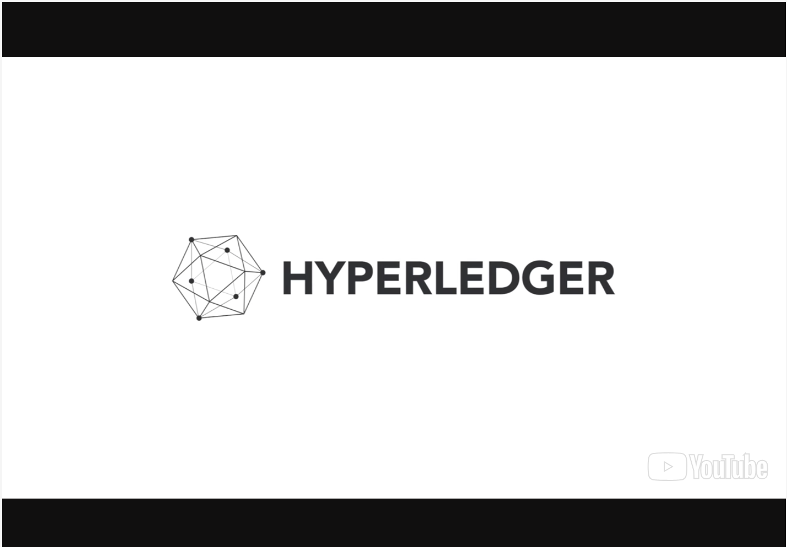

# Introduction to Hyperledger Sawtooth
<!-- TOC depthFrom:1 depthTo:6 withLinks:1 updateOnSave:1 orderedList:0 -->
- [Introduction to Hyperledger Sawtooth](#introduction-to-hyperledger-sawtooth)
  - [Introduction & Learning Objectives](#introduction--learning-objectives)
    - [Video: Introduction to Hyperledger Sawtooth (Alexandra & Arianna Groetsema)](#video-introduction-to-hyperledger-sawtooth-alexandra--arianna-groetsema)
      - [Introduction to Hyperledger Sawtooth (Alexandra & Arianna Groetsema)](#introduction-to-hyperledger-sawtooth-alexandra--arianna-groetsema)
    - [Learning Objectives](#learning-objectives)
  - [Addressing Illegal, Unregulated, and Unreported Tuna Fishing (Demonstrated Scenario)](#addressing-illegal-unregulated-and-unreported-tuna-fishing-demonstrated-scenario)
    - [Video: About the Demonstrated Scenario (Alexandra & Arianna Groetsema)](#video-about-the-demonstrated-scenario-alexandra--arianna-groetsema)
      - [About the Demonstrated Scenario (Alexandra & Arianna Groetsema)](#about-the-demonstrated-scenario-alexandra--arianna-groetsema)
    - [Defining Our Actors](#defining-our-actors)
    - [Featured Hyperledger Sawtooth Elements](#featured-hyperledger-sawtooth-elements)
    - [Why Sawtooth?](#why-sawtooth)
    - [The Supply Chain](#the-supply-chain)
    - [The Tuna Asset](#the-tuna-asset)
    - [Recording a Catch](#recording-a-catch)
    - [Reaching Consensus](#reaching-consensus)
    - [Other Actors in the Supply Chain](#other-actors-in-the-supply-chain)
    - [Summary of Supply Chain Flow](#summary-of-supply-chain-flow)
  - [Key Components and Transaction Flow](#key-components-and-transaction-flow)
    - [Video: Hyperledger Sawtooth Key Components (Arianna Groetsema)](#video-hyperledger-sawtooth-key-components-arianna-groetsema)
      - [Hyperledger Sawtooth Key Components (Arianna Groetsema)](#hyperledger-sawtooth-key-components-arianna-groetsema)
    - [Requirements Supported by Hyperledger Sawtooth](#requirements-supported-by-hyperledger-sawtooth)
    - [Transaction Batching](#transaction-batching)
    - [Validators](#validators)
    - [Consensus Interface](#consensus-interface)
    - [Introducing Proof of Elapsed Time (PoET)](#introducing-proof-of-elapsed-time-poet)
    - [How Proof of Elapsed Time Works](#how-proof-of-elapsed-time-works)
    - [Forks](#forks)
    - [Sawtooth Applications](#sawtooth-applications)
    - [Transaction Processors](#transaction-processors)
    - [Sawtooth Node](#sawtooth-node)
  - [Installing Hyperledger Sawtooth](#installing-hyperledger-sawtooth)
    - [Technical Prerequisites](#technical-prerequisites)
    - [Installing Hyperledger Sawtooth](#installing-hyperledger-sawtooth)
    - [Starting Hyperledger Sawtooth](#starting-hyperledger-sawtooth)
    - [Logging into the Client Container](#logging-into-the-client-container)
    - [Stopping Hyperledger Sawtooth](#stopping-hyperledger-sawtooth)
    - [Video: Bringing Up a Sample Hyperledger Sawtooth Network (Demo)](#video-bringing-up-a-sample-hyperledger-sawtooth-network-demo)
      - [Change Bringing Up a Sample Hyperledger Sawtooth Network (Demo)](#change-bringing-up-a-sample-hyperledger-sawtooth-network-demo)
  - [Writing an Application](#writing-an-application)
    - [Applications](#applications)
    - [Video: Designing an Application (Alexandra Groetsema)](#video-designing-an-application-alexandra-groetsema)
    - [Review of Hyperledger Sawtooth Components](#review-of-hyperledger-sawtooth-components)
    - [Sawtooth TunaChain Application](#sawtooth-tunachain-application)
    - [Cloning the Repository](#cloning-the-repository)
    - [File Structure of the TunaChain Application](#file-structure-of-the-tunachain-application)
    - [Running the Application](#running-the-application)
    - [Sawtooth TunaChain State](#sawtooth-tunachain-state)
    - [Sawtooth TunaChain Addressing](#sawtooth-tunachain-addressing)
    - [Sawtooth TunaChain Transaction Payload](#sawtooth-tunachain-transaction-payload)
    - [Browser Client](#browser-client)
    - [Creating a New Holder](#creating-a-new-holder)
    - [Creating a Record of Tuna](#creating-a-record-of-tuna)
    - [Transferring a Tuna](#transferring-a-tuna)
    - [Accepting or Rejecting Transfers](#accepting-or-rejecting-transfers)
    - [TunaChain Transaction Processor](#tunachain-transaction-processor)
    - [Shutting Down Sawtooth](#shutting-down-sawtooth)
    - [Summary of TunaChain Application Flow](#summary-of-tunachain-application-flow)
  - [Joining the Hyperledger Sawtooth Community](#joining-the-hyperledger-sawtooth-community)
    - [Learning More about Hyperledger Sawtooth](#learning-more-about-hyperledger-sawtooth)
    - [Becoming Involved with the Hyperledger Sawtooth Project](#becoming-involved-with-the-hyperledger-sawtooth-project)
    - [Community Meetings and Mailing Lists](#community-meetings-and-mailing-lists)
    - [GitHub and Rocket.Chat](#github-and-rocketchat)
  - [Knowledge Check](#knowledge-check)
    - [Knowledge Check 6.1](#knowledge-check-61)
    - [Knowledge Check 6.2](#knowledge-check-62)
    - [Knowledge Check 6.3](#knowledge-check-63)
    - [Knowledge Check 6.4](#knowledge-check-64)
    - [Knowledge Check 6.5](#knowledge-check-65)
    - [Knowledge Check 6.6](#knowledge-check-66)
    - [Knowledge Check 6.7](#knowledge-check-67)
    - [Knowledge Check 6.8](#knowledge-check-68)
    - [Knowledge Check 6.9](#knowledge-check-69)
    - [Knowledge Check 6.10](#knowledge-check-610)
  - [Conclusions & Learning Objectives (Review)](#conclusions--learning-objectives-review)
    - [Learning Objectives (Review)](#learning-objectives-review)
    - [Video: Conclusions (Arianna Groetsema)](#video-conclusions-arianna-groetsema)
<!-- /TOC -->

## Introduction & Learning Objectives

### Video: Introduction to Hyperledger Sawtooth (Alexandra & Arianna Groetsema)

---

The Hyperledger Sawtooth chapter has been updated to Sawtooth v1.0 (as of May 2018). At this time, we were unable to update the videos introducing each section, so there may be some discrepancies. We apologize for the inconvenience, and we will update these videos in a future course version.

---

#### Introduction to Hyperledger Sawtooth (Alexandra & Arianna Groetsema)

[](https://youtu.be/oFUMUJOjLj4)

### Learning Objectives

By the end of this chapter you should be able to:

* Understand the basics of Hyperledger Sawtooth v1.0.
* Walk through a demonstrated scenario highlighting aspects of Hyperledger Sawtooth.
* Discuss crucial components of Hyperledger Sawtooth, including the consensus algorithm Proof of Elapsed Time, transaction processors, batches, and validators.
* Set up a running Hyperledger Sawtooth network and test an application.
* Get involved in the Sawtooth community for application or framework discussion and development.

## Addressing Illegal, Unregulated, and Unreported Tuna Fishing (Demonstrated Scenario)

### Video: About the Demonstrated Scenario (Alexandra & Arianna Groetsema)

According to the [World Economic Forum](https://www.weforum.org/agenda/2017/05/can-technology-help-tackle-illegal-fishing/),

_"Illegal, unreported, and unregulated (IUU) fishing represents a theft of around 26 million tonnes, or close to $24 billion value of seafood a year."_

---

The Hyperledger Sawtooth chapter has been updated to Sawtooth v1.0 (as of May 2018). At this time, we were unable to update the videos introducing each section, so there may be some discrepancies. We apologize for the inconvenience, and we will update these videos in a future course version.

---

#### About the Demonstrated Scenario (Alexandra & Arianna Groetsema)

[](https://youtu.be/ZzZN0bY2CSo)

### Defining Our Actors

**Sarah** is the tuna fisher who sustainably and legally catches tuna.

**Tuna processing plant** processes and bags the tuna after they have been caught.

**Regulators** verify that the tuna has been legally and sustainably caught.

**Miriam** is a restaurant owner who will serve as the recipient in this situation.

||
|:--:|
| *Licensed under [CC By 4.0](https://creativecommons.org/licenses/by/4.0/)* |

We will be describing how tuna fishing can be improved starting from the source, tuna fisher Sarah, and the process by which her tuna ends up at Miriam's restaurant.

### Featured Hyperledger Sawtooth Elements

Hyperledger is a modular platform for building networks and running distributed ledger applications. Sawtooth simplifies application development by separating the core system from the application level. Application developers can specify the business logic for their applications, using the programming languages of their choice, without needing to know the underlying design of the core system.

**Sawtooth validators** validate transactions. Validators are responsible for combining batches of transactions into blocks, submitting them to the ledger, and approving valid blocks according to the network's consensus algorithm.

**Sawtooth applications** are distributed applications, such as smart contracts, that are separate from the core framework. An application provides a transaction family to define the operations that can be applied to transactions, and the meaning of the transaction contents. An application consists of both a transaction processor (the server-side logic) and one or more clients (for use from Web, CLI command line, or mobile applications).

**Transaction processors** provide server-side business logic. Most nodes run several transaction processors, one for each specific use case or application. Each node in the Sawtooth network must run an identical set of transaction processors.

**Batches** are clusters of transactions that are submitted together. A batch can contain a single transaction or several related transactions that are all committed to state together. If one transaction fails, the other transactions in that batch also fail.

**The network layer** is responsible for communicating between validators in a Hyperledger Sawtooth network, including performing initial connectivity, peer discovery, and message handling.

**Global state** contains the current state of the ledger and a chain of transaction invocations. The state for all applications running on the network is represented on each node. The process of transaction validation on each node ensures that the same transactions result in the same state transitions, and that the resulting ledger data is the same for all participants in the network. The state is split into application-specific namespaces, which allow flexibility for application authors to define, share, and reuse global state data between transaction processors.

**Proof of Elapsed Time (PoET)** is a consensus algorithm in Hyperledger Sawtooth that implements time-based consensus, which reduces energy consumption on large distributed networks when compared to other algorithms such as Proof of Work.

### Why Sawtooth?

Miriam is a restaurant owner looking to source high quality tuna, that have been caught responsibly. Whenever Miriam buys tuna, she cannot be sure whether she can trust that the tuna she is purchasing is legally and sustainably caught, given the prominence of illegal and unreported tuna fishing. Luckily, Hyperledger Sawtooth can help!

Hyperledger Sawtooth is ideal for this scenario because of its ability to track the provenance and journey of an asset (in this case, tuna). The ability to batch transactions together allows for all tuna within a catch to be entered as a whole. The distributed state agreement, novel consensus algorithm, and decoupled business logic from the consensus layer allow Miriam to be confident that she is buying tuna that has been legally caught.

### The Supply Chain

Hyperledger Sawtooth is extremely scalable and able to withstand high throughput of data, which makes it a great option for production supply chain scenarios.

We will start with Sarah, our licensed tuna fisher, who sells her tuna to multiple restaurants. Sarah operates as a private business, in which her company frequently makes international deals. Through an application, Sarah is able to gain entry to a Hyperledger Sawtooth blockchain network comprised of other fishermen, as well as processing plants, regulators, and restaurant owners. Sarah, as  well as the processing plants, have the ability to add and update information to this ledger as tuna passes through the supply chain, while regulators and restaurants have read access to ledger records.

### The Tuna Asset

With each catch, Sarah records some information about each individual tuna, including a unique ID number, the location and time of the catch, its weight, and who caught the fish. For the sake of simplicity, we will stick with these data attributes. However, in an actual application, many more details would be recorded, from toxicology, to other physical characteristics, such as the temperature of the tuna.

These details are saved in the global state as **_key/value pairs_** based on the specifications of a **_Sawtooth application_**, while the **_transaction processor_** allows Sarah's application to effectively create a transaction on the ledger. Please see the example below:

```
var tuna = {
     id: ‘0002’,
     holder: ‘Sarah’, 
     location: { latitude: '15.623036831528264', longitude: '-158.466796875'}, 
     when: '20170635123546', 
     weight: ‘58lbs’ 
}
```

### Recording a Catch

After Sarah catches her tuna and records data for each tuna, she is able to treat a haul of tuna as a single **_batch_** of transactions. As a reminder, a **_batch_** is a cluster of transactions that are committed to state together. Using a batch, Sarah is able to record many tuna together, while still being able to specify data for each tuna. If one of the tuna transactions is invalid, the entire shipment is invalidated; that is, no tuna within the batch of tuna is validated.

### Reaching Consensus

After a batch of many transactions is submitted to the network, the network’s consensus algorithm chooses a node to publish this batch as a block on the ledger (possibly along with other batches). If the **_Proof of Elapsed Time_** consensus algorithm is used, the **_validator_** with the shortest wait time publishes the transaction block. (We'll discuss this in more detail later in the course.) The transaction block is then broadcasted to the publishing nodes.

Each node within the network receives the transaction block, and validators verify whether the transaction is valid or not. If the transaction is validated, the global state is updated.

Hyperledger Sawtooth provides full distributed state agreement, where every node in the system has the same understanding of information. As the supply chain matures, the data stored remains consistent across the network.

With the global state adjusted, the processing plant, the regulator, and Miriam are able to see the details of the catch and who the current holder is, thus keeping the supply chain transparent and verifiable.

### Other Actors in the Supply Chain

Before Sarah's tuna can reach Miriam's restaurant, they need to go through a tuna processing plant. Also, regulators will need to verify and view details from the ledger. Therefore, both parties will gain entry to this Sawtooth blockchain. The regulators will need to query the ledger to confirm that Sarah is legally catching her fish. At the same time, tuna processing plants will need to record their processing and shipping of the tuna on the ledger.

### Summary of Supply Chain Flow

Now, let's review the summary of the transaction flow.

||
|:--:|
| *Licensed under [CC By 4.0](https://creativecommons.org/licenses/by/4.0/)* |

Sarah catches a tuna and uses the client application to record all the details about the catch to the ledger. An entire haul of tuna can be treated as a transaction batch, with each individual tuna registered as a transaction within the batch.

||
|:--:|
| *Licensed under [CC By 4.0](https://creativecommons.org/licenses/by/4.0/)* |

After the details of the catch are saved to the ledger and the tuna is passed along the supply chain, the processing plant may use the client application to query the ledger for details about specific catches, such as weight. The processing plant will add details reflecting the processing date and time, as well as other relevant information.

||
|:--:|
| *Licensed under [CC By 4.0](https://creativecommons.org/licenses/by/4.0/)* |

As the tuna is passed along the supply chain, the regulators may use the client application to query the ledger for details about specific catches, such as the owner and location of the catch, to verify legitimacy.

||
|:--:|
| *Licensed under [CC By 4.0](https://creativecommons.org/licenses/by/4.0/)* |

Lastly, when the haul of tuna arrives at Miriam's restaurant, Miriam is able to use the client application to query the ledger, to make sure Sarah was truthful in her account of where each fish was sourced. This, in turn, guarantees Miriam's restaurant is serving their customers the sustainably caught fish they advertise.

## Key Components and Transaction Flow

### Video: Hyperledger Sawtooth Key Components (Arianna Groetsema)

---

The Hyperledger Sawtooth chapter has been updated to Sawtooth v1.0 (as of May 2018). At this time, we were unable to update the videos introducing each section, so there may be some discrepancies. We apologize for the inconvenience, and we will update these videos in a future course version.

---

#### Hyperledger Sawtooth Key Components (Arianna Groetsema)

[](https://youtu.be/5KO8jSSx7w8)

### Requirements Supported by Hyperledger Sawtooth

Hyperledger Sawtooth is a blockchain framework with potential in IoT, manufacturing, finance, and enterprise. Hyperledger Sawtooth supports diverse requirements, including both permissioned and permissionless deployments, and a pluggable consensus algorithm. This framework also provides a revolutionary consensus algorithm, Proof of Elapsed Time (PoET), that allows for versatility and scalability suited for a variety of solutions.

Hyperledger Sawtooth supports many different infrastructural requirements, such as:

* Permissioned and permissionless infrastructure
* Modular blockchain architecture
* Scalability, which is good for larger blockchain networks due to higher throughput
* Many languages for transaction logic
* On-chain governance that allows peers to vote on blockchain configuration
* An advanced transaction execution engine that can process transactions in parallel to accelerate block creation and validation
* Ethereum contract support with Seth, which allows participants to run Solidity smart contracts and integrate with Ethereum tooling
* Dynamic consensus lets you upgrade or swap blockchain consensus protocol on the fly as the network grows.

### Transaction Batching

In Hyperledger Sawtooth, **batches** are clusters of transactions that are committed to state together. If one transaction in the batch cannot be committed, none of the transactions are committed. As a result, transaction batches are often described as an atomic unit of change, since a group of transactions are treated as one, and are committed to the state as one. Every single transaction in Hyperledger Sawtooth is submitted within a batch. Batches can contain as little as a single transaction.

When a transaction is created by a client, the batch is submitted to the validator (which we will cover more in-depth in the next section). Transactions are organized into a batch in the order they are intended to be committed. The validator then, in turn, applies each transaction within the batch, leading to a change in the global state. The batch is committed to the state. If one transaction within the batch is invalid, then none of the transactions within that batch are committed.

In summary, transaction batching allows a group of transactions to be applied in a specific order, and if any are invalid, then none of the transactions are applied. This is a powerful tool that can be utilized by many enterprise solutions, as it provides greater efficiency and control for end users.

### Validators

In any blockchain network, modifying the global state requires creating and applying a transaction. In Hyperledger Sawtooth, **validators** apply batches of transactions that cause changes in the state. More specifically, validators group batches into blocks, submit the blocks, and ensure that transactions result in state changes that are consistent across all participants in the network.

To start, a user creates a batch containing one or more transactions, and submits it to a validator, usually via a client that communicates with a REST API. The validator then checks the transactions and applies the batch if all transactions are considered valid, resulting in a change to the state. In terms of our demonstrated scenario, Sarah, the tuna fisher, creates a batch to record information about a group of tuna catches. The validator then applies the transactions, and the state is updated if all appropriate attributes are present: a unique ID number, location and time of the catch, weight, and who caught the fish. If any of these elements are missing, the transactions within the batch would not be applied, and the state would not be updated.

||
|:--:|
| *Licensed under [CC By 4.0](https://creativecommons.org/licenses/by/4.0/)* |

### Consensus Interface

A key feature of Hyperledger Sawtooth is its flexibility in allowing different consensus algorithms. As a reminder, the consensus algorithm determines which node on the network will publish the next block on the ledger. Hyperledger Sawtooth provides an abstract interface that supports both PBFT and Nakamoto-style algorithms. Consensus in Hyperledger Sawtooth is modular, meaning that the consensus algorithm can be easily modified.

Currently, Hyperledger Sawtooth supports the following consensus implementations:

* **Proof of Elapsed Time**, or **PoET**, a Nakamoto-style consensus algorithm that is designed to be a production-grade protocol capable of supporting large networks.
* **Dev mode**, a simplified random-leader algorithm that is useful for development and testing on single-node or small networks.

PoET is available in two versions:

* **PoET-SGX**, which relies on Intel® Software Guard Extensions (SGX) to implement a leader-election lottery system
* **PoET simulator**, which is the PoET consensus algorithm deployed on an SGX simulator.

### Introducing Proof of Elapsed Time (PoET)

The **Proof of Elapsed Time (PoET)** consensus algorithm impartially determines who will commit a transaction to state using a lottery function that elects a leader from many different distributed nodes.

Hyperledger Sawtooth’s PoET algorithm differs from the Proof of Work algorithm implemented by the Bitcoin blockchain in that Proof of Work relies on vast amounts of power, while Proof of Elapsed Time is able to ensure trust and randomness in electing a leader without the high power consumption. PoET allows for increased scalability and participation, as every node in the network has an equal opportunity to create the next block on the chain.

### How Proof of Elapsed Time Works

To start, each validator within the network requests a wait time from an enclave, or a trusted function. This is where the 'Elapsed Time' comes into play. The validator with the shortest wait time for a specific block is appointed the leader, and creates the block to be committed to the ledger. As a result, a truly random leader is elected, and the amount of power or type of hardware you have will not give you an advantage. Using simple functions, the network can verify that the winning validator did indeed 'win', by proving that it had the shortest time to wait before assuming the leadership position.

### Forks

While PoET provides many benefits and aids tremendously with scalability, there is a downside to the PoET consensus algorithm. And that is the issue of **forks**. The PoET algorithm may lead to forking, in which two 'winners' propose a block. Each fork has to be resolved by validators, and this results in a delay in reaching consistency across the network.

### Sawtooth Applications

As with any blockchain framework, transaction updates need to be approved and shared between many untrusted parties. In Hyperledger Sawtooth, the business logic for an application, the data model that is used to record and store state data, and the client logic are defined as a **Sawtooth application**, also called a _transaction family_. An application consists of both a transaction processor (the server-side logic) and one or more clients (for use from the Web, CLI command line, or mobile applications).

A transaction family defines a set of operations or _transaction types_ that are allowed on the shared ledgers. This allows for flexibility in the level of versatility and risk that exists on a network. Transaction families can provide 'safer' smart contracts, because they specify a predefined set of acceptable smart contract templates, as opposed to programming smart contracts from scratch.

||
|:--:|
| *Licensed under [CC By 4.0](https://creativecommons.org/licenses/by/4.0/)* |

### Transaction Processors

A **transaction processor** provides the server-side business logic that operates on assets within a network. Because  Hyperledger Sawtooth separates the application layer from the consensus and core framework layer, businesses are able to develop transaction processors that do exactly what their applications need. 

Each node within the Hyperledger Sawtooth network runs at least one transaction processor (most networks run several). Each transaction processor handles its own incoming transactions as submitted by authorized clients. Hyperledger Sawtooth allows application developers to specify a **_namespace_** for each transaction processor (an application-specific range of addresses in state), which provides flexibility in defining, sharing, and reusing data between transaction processors. Using namespaces in global state lets programmers focus on developing application logic, as opposed to building communication mechanisms between transaction processors.

Hyperledger Sawtooth's transaction processors can be written in a variety of languages, including Javascript, Java, Rust, Python, and Go, which allows flexibility for businesses to create their own applications. Hyperledger Sawtooth provides SDKs in several common languages.

Later in this chapter, in the _Writing an Application_ section, you will be able to explore exactly how transaction processors interact with a client and other Hyperledger Sawtooth components.

### Sawtooth Node

Each organization that enters the Hyperledger Sawtooth network runs at least one validator node, and receives blocks that are broadcasted by peer nodes. Each validator node runs the following things:

* The **validator** process
* The **REST API** (optional) listening for requests such as transaction posts or state queries
* One or more **transaction processors**

A REST API on each node is optional. Clients can use an external REST API or communicate directly with the validator using ZeroMQ and protocol buffers (protobufs).

||
|:--:|
| *Licensed under [CC By 4.0](https://creativecommons.org/licenses/by/4.0/)* |

## Installing Hyperledger Sawtooth

### Technical Prerequisites

In order to successfully install Hyperledger Sawtooth, you should have the following software installed on your computer: cURL, Git, Docker, and Docker Compose.

If you need further details on these prerequisites, visit Chapter 4, _Technical Requirements_.

### Installing Hyperledger Sawtooth

Hyperledger Sawtooth is a suite that permits the creation and utilization of a distributed ledger. Installing Hyperledger Sawtooth will involve adding signing keys for the software creator to our environment, including the repository that contains the code to our system, and performing a typical update/install.

A Hyperledger Sawtooth validator node can be run either from pre-built Docker images, or natively using Ubuntu 16.04. In this tutorial, we will demonstrate how to set up Hyperledger Sawtooth using Docker.

Our example Sawtooth environment is a single validator node using the dev mode consensus, a REST API, three transaction processors, and a client container.

### Starting Hyperledger Sawtooth

First, download the following Docker Compose file as **sawtooth-default.yaml**:

[https://raw.githubusercontent.com/hyperledger/education/master/LFS171x/sawtooth-material/sawtooth-default.yaml](https://raw.githubusercontent.com/hyperledger/education/master/LFS171x/sawtooth-material/sawtooth-default.yaml)

Next, open a terminal window.

Then, change your working directory to the same directory where the **sawtooth-default.yaml** Docker Compose file is saved.

**Note:** Make sure you do **not** have anything else running on port 8008 or port 4004.

Also, make sure to have Docker running on your device before running the commands in this section. Otherwise, when you run **docker-compose** in the next step, you will get a similar error to the one below:

```
ERROR: Couldn't connect to Docker daemon. You might need to start Docker for Mac.
```

Run the following command:

```
$ docker-compose -f sawtooth-default.yaml up
```

This command will download the Docker images that comprise the Hyperledger Sawtooth demo environment. The download will take several minutes. The terminal will start to display containers registering and creating initial blocks.

### Logging into the Client Container

The client container is used to run Sawtooth commands, which are used to configure the Sawtooth network and run client functions from the command line.

Open a new terminal window and navigate to the directory where the **sawtooth-default.yaml** Docker Compose file is saved.

Log into the client container by running the following command:

```
$ docker exec -it sawtooth-shell-default bash
```

In your terminal, you will see something similar to the following:

```
root@75b380886502:/#
```

Your environment is now set up and you are ready to start experimenting with the network. But first, let’s confirm that our validator is up and running, and reachable from the client container. To do this, run the following command:

```
$ curl http://rest-api:8008/blocks
```

After running this command, you should see a **json** object response with “data”, array of batches, header, etc.

To check the connectivity from the host computer to the Docker container, run the following command in a new terminal window (it does not need to be the same directory as mentioned previously in this section):

```
$ curl http://localhost:8008/blocks
```

After running this command, you should see a **json** object response with “data”, array of batches, header, etc. 

### Stopping Hyperledger Sawtooth

First, press **Ctrl+C** from the window where you originally ran **docker-compose**.

Then, in the terminal, you will see containers stopping. After that, run the following command:

```
$ docker-compose -f sawtooth-default.yaml down
```
### Video: Bringing Up a Sample Hyperledger Sawtooth Network (Demo)

#### Change Bringing Up a Sample Hyperledger Sawtooth Network (Demo)

[](https://youtu.be/0a_vPhCj-So)

## Writing an Application

### Applications

In a Sawtooth application, the ledger will store the state of the system, in addition to the immutable record of transactions that created that state. An application typically consists of two parts:

* **Client Application**<br>
 Sends transactions to the blockchain, typically through the Sawtooth REST API.
 Provides a user interface for the application. A client can be a command-line interface, a web page, a mobile app, an IoT sensor, or most any other kind of interface capable of sending HTTP requests.
* **Transaction Processor**<br>
 Encodes the business logic of the application.
 Communicates with the validator, which sends transactions received from the client to the transaction processor for validation.

### Video: Designing an Application (Alexandra Groetsema)

---

The Hyperledger Sawtooth chapter has been updated to Sawtooth v1.0 (as of May 2018). At this time, we were unable to update the videos introducing each section, so there may be some discrepancies. We apologize for the inconvenience, and we will update these videos in a future course version.

---

#### Designing an Application (Alexandra Groetsema)

[](https://youtu.be/ZlXh6riRKZs)

### Review of Hyperledger Sawtooth Components

**Sawtooth validators** validate transactions, combine batches of transactions into blocks, submit them to the ledger, and approve valid blocks according to the network's consensus algorithm.

**Sawtooth applications** are distributed applications (also called transaction families) that consist of a transaction  processor  for the server-side logic and a client for use from Web, CLI, or mobile applications.

**Transaction processors** provide the server-side business logic.

**Batches** are clusters of transactions that are submitted together. If one transaction fails, the other transactions in that batch also fail.

The **network layer** is responsible for communicating between validator nodes in a Hyperledger Sawtooth network, including performing initial connectivity, peer discovery, and message handling.

The **global state** contains the current state of the ledger and a chain of transaction invocations. The state for all applications running on the network s is represented on each node. The state is split into application-specific namespaces, which allows applications to share and reuse global state data between transaction processors.

### Sawtooth TunaChain Application

Let’s get our feet wet with an example of a simple Hyperledger Sawtooth blockchain application that relates to the tuna supply scenario we discussed in our demonstrated scenario. Sawtooth TunaChain allows a user to create named assets (_Tuna_), and transfer them between different _Holders_ designated by a public key.

In our example, we will look at:

* A **Transaction Processor**
* A simple browser-based client.

The TunaChain transaction processor is written using the Python 3 Sawtooth SDK. It interfaces with a Sawtooth validator in order to validate transactions.

The client is a simple browser-based user interface written using the Sawtooth Javascript SDK. It allows the user to manage public/private key pairs and submit transactions using the Sawtooth REST API.

### Cloning the Repository

If you have not done so, you must clone the hyperledger/education GitHub repository. This repository contains the code for the Sawtooth TunaChain example application.

To clone the repository, open a terminal window, navigate to your projects folder, and enter the following commands:

```
$ git clone https://github.com/hyperledger/education.git
$ cd education/LFS171x/sawtooth-material/sawtooth-tuna
```

Now you are in the folder that contains the code for the Sawtooth TunaChain example.

### File Structure of the TunaChain Application

Here you can see the file structure of the Sawtooth TunaChain application:

||
|:--:|
| *Licensed under [CC By 4.0](https://creativecommons.org/licenses/by/4.0/)* |

### Running the Application

Make sure you have Docker running on your machine before you run the next command. If you do not have Docker installed, you should review Chapter 4, _Technical Requirements_.

**Note:** Make sure you are in the **sawtooth-tuna** folder

We will use the provided **docker-compose.yaml** file to create and run Docker containers for the required Sawtooth and TunaChain components.

Run the following command to start Sawtooth with our TunaChain application:

```
$ docker-compose up
```

At this point, your terminal window should show that these containers are running: **sawtooth-validator**, **tunachain-shell**, **sawtooth-settings-tp**, **tunachain-tp**, **sawtooth-rest-api**, and **tunachain-client**.

You should also see messages showing that **sawtooth-settings-tp** and **tunachain-tp** have registered with the validator, that the REST API has connected to the validator at port 4004, and that the client has been built inside the **tunachain-shell** container.

If all of these conditions are true, and no other errors occur, you have successfully started a single-node Sawtooth network running the TunaChain demo application.

### Sawtooth TunaChain State

There are two kinds of state entries within the TunaChain application: _Assets_ and _Transfers_. These state entries are represented as UTF-8 encoded JSON objects with sorted keys.

Asset state entries are formatted as follows:

```
{
    # Name of the Asset
    "name": "name",
}
```

Transfer state entries are formatted as follows:

```
{
    # Name of the Asset
    "asset": "asset",

    # Public key of the proposed recipient of the Asset
    "owner": "owner",
}
```
### Sawtooth TunaChain Addressing

In Hyperledger Sawtooth, **_namespaces_** define the addressing scheme for application data. All Sawtooth applications store data in the state dictionary at 35-byte (70 hex-character) addresses. The addresses for TunaChain resources are generated as follows:

 1. The first 3 bytes of any Sawtooth state address are reserved for the application namespace. For the TunaChain application, the namespace prefix is generated by taking the first 6 characters of a SHA-512 hash of the application name "transfer-chain":
 ```
 19d832
 ```
 2. The next byte of a TunaChain address specifies which type of resource is stored at the address:
 Asset
 ```
 00
 ```
 3. The final 31 bytes of a TunaChain address are the first 62 characters of a SHA-512 hash of the name  of the asset.

For example, the TunaChain address of an Asset with the name "tuna4" would be generate as follows:

```
>>> hashlib.sha512('transfer-chain'.encode('utf-8')).hexdigest()[:6] + '00' + hashlib.sha512('tuna4'.encode('utf-8')).hexdigest()[:62]'19d83200714923803714eeb557276759eab2ce605c929dee093e7aa4359ee6f29a8880'
```

### Sawtooth TunaChain Transaction Payload

Each TunaChain transaction payload is represented as a JSON object with the following format:

```
{
    # Action the transaction takes, either "create", "transfer", "accept", or
    # "reject"
    "action": "action",

    # Name of the Asset to be affected by the transaction
    "asset": "asset",

    # Public key of the proposed new owner for a "transfer" transaction
    "owner": "owner"
}
```

### Browser Client

We are now ready to test our application through the user interface. In order to use the TunaChain client application, use a browser to navigate to **localhost:8000**.

There are four different things we can do within the application:

- **Select Holder** allows us to select a public key or create a new public/private key pair, which is referenced as a _Holder_
- **Create Tuna Record** submits a transaction to create a new _Tuna_ entry in state, which is held by the currently selected _Holder_
- **Transfer Tuna** submits a transaction to create a new _Transfer_ entry in state, which can be accepted or rejected by the potential recipient of the _Tuna_ asset
- **Accept Tuna** shows a list of the current _Transfers_ with the currently selected _Holder_ listed as a recipient, as well as options to either **Accept** or **Reject** the _Transfer_.
Also, there is a **Tuna List** table that shows all of the current _Tuna_ assets in state with their respective _Holders_.

Note: The application is running inside the **tunachain-client** Docker container, but the port that it is running on is exposed at port 8000 on the host machine.

### Creating a New Holder

In order to submit transactions to the REST API, we need to create a new _Holder_. For the TunaChain application, _Holders_ are just public/private key pairs which are stored in your browser's local storage.

Within the user interface, you can create these keys from the _Select Holder_ dropdown list. You can use this same dropdown list to switch between multiple users in local storage.

||
|:--:|
| *Licensed under [CC By 4.0](https://creativecommons.org/licenses/by/4.0/)* |

||
|:--:|
| *Licensed under [CC By 4.0](https://creativecommons.org/licenses/by/4.0/)* |

This user interface element invokes the following function within the client code:

```javascript
// Select User
$('[name="keySelect"]').on('change', function () {
  if (this.value === 'new') {
    app.user = makeKeyPair()
    app.keys.push(app.user)
    saveKeys(app.keys)
    addOption(this, app.user.public, true)
    addOption('[name='transferSelect"]', app.user.public)
  } else if (this.value === 'none') {
    app.user = null
  } else {
    app.user = app.keys.find(key => key.public ===this.value)
    app.refresh()
  }
})
```
_app.js:  Select User_

```javascript
//Create new key-pair
const makeKeyPair = () => {
  const context = createContext('secp256k1')
  const privateKey = context.newRandomPrivateKey()
  return {
    public: context.getPublicKey(privateKey).asHex(),
    private: privateKey.asHex()
  }
}
```
_state.js:  makeKeyPair_

This function uses the JavaScript Client Signing SDK to create a random 256-bit private key represented as a 64-char hex string. This key should not be shared with anyone else.

Next, the function derives a public key from the 256-bit private key created above. This is the key that is safe to share.

It returns this key pair to the application, where it calls the following function to save the key pair to local storage:

```javascript
//Save key-pairs to localStorage
const saveKeys = keys => {
  const paired = keys.map(pair => [pair.public, pair.private].join(','))
  localStorage.setItem(KEY_NAME, paired.join(';'))
}
```
_state.js:  saveKeys_

**Note: This method of saving the key pair is for demonstration purposes only. This method is not recommended for a production environment.**

### Creating a Record of Tuna

Within the user interface, select the owner of the new _Asset_ in the **Select Holder** dropdown, then provide a unique name for the tuna in the **_Create Tuna Record_** text box. Lastly, click the **Create** button.

||
|:--:|
| *Licensed under [CC By 4.0](https://creativecommons.org/licenses/by/4.0/)* |

After clicking the **Create** button, the following function is called within the client:

```javascript
//Create Asset
$('#createSubmit').on('click', function () {
  const asset = $('#createName').val()
  if (asset) app.update('create', asset)
})
```
_apps.js:  Create Asset_

Each user interface element that needs to make a change to state will call the **app.update()** function. This function formats the transaction payload and sends it to the **submitUpdate()** function in **state.js**.

```javascript
app.update = function (action, asset, owner) {
  if (this.user) {
    submitUpdate(
      { action, asset, owner },
      this.user.private,
      success => success ? this.refresh() : null
    )
  }
}
```
_app.js:  app.update()_

The **submitUpdate()** function handles the process of creating a transaction, adding it to a batch, submitting the batch to the REST API, and waiting for a response.

If the transaction was successfully executed by the transaction processor, added to a block, and published by the validator, state will be updated with the new entry. After refreshing the page, you will see the tuna _Asset_ show up in the **Tuna List**, along with its associated _Holder's_ public key.

||
|:--:|
| *Licensed under [CC By 4.0](https://creativecommons.org/licenses/by/4.0/)* |

### Transferring a Tuna

Any _Asset_ assigned to a particular _Holder_ can be transferred to another Holder by using the dropdowns under **_Transfer Tuna_**. Note that the transfer must be accepted by the recipient before it is finalized.

||
|:--:|
| *Licensed under [CC By 4.0](https://creativecommons.org/licenses/by/4.0/)* |

In the above example, we are proposing to transfer the ownership of **tuna4** from the current owner (identified by the key starting with **02ddf8de...**) to a new owner (identified by the key starting with **03b241b1...**).

After clicking the **Transfer** button, the following function is called within the client:

```javascript
//Transfer Asset
$('#transferSubmit').on('click', function () {
  const asset = $('[name="assetSelect"]').val()
  const owner = $('[name="transferSelect"]').val()
  if (asset && owner) app.update('transfer', asset, owner)
})
```
_apps.js: Transfer Asset_

This function calls **app.update()**, which in turn calls **submitUpdate()** to submit the transaction to create a new _Transfer entry_ in state.

### Accepting or Rejecting Transfers

Once a _Transfer_ has been created, go to the **Select Holder** dropdown and select the public key of the potential recipient. This will reload the page and populate the **Accept Tuna** section with all of the _Transfers_ in state with the selected _Holder_ as the potential recipient, as shown below:

||
|:--:|
| *Licensed under [CC By 4.0](https://creativecommons.org/licenses/by/4.0/)* |

Clicking **Accept** or **Reject** will invoke one of the following functions:

```javascript
//Accept Asset
$('#transferList').on('click', '.accept', function () {
  const asset = $(this).prev().text()
  if (asset) app.update('accept', asset)
})
```
_app.js:  Accept Asset_

```javascript
//Reject Asset
$('#transferList').on('click', '.reject', function () {
  const asset = $(this).prev().prev().text()
  if (asset) app.update('reject', asset)
})
```
_app.js:  Reject Asset_

After accepting or rejecting the _Transfer_, the _Transfer_ will be removed from the **Accept Tuna** section. If the _Transfer_ was accepted, the **Tuna List** table will be updated to show the new owner. If it was rejected, the **Tuna List** table will be unchanged indicating that a transfer did not take place.

### TunaChain Transaction Processor

To review, there are two main components of a **transaction processor**:

- **TransactionProcessor** class<br>
 A general purpose class that is provided by the Sawtooth SDK. It handles the connection between the transaction processor and the validator.
- **TransactionHandler** class<br>
 A base class that is extended with specific validation logic for each application. In addition to several metadata methods, it has an **apply()** method which encompasses the logic for validating and executing a transaction.<br>
 The **apply()** method gets called with two arguments, **transaction** and **context**. The argument **transaction** holds the command that is to be executed, while **context** stores information about the current state.

To separate details of state encoding and payload handling from validation logic, the TunaChain transaction processor utilizes two additional classes:

- **TunachainPayload** has **action**, **asset**, and **owner** fields, and is responsible for validating that the transaction payload was properly formed.
- **TunachainState** contains a reference to **context**, and has additional methods for generating state addresses, as well as getting and setting values in state.

The code for the TunaChain transaction processor can be found here: [https://github.com/hyperledger/education/tree/master/LFS171x/sawtooth-material/sawtooth-tuna/processor](https://github.com/hyperledger/education/tree/master/LFS171x/sawtooth-material/sawtooth-tuna/processor)

### Shutting Down Sawtooth

**Note:** When we are done with this tutorial, run the following command to shut down the Docker containers running the Sawtooth components:

```
$ docker-compose down
```

### Summary of TunaChain Application Flow

The example TunaChain application demonstrates Hyperledger Sawtooth features with a simple browser-based client for the user interface and a transaction processor for the business logic.

||
|:--:|
| *Licensed under [CC By 4.0](https://creativecommons.org/licenses/by/4.0/)* |

Hyperledger Sawtooth allows entities to securely update and read the distributed ledger without involving a central authority. Developers create application and transaction processor business logic (smart contract).

Through the client application, users (tuna fisher, regulator, restaurant) are able to modify the state by creating and applying transactions.

Through a REST API, the client application creates a batch containing a single transaction, and submits it to the validator.

The validator applies the transaction using the transaction processor, which makes a change to the state (e.g., creating a record of a tuna catch).

## Joining the Hyperledger Sawtooth Community

### Learning More about Hyperledger Sawtooth

See the Hyperledger Sawtooth project page for links to code, documentation, examples, and latest news:

[https://www.hyperledger.org/projects/sawtooth](https://www.hyperledger.org/projects/sawtooth)

### Becoming Involved with the Hyperledger Sawtooth Project

Hyperledger Sawtooth is an open source project, where ideas and code can be publicly discussed, created, and reviewed. There are many ways to join the Hyperledger Sawtooth community. The next few pages highlight some of the ways to get involved, either from a technical standpoint, or from an ideas/issues-creation perspective.

### Community Meetings and Mailing Lists

You can join the Sawtooth mailing list for technical discussions and announcements: [https://lists.hyperledger.org/g/sawtooth](https://lists.hyperledger.org/g/sawtooth).

The Hyperledger Community Meetings calendar includes online application developer forums and sprint planning meetings for Hyperledger Sawtooth: [https://calendar.google.com/calendar/embed?src=linuxfoundation.org_nf9u64g9k9rvd9f8vp4vur23b0%40group.calendar.google.com&ctz=America/SanFrancisco](https://calendar.google.com/calendar/embed?src=linuxfoundation.org_nf9u64g9k9rvd9f8vp4vur23b0%40group.calendar.google.com&ctz=America/SanFrancisco).

Some of the recordings of previous virtual tech forums on Hyperledger Sawtooth can be found here: [https://drive.google.com/drive/folders/0B_NJV6eJXAA1VnFUakRzaG1raXc](https://drive.google.com/drive/folders/0B_NJV6eJXAA1VnFUakRzaG1raXc).

### GitHub and Rocket.Chat

You can also get involved with the Hyperledger Sawtooth community on GitHub and Rocket.Chat.

Hyperledger Sawtooth code is available in GitHub repositories. All code available on GitHub is forkable and viewable:

- [https://github.com/hyperledger/sawtooth-core](https://github.com/hyperledger/sawtooth-core)
- [https://github.com/hyperledger/sawtooth-supply-chain](https://github.com/hyperledger/sawtooth-supply-chain)
- [https://github.com/hyperledger/sawtooth-seth](https://github.com/hyperledger/sawtooth-seth)

You can also join the live conversations on Hyperledger Chat (powered by Rocket.Chat, an alternative to Slack), using your Linux Foundation ID:

- [https://chat.hyperledger.org/channel/sawtooth](https://chat.hyperledger.org/channel/sawtooth)
- [https://chat.hyperledger.org/channel/sawtooth-consensus](https://chat.hyperledger.org/channel/sawtooth-consensus)
- [https://chat.hyperledger.org/channel/sawtooth-seth](https://chat.hyperledger.org/channel/sawtooth-seth)

## Knowledge Check

### Knowledge Check 6.1
<!-- C -->
Which of the following is a consensus algorithm introduced in Hyperledger Sawtooth?

<ol type="A">
<li>Proof of Stake</li>
<li>Proof of Work</li>
<li>Proof of Elapsed Time</li>
<li>PBFT</li>
</ol>

### Knowledge Check 6.2
<!-- D -->
What are some of the advantages of a platform like Hyperledger Sawtooth?

<ol type="A">
<li>It is highly modular, enabling different consensus algorithms to be plugged in</li>
<li>It allows for permissionless or permissioned deployments</li>
<li>Transaction Batching</li>
<li>All of the above</li>
</ol>

### Knowledge Check 6.3
<!-- B -->
Which of the following correctly describes an application (a transaction family) in the context of Hyperledger Sawtooth?

<ol type="A">
<li>Separates framework from transaction logic</li>
<li>Communicates between the client and validator</li>
<li>Provides the business logic and operations for assets within a network</li>
<li>Contains the state of the ledger and transaction processors</li>
</ol>

### Knowledge Check 6.4
<!-- A -->
Validators validate transactions and ensure that changes in data are equivalent for all participants in the network. True or False?

<ol type="A">
<li>True</li>
<li>False</li>
</ol>

### Knowledge Check 6.5
<!-- B -->
Thinking back to the demonstrated scenario we used in this chapter, what is the difference between what a regulator can do and what tuna fisher Sarah can do?

<ol type="A">
<li>There is no difference between these two users</li>
<li>Sarah is able to perform all actions, including read and write to the ledger, while the regulator only has the ability to read the ledger</li>
<li>The regulator has full access to the ledger to read and write, while Sarah is only allowed to write to the ledger</li>
<li>None of the above</li>
</ol>

### Knowledge Check 6.6
<!-- B -->
Which of the following correctly describes batches in the context of Hyperledger Sawtooth?

<ol type="A">
<li>Transactions can be organized into batches, where each transaction may or may not be committed</li>
<li>Transactions are organized into batches, where either all transactions in a batch are committed, or none are committed</li>
<li>Transactions are combined into a block, and all transactions within the block are committed</li>
</ol>

### Knowledge Check 6.7
<!-- A -->
What are the two main components of a transaction processor?

<ol type="A">
<li>Processor class and handler class</li>
<li>Processor class and transaction families</li>
<li>Handler class and validator</li>
<li>Processor class and transaction batches</li>
</ol>

### Knowledge Check 6.8
<!-- A -->
In the TunaChain application, the web client can be used to submit a transaction to create a new tuna _Asset_ in state, and the owner of a newly created Asset is the public key of the user who signed the transaction. True or False?

<ol type="A">
<li>True</li>
<li>False</li>
</ol>

### Knowledge Check 6.9
<!-- D -->
Which of the following plays the main role within a Hyperledger Sawtooth network?

<ol type="A">
<li>Transaction processors</li>
<li>Nodes</li>
<li>Peers</li>
<li>Validators</li>
</ol>

### Knowledge Check 6.10
<!-- B -->
What aspects of the Hyperledger Sawtooth application flow are created by a developer?

<ol type="A">
<li>Validator and application</li>
<li>Application client and transaction processor</li>
<li>Transaction processor and validator</li>
<li>Application client and state</li>
</ol>

## Conclusions & Learning Objectives (Review)

### Learning Objectives (Review)

You should now be able to:

- Understand the basics of Hyperledger Sawtooth v1.0.
- Walk through a demonstrated scenario highlighting aspects of Hyperledger Sawtooth.
- Discuss crucial components of Hyperledger Sawtooth, including the consensus algorithm _Proof of Elapsed Time_, transaction processors, batches, and validators.
- Set up a running Hyperledger Sawtooth network and test an application.
- Get involved in the Hyperledger Sawtooth application or framework discussion and development.

### Video: Conclusions (Ariana Groetsema)

---

The Hyperledger Sawtooth chapter has been updated to Sawtooth v1.0 (as of May 2018). At this time, we were unable to update the videos introducing each section, so there may be some discrepancies. We apologize for the inconvenience, and we will update these videos in a future course version.

---

#### Conclusions (Ariana Groetsema)

[](https://youtu.be/ZYFPDKsQovg)