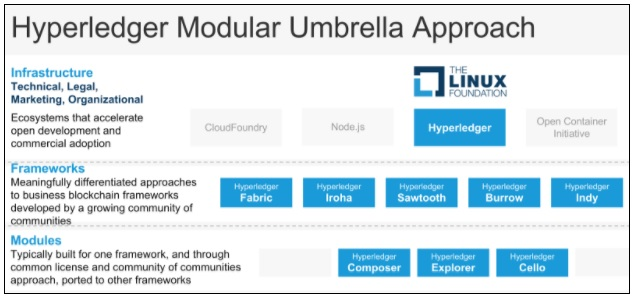
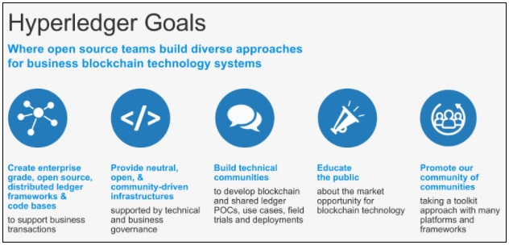
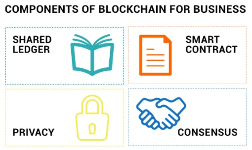
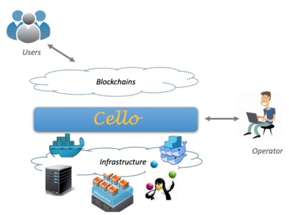

<!-- TOC depthFrom:1 depthTo:6 withLinks:1 updateOnSave:1 orderedList:0 -->

- [Introduction and Learning Objectives](#introduction-and-learning-objectives)
	- [Introduction](#introduction)
	- [Learning Objectives](#learning-objectives)
- [Hyperledger](#hyperledger)
	- [Hyperledger (Navroop Sahdev)](#hyperledger-navroop-sahdev)
	- [Hyperledger](#hyperledger)
	- [The Birth of Hyperledger (Brian Behlendorf)](#the-birth-of-hyperledger-brian-behlendorf)
	- [Comparing Hyperledger with Bitcoin and Ethereum](#comparing-hyperledger-with-bitcoin-and-ethereum)
	- [Hyperledger Goals](#hyperledger-goals)
	- [Open Standards](#open-standards)
	- [The Importance of Open Source (Brian Behlendorf)](#the-importance-of-open-source-brian-behlendorf)
	- [Open Source and Open Governance](#open-source-and-open-governance)
	- [Software Governance of the Hyperledger Projects (Brian Behlendorf)](#software-governance-of-the-hyperledger-projects-brian-behlendorf)
	- [Blockchain for Business](#blockchain-for-business)
	- [Why Businesses Choose to Use Hyperledger? (Brian Behlendorf)](#why-businesses-choose-to-use-hyperledger-brian-behlendorf)
- [Hyperledger Frameworks](#hyperledger-frameworks)
	- [Incubated Hyperledger Projects (Brian Behlendorf)](#incubated-hyperledger-projects-brian-behlendorf)
	- [Components of Hyperledger Frameworks](#components-of-hyperledger-frameworks)
	- [Hyperledger Iroha v0.95](#hyperledger-iroha-v095)
	- [Introduction to Hyperledger Sawtooth (Courtesy of Sawtooth)](#introduction-to-hyperledger-sawtooth-courtesy-of-sawtooth)
	- [Hyperledger Sawtooth v1.0](#hyperledger-sawtooth-v10)
	- [Unique Characteristics of Hyperledger Sawtooth (Dan Middleton)](#unique-characteristics-of-hyperledger-sawtooth-dan-middleton)
	- [Hyperledger Sawtooth Characteristics Relative to Use Cases (Dan Middleton)](#hyperledger-sawtooth-characteristics-relative-to-use-cases-dan-middleton)
	- [Hyperledger Fabric v1.0](#hyperledger-fabric-v10)
	- [What Is Unique about Hyperledger Fabric? (Chris Ferris)](#what-is-unique-about-hyperledger-fabric-chris-ferris)
	- [Hyperledger Indy (Nathan George)](#hyperledger-indy-nathan-george)
	- [Hyperledger Indy](#hyperledger-indy)
	- [Hyperledger Burrow v0.16.1](#hyperledger-burrow-v0161)
- [Hyperledger Modules](#hyperledger-modules)
	- [Hyperledger Modules](#hyperledger-modules)
	- [Hyperledger Cello](#hyperledger-cello)
	- [Hyperledger Explorer](#hyperledger-explorer)
	- [Hyperledger Composer](#hyperledger-composer)
	- [Hyperledger Composer (Simon Stone & Kathryn Harrison)](#hyperledger-composer-simon-stone-kathryn-harrison)
	- [Hyperledger Composer (Continued)](#hyperledger-composer-continued)
- [Q/A with Brian Behlendorf, Executive Director of Hyperledger](#qa-with-brian-behlendorf-executive-director-of-hyperledger)
	- [Q/A with Brian Behlendorf, Executive Director of Hyperledger](#qa-with-brian-behlendorf-executive-director-of-hyperledger)
	- [Reasons Why Developers Would Become Interested in Open Source Software](#reasons-why-developers-would-become-interested-in-open-source-software)
	- [Hyperledger vs. Apache](#hyperledger-vs-apache)
	- [A Key Feature of Hyperledger Fabric, Hyperledger Sawtooth, and Hyperledger Iroha](#a-key-feature-of-hyperledger-fabric-hyperledger-sawtooth-and-hyperledger-iroha)
	- [Interoperability between Hyperledger Frameworks](#interoperability-between-hyperledger-frameworks)
- [Knowledge Check](#knowledge-check)
	- [Knowledge Check 2.1](#knowledge-check-21)
	- [Knowledge Check 2.2](#knowledge-check-22)
	- [Knowledge Check 2.3](#knowledge-check-23)
	- [Knowledge Check 2.4](#knowledge-check-24)
- [Conclusions & Learning Objectives (Review)](#conclusions-learning-objectives-review)
	- [Learning Objectives (Review)](#learning-objectives-review)
	- [Blockchain Security at Hyperledger (David Huseby)](#blockchain-security-at-hyperledger-david-huseby)
	- [How Will Hyperledger Change the Blockchain Ecosystem? (Brian Behlendorf)](#how-will-hyperledger-change-the-blockchain-ecosystem-brian-behlendorf)

<!-- /TOC -->

# Introduction and Learning Objectives

## Introduction
This chapter provides an overview of Hyperledger, a collaborative project hosted by The Linux Foundation that is focused on business blockchain technologies. It also introduces the current Hyperledger frameworks and modules, as of October 2017.

## Learning Objectives
By the end of this chapter you should be able to:

* Explain the differences between Hyperledger and permisionless blockchain technologies.
* Discuss how Hyperledger leverages open standards and open governance to support business solutions.
* Discuss Hyperledger frameworks (Iroha, Sawtooth, Fabric, Indy, and Burrow) and modules (Cello, Explorer, and Composer).

# Hyperledger

## Hyperledger (Navroop Sahdev)

## Hyperledger
Hyperledger is a group of open source projects focused around cross-industry distributed ledger technologies. Hosted by The Linux Foundation, collaborators include industry leaders in technology, finance, banking, supply chain management, manufacturing, and IoT.

As of October 2017, Hyperledger consists of eight projects, five of which are distributed ledger frameworks. The other three projects are modules that support these frameworks.

||
|:--:|
|*Licensed under [CC By 4.0](https://creativecommons.org/licenses/by/4.0/)*|

As [Arnaud Le Hors](https://www.hyperledger.org/blog/2017/09/12/3431), member of the Hyperledger Technical Steering Committee, emphasized,

>"these projects show how broadly applicable blockchain technology really is. This goes way beyond cryptocurrencies".

[Hyperledger](https://www.hyperledger.org/about) provides an alternative to the cryptocurrency-based blockchain model, and focuses on developing blockchain frameworks and modules to support global enterprise solutions. The focus of Hyperledger is to provide a transparent and collaborative approach to blockchain development.

## The Birth of Hyperledger (Brian Behlendorf)

## Comparing Hyperledger with Bitcoin and Ethereum
The following table explores the differences between Hyperledger's permissioned distributed ledgers and the Bitcoin and Ethereum permissionless blockchains. If you are considering blockchain solutions for your business requirements, it is important to pay attention to all these elements and weigh in on those that are most important for your use case.

&nbsp; |Bitcoin|Ethereum|Hyperledger Frameworks
--|-------|--------|----------------------
**Cryptocurrency based** |Yes|Yes|No
**Permissioned** |No|No|Yes (in general)\*
**Pseudo-anonymous** |Yes|No|No
**Auditable** |Yes|Yes|Yes
**Immutable ledger** |Yes|Yes|Yes
**Modularity** |No|No|Yes
**Smart contracts** |No|Yes|Yes
**Consensus protocol** |PoW|PoW|Various\*\*

\* Sawtooth can be configured to be permissionless

\*\* Key Hyperledger consensus protocols are Apache Kafka in Hyperledger Fabric, PoET in Hyperledger Sawtooth, RBFT in Hyperledger Indy, Tendermint in Hyperledger Burrow, and Yet Another Consensus (YAC) in Hyperledger Iroha. For more details, see the [Hyperledger Architecture, Volume 1](https://www.hyperledger.org/wp-content/uploads/2017/08/HyperLedger_Arch_WG_Paper_1_Consensus.pdf) paper.

## Hyperledger Goals
Hyperledger has taken a leadership role to develop cross-industry standards and provide a neutral space for software collaboration. The financial services industry, in particular, is witnessing an unprecedented level of collaboration between institutions that have traditionally been competitors. The advent of a new foundational or infrastructural technology like the blockchain - much like the Internet - requires collaboration of various actors in order to realize the full benefits of the technology. Unless all actors use a certain standard, the pace of technological dissemination will continue to be slow. Technological adoption is characterized by network effects, where the costs decrease with the increase in use of a certain technology. Since shifting to distributed ledger technology involves significant costs, open source software, communities and ecosystems that develop around these have a significant part to play.

||
|:--:|
|*Licensed under [CC By 4.0](https://creativecommons.org/licenses/by/4.0/)*|

## Open Standards
>"Only an Open Source, collaborative software development approach can ensure the transparency, longevity, interoperability and support required to bring blockchain technologies forward to mainstream commercial adoption. That is what Hyperledger is about - communities of software developers building blockchain frameworks and platforms."

\- [hyperledger.org](https://www.hyperledger.org/about)

As we learned in *Chapter 1: Discovering Blockchain Technologies*, the non-availability of standards in distributed ledger technologies is one of the major hurdles in scaling them. One of Hyperledger's key goals is to facilitate the process of standards formation, not by promoting its own distributed ledger(s), but by providing a space for a variety of standards to co-exist simultaneously:

>"Rather than declaring a single blockchain standard, it encourages a collaborative approach to developing blockchain technologies via a community process, with intellectual property rights that encourage open development and the adoption of key standards over time."

\- [hyperledger-fabric.readthedocs.io](https://hyperledger-fabric.readthedocs.io/en/latest/)

Hyperledger aims to adhere to '**open standards**', which means they are

>"(...) interoperable through open published interfaces and services."

\- John Palfreyman, [ibm.com](https://www.ibm.com/blogs/insights-on-business/government/open-innovation-blockchain-hyperledger/)

## The Importance of Open Source (Brian Behlendorf)

## Open Source and Open Governance

>"Today, most people understand the concept of **Open Source**. What many people don't get, and something we here at Hyperledger and The Linux Foundation pride ourselves on doing well, is **Open Governance**."

\- [hyperledger.org](https://hyperledger.org/blog/2017/09/06/abcs-of-open-governance)

Open source software is software that is made freely available and may be redistributed and modified. In other words, anyone has the ability to view the code, use the code, copy the code, change the code, and, depending on the open source license, contribute back changes.

Open governance means that technical decisions for an open source project are made by a group of community-elected developers drawn from a pool of active participants. These decisions include things such as which features to add, how, and when to add them.

Learn more about the specifics of Hyperledger's open governance at https://hyperledger.org/blog/2017/09/06/abcs-of-open-governance.

## Software Governance of the Hyperledger Projects (Brian Behlendorf)

## Blockchain for Business
The cryptocurrency-based blockchain model, popularized by public blockchains like Bitcoin and Ethereum, currently falls short of fulfilling a host of requirements that many types of organizations would have to fulfill in order to be compliant when using blockchain and distributed ledger technologies - for instance, in the areas of financial services, healthcare, and government.

Hyperledger is a unique platform that is developing permissioned distributed ledger frameworks specifically designed for enterprises, including those in industries with strong compliance requirements. Enterprise use cases require capabilities such as scalability and throughput, built-in or interoperable identity modules for the parties involved in a transaction or a network, or even access to regulators who can access all data in the ledger as read-only to ensure compliance. The latter is particularly important because, regardless of the innovation, it has to operate within the current regulatory framework, as well as comply with any new rules that come into place specifically targeted at blockchain technologies.

The enterprise continues to be at the heart of this course.

## Why Businesses Choose to Use Hyperledger? (Brian Behlendorf)

# Hyperledger Frameworks

## Incubated Hyperledger Projects (Brian Behlendorf)
In the following video, Brian Behlendorf covers the projects that are part of Hyperledger (as of October 2017). These include the Hyperledger frameworks, which are detailed in this section, as well as the Hyperledger modules, which are covered in the next section.

## Components of Hyperledger Frameworks
Hyperledger business blockchain frameworks are used to build enterprise blockchains for a consortium of organizations. They are different than public ledgers like the Bitcoin blockchain and Ethereum. The Hyperledger frameworks include:

* An append-only distributed **ledger**
* A **consensus algorithm** for agreeing to changes in the ledger
* **Privacy** of transactions through permissioned access
* **Smart contracts** to process transaction requests.

||
|:--:|
|*Licensed under [CC By 4.0](https://creativecommons.org/licenses/by/4.0/)*|

Now, let's explore the five Hyperledger frameworks (as of October 2017)!

## Hyperledger Iroha v0.95
[Hyperledger Iroha](https://hyperledger.org/projects/iroha) is a blockchain framework contributed by Soramitsu, Hitachi, NTT Data, and Colu. Hyperledger Iroha is designed to be simple and easy to incorporate into infrastructure projects requiring distributed ledger technology. Hyperledger Iroha emphasizes mobile application development with client libraries for Android and iOS, making it distinct from other Hyperledger frameworks. Inspired by Hyperledger Fabric, Hyperledger Iroha seeks to complement Hyperledger Fabric and Hyperledger Sawtooth, while providing a development environment for C++ developers to contribute to Hyperledger.

In conclusion, Hyperledger Iroha features a simple construction, modern, domain-driven C++ design, along with the consensus algorithm [YAC](https://www.overleaf.com/read/wzhwjzbjvrzn#/40115559/).

## Introduction to Hyperledger Sawtooth (Courtesy of Sawtooth)

## Hyperledger Sawtooth v1.0
[Hyperledger Sawtooth](https://www.hyperledger.org/projects/sawtooth), contributed by Intel, is a blockchain framework that utilizes a modular platform for building, deploying, and running distributed ledgers. Distributed ledger solutions built with Hyperledger Sawtooth can utilize various consensus algorithms based on the size of the network. It includes the Proof of Elapsed Time (PoET) consensus algorithm, which provides the scalability of the Bitcoin blockchain without the high energy consumption. PoET allows for a highly scalable network of validator nodes. Hyperledger Sawtooth is designed for versatility, with support for both permissioned and permissionless deployments.

## Unique Characteristics of Hyperledger Sawtooth (Dan Middleton)

## Hyperledger Sawtooth Characteristics Relative to Use Cases (Dan Middleton)

## Hyperledger Fabric v1.0
[Hyperledger Fabric](https://www.hyperledger.org/projects/fabric) was the first proposal for a codebase, combining previous work done by Digital Asset Holdings, Blockstream's libconsensus, and IBM's OpenBlockchain. Hyperledger Fabric provides a modular architecture, which allows components such as consensus and membership services to be plug-and-play. Hyperledger Fabric is revolutionary in allowing entities to conduct confidential transactions without passing information through a central authority. This is accomplished through different channels that run within the network, as well as the division of labor that characterizes the different nodes within the network. Lastly, it is important to remember that, unlike Bitcoin, which is a public chain, Hyperledger Fabric supports permissioned deployments.

>"If you have a large blockchain network and you want to share data with only certain parties, you can create a private channel with just those participants. It is the most distinctive thing about Fabric right now."

\- Brian Behlendorf, Executive Director of Hyperledger, The Linux Foundation

## What Is Unique about Hyperledger Fabric? (Chris Ferris)

## Hyperledger Indy (Nathan George)

## Hyperledger Indy
[Hyperledger Indy](https://www.hyperledger.org/projects) is a distributed ledger purpose-built for decentralized identity. Hyperledger Indy's goal is to achieve this by developing a set of

>"(...) decentralized identity specs and artifacts that are independent of any particular ledger and will enable **interoperability** across any DLT that supports them."

Contributed by the Sovrin Foundation, Hyperledger Indy allows individuals to manage and control their digital identities. Rather than having businesses store huge amounts of personal data of individuals, Hyperledger Indy allows businesses to store pointers to identity. Once the company verifies the other party's identity, it throws it away.

According to Brian Behlendorf,

>"(...) identity is a toxic asset that could present a liability to organizations."

Indeed, since 2013, over 9 billion data records were lost or stolen. What is striking is that, out of these, only 4% were encrypted, and hence, rendered useless after being stolen (also called 'secure breaches'). You can find detailed statistics at http://breachlevelindex.com/.

One of the key principles of Hyperledger Indy is its '[Privacy by Design](https://en.wikipedia.org/wiki/Privacy_by_design)' approach. Given the immutable nature of the DLT, it is all the more important that digital identities be handled with the utmost care, keeping human values front and center.

>"Hyperledger Indy lets users authenticate identity based on the attributes they are willing to store and share themselves. This can reduce the amount of liability contained within a business because the data can be kept with the user and presented to you again in a way that you can trust and validate that what has been said really was said and is trusted by the other parties you do business with."

\- Nathan George, Maintainer, Hyperledger Indy

Further information about the history of the project can be found at https://sovrin.org/.

## Hyperledger Burrow v0.16.1
Formally known as eris-db, [Hyperledger Burrow](https://www.hyperledger.org/projects/hyperledger-burrow) was released in December 2014. Currently under incubation, Hyperledger Burrow is a permissionable smart contract machine that provides a modular blockchain client with a permissioned smart contract interpreter built- in part to the specification of the Ethereum Virtual Machine (EVM). It is the only available Apache-licensed EVM implementation.

Following are the major components of Burrow:

* The **Gateway** provides interfaces for systems integration and user interfaces
* The **Smart contract application engine** facilitates integration of complex business logic
* The **Consensus Engine** serves the dual purpose of:
  1. Maintaining the networking stack between the nodes, and,
  2. Ordering transactions
* The **Application Blockchain Interface** (ABCI) provides interface specification for the consensus engine and smart contract application engine to connect.

You can go online to learn more about [Hyperledger Burrow](https://www.hyperledger.org/projects/hyperledger-burrow).

# Hyperledger Modules

## Hyperledger Modules
The Hyperledger frameworks which we examined in the previous section are used to build blockchains and distributed ledgers. The Hyperledger modules, which we will look at next, are auxiliary softwares used for things like deploying and maintaining blockchains, examining the data on the ledgers, as well as tools to design, prototype, and extend blockchain networks.

## Hyperledger Cello
For businesses that want to deploy Blockchain-as-a-Service, [Hyperledger Cello](https://www.hyperledger.org/projects/cello) provides a toolkit that fulfills this need. Particularly for lean businesses and small enterprises, who want to reduce or eliminate the effort required in creating, managing, and terminating blockchains, Hyperledger Cello allows blockchains deployment to the cloud. Operators can create and manage such blockchains through a dashboard, and users (typically, chaincode developers) can obtain a blockchain instance immediately.

As a Hyperledger module, *"Cello aims to bring the on-demand 'as-a-service' deployment model to the blockchain ecosystem"*, thus helping in furthering the development and deployment of Hyperledger's frameworks. Hyperledger Cello was initially contributed by IBM, with sponsors from Soramitsu, Huawei, and Intel.

Application developers and system administrators using Cello can provision and maintain Hyperledger networks. For instance, you can create a group of distributed ledger networks in virtual clouds known as 'container clusters', and then, manage and monitor those networks with a configurable dashboard. Additionally, you can build a Blockchain-as-a-Service (BaaS) platform.

||
|:--:|
|*Hyperledger Cello (Source: https://www.hyperledger.org/blog/2017/01/17/hyperledger-says-hello-to-cello)*|

## Hyperledger Explorer
[Hyperledger Explorer](https://www.hyperledger.org/projects/explorer) is a tool for visualizing blockchain operations. It is the first ever blockchain explorer for permissioned ledgers, allowing anyone to explore the distributed ledger projects being created by Hyperledger's members from the inside, without compromising their privacy. The project was contributed by DTCC, Intel, and IBM.

Designed to create a user-friendly web application, Hyperledger Explorer can view, invoke, deploy, or query:

* Blocks
* Transactions and associated data
* Network information (name, status, list of nodes)
* Smart contracts (chain codes and transaction families)
* Other relevant information stored in the ledger.

The ability to visualize data is of critical importance, in order to extract business value from it. Hyperledger Explorer provides this much needed functionality. Key components include a web server, a web UI, web sockets, a database, a security repository, and a blockchain implementation.

## Hyperledger Composer
[Hyperledger Composer](https://www.hyperledger.org/projects/composer) provides a suite of tools for building blockchain business networks. These tools allow you to:

* Model your business blockchain network
* Generate REST APIs for interacting with your blockchain network
* Generate a skeleton Angular application.

Built in Javascript, Hyperledger Composer provides an easy-to-use set of components that developers can quickly learn and implement. The project was contributed by Oxchains and IBM.

## Hyperledger Composer (Simon Stone & Kathryn Harrison)

## Hyperledger Composer (Continued)
Hyperledger Composer has created a modelling language that allows you to define the assets, participants, and transactions that make up your business network using business vocabulary. In addition, the transaction logic is then written by developers using Javascript. This simple interface allows business people and technologists to work together on defining their business network.

The [benefits](https://www.hyperledger.org/wp-content/uploads/2017/05/Hyperledger-Composer-Overview.pdf) of Hyperledger Composer are:

* **Faster creation of blockchain applications**, eliminating the massive effort required to build blockchain applications from scratch
* **Reduced risk with well-tested**, efficient design that aligns understanding across business and technical analysts
* **Greater flexibility** as the higher-level abstractions make it far simpler to iterate.

You can watch an introduction to Hyperledger Composer [here](https://www.youtube.com/watch?v=cNvOQp8r0xo).

# Q/A with Brian Behlendorf, Executive Director of Hyperledger

## Q/A with Brian Behlendorf, Executive Director of Hyperledger
Before diving into Hyperledger Iroha, Hyperledger Sawtooth, and Hyperledger Fabric, we asked Brian Behlendorf, Executive Director of Hyperledger at The Linux Foundation, some questions. We hope these questions will give you a better perspective of the Hyperledger technologies for the upcoming technical chapters.

## Reasons Why Developers Would Become Interested in Open Source Software

## Hyperledger vs. Apache

## A Key Feature of Hyperledger Fabric, Hyperledger Sawtooth, and Hyperledger Iroha

## Interoperability between Hyperledger Frameworks

# Knowledge Check

## Knowledge Check 2.1
<!-- D -->
Which consensus algorithms do Hyperledger frameworks support?

<ol type="A">
  <li>Kafka, RBFT, PoW and YAC</li>
  <li>Proof of Work, Proof of Stake, Proof of Elapsed Time </li>
  <li>YAC, Kafka, RBFT, Proof of Stake</li>
  <li>RBFT, YAC, Proof of Elapsed Time and Kafka</li>
</ol>

## Knowledge Check 2.2
<!-- B -->
Which of the following are Hyperledger frameworks?

<ol type="A">
  <li>Cello, Ethereum, Indy, Burrow, Fabric</li>
  <li>Fabric, Sawtooth, Indy, Burrow, Iroha</li>
  <li>Sawtooth, Indy, Fabric, Cello, Composer</li>
  <li>Burrow, Iroha, Fabric, Sawtooth, Cello</li>
</ol>

## Knowledge Check 2.3
<!-- C -->
Which of the following best defines Hyperledger Sawtooth?

<ol type="A">
  <li>A production distributed ledger</li>
  <li>A blockchain framework for building, deploying, and running Docker containers</li>
  <li>A modular blockchain framework that implements the PoET consensus algorithm</li>
  <li>A distributed ledger platform designed for supply chain solutions </li>
</ol>

## Knowledge Check 2.4
<!-- D -->
What is Indy?

<ol type="A">
  <li>A business blockchain framework for supporting independent identity on distributed ledgers</li>
  <li>A Hyperledger project that allows digital identities to be interoperable across administrative domains, applications, and any other silo</li>
  <li>A Hyperledger project that provides tools, libraries, and reusable components for providing digital identities rooted on blockchains or other distributed ledgers </li>
  <li>All of the above</li>
</ol>

# Conclusions & Learning Objectives (Review)

## Learning Objectives (Review)
You should now be able to:

* Explain the differences between Hyperledger and permisionless blockchain technologies.
* Discuss how Hyperledger leverages open standards and open governance to support business solutions.
* Discuss Hyperledger frameworks (Iroha, Sawtooth, Fabric, Indy, and Burrow) and modules (Cello, Explorer, and Composer).

## Blockchain Security at Hyperledger (David Huseby)

## How Will Hyperledger Change the Blockchain Ecosystem? (Brian Behlendorf)

