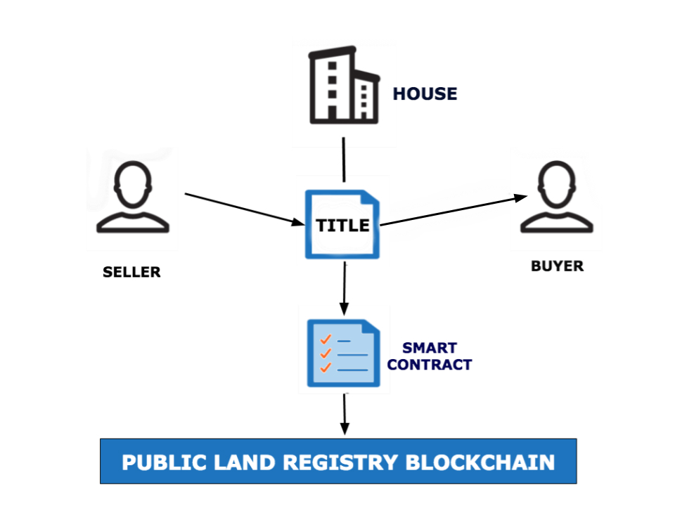

# The Promise of Business Blockchain Technologies
<!-- TOC depthFrom:1 depthTo:6 withLinks:1 updateOnSave:1 orderedList:0 -->

- [The Promise of Business Blockchain Technologies](#the-promise-of-business-blockchain-technologies)
  - [Introduction and Learning Objectives](#introduction-and-learning-objectives)
    - [Video: Introduction (Nathalie Salami)](#video-introduction-nathalie-salami)
    - [Learning Objectives](#learning-objectives)
  - [Existing Blockchain Use Cases](#existing-blockchain-use-cases)
    - [Business Blockchain Technologies Overview](#business-blockchain-technologies-overview)
    - [Video: Hyperledger Advantages for Businesses (Brian Behlendorf)](#video-hyperledger-advantages-for-businesses-brian-behlendorf)
    - [Video: Blockchain Use Case (Brian Behlendorf)](#video-blockchain-use-case-brian-behlendorf)
    - [Supply Chain Management (Part I)](#supply-chain-management-part-i)
    - [Supply Chain Management (Part II)](#supply-chain-management-part-ii)
    - [Provenance (Part I)](#provenance-part-i)
    - [Provenance (Part II)](#provenance-part-ii)
    - [Property Rights (Part I)](#property-rights-part-i)
    - [Property Rights (Part II)](#property-rights-part-ii)
      - [REGISTERING PROPERTY TITLES ON A BLOCKCHAIN VIA A SMART CONTRACT](#registering-property-titles-on-a-blockchain-via-a-smart-contract)
    - [Video: Business Interest in Hyperledger (Brian Behlendorf)](#video-business-interest-in-hyperledger-brian-behlendorf)
    - [Finance (Part I)](#finance-part-i)
    - [Finance (Part II)](#finance-part-ii)
    - [Finance (Part III)](#finance-part-iii)
    - [Finance (Part IV)](#finance-part-iv)
    - [Finance (Part V)](#finance-part-v)
    - [Healthcare (Part I)](#healthcare-part-i)
    - [Healthcare (Part II)](#healthcare-part-ii)
  - [When to Use or Not to Use Blockchain Technologies](#when-to-use-or-not-to-use-blockchain-technologies)
    - [Video: What Enterprises Look for When Evaluating Whether or Not to Use Hyperledger (Brian Behlendorf)](#video-what-enterprises-look-for-when-evaluating-whether-or-not-to-use-hyperledger-brian-behlendorf)
    - [When to Use Blockchain](#when-to-use-blockchain)
    - [When Not to Use Blockchain](#when-not-to-use-blockchain)
    - [I. The Process Involves Confidential Data](#i-the-process-involves-confidential-data)
    - [II. The Process Stores a Lot of Static Data/Data Is Quite Large](#ii-the-process-stores-a-lot-of-static-datadata-is-quite-large)
    - [III. Rules of Transactions Change Frequently](#iii-rules-of-transactions-change-frequently)
    - [IV. The Use of External Services to Gather/Store Data](#iv-the-use-of-external-services-to-gatherstore-data)
    - [V. Simpler Alternatives](#v-simpler-alternatives)
    - [Blockchain Decision Path](#blockchain-decision-path)
  - [Knowledge Check](#knowledge-check)
    - [Knowledge Check 3.1](#knowledge-check-31)
    - [Knowledge Check 3.2](#knowledge-check-32)
    - [Knowledge Check 3.3](#knowledge-check-33)
  - [Conclusions and Learning Objectives (Review)](#conclusions-and-learning-objectives-review)
    - [Learning Objectives (Review)](#learning-objectives-review)
    - [Conclusions](#conclusions)

<!-- /TOC -->

## Introduction and Learning Objectives

### Video: Introduction (Nathalie Salami)

### Learning Objectives

By the end of this chapter you should be able to:

* Examine several use cases where blockchain technology is actively used to solve real world business problems.
* Discover the factors to look at when evaluating if blockchain technology is right for a particular project.
* Decide when to use and when not to use blockchain technology.

## Existing Blockchain Use Cases

### Business Blockchain Technologies Overview

Blockchain is a new data structure with an automated way to enforce trust among participants. Consensus algorithms ensure that all participants agree on the data stored within the blockchain. Blockchain opens the door to disrupt any industry that relies on a central authority to confirm authenticity. It also allows independent, and even competing organizations, to share information to gain efficiencies across an industry.

In permissioned blockchains, a consortium of organizations are responsible for authenticating and controlling the participants in a blockchain. In public blockchains, no central authority or administration is required to exchange data. Blockchains can drive business innovation through controlled data-sharing networks for industry consortiums.

The promise of distributed ledger technologies (DLT) to simplify and automate key work functions has many industries taking notice. Businesses recognize the efficiency gains from transitioning from closed and proprietary solutions to standard open source capabilities, such as Hyperledger business blockchain technologies. Several common project features of blockchain applications are taking shape as the technology matures.

How exactly are businesses using these emerging technologies today? Next, we will explore the state of distributed ledger technologies in actual corporate settings, and how they compare against traditional tools. 

### Video: Hyperledger Advantages for Businesses (Brian Behlendorf)

### Video: Blockchain Use Case (Brian Behlendorf)

### Supply Chain Management (Part I)

Supply chain management is an important piece of enterprise resource planning (ERP). Supply chain management is the oversight of funds, raw materials, components, and finished products, as they move from suppliers, to manufacturers, to wholesalers, to retailers, to consumers. This movement can occur both within one company, or among several companies. As assumptions change over time, the supply chain models can begin to show weak performance metrics. Good supply chain management will keep product quality consistent, and also prevent either understocking or overstocking of inventory.

Stocking the right amount of inventory over time is also known as supply demand synchronization, and is the key component in just-in-time lean manufacturing and distribution. Companies want to ensure that products are available when needed, but overstocking inventory is costly. Companies that overstock perishable goods must discard items. Companies that overstock non-perishable goods cannot use the money paid for those goods for other purposes until the inventory is used. Furthermore, if the price of a good drops while a company is storing excess inventory, then the company will lose money.

Currently, there are weak points in the supply chain management. These weak points occur where there are multiple ERP systems in use across organizations. Data doesn't flow well through the handshakes or interface points between systems. These weak points usually happen during transference of ownership, or change in status between two parties. Visibility is limited at the hand-off points of funds, raw materials, components, or finished products. This lack of transparency is often intentional, as companies don't want to expose their competitive advantages (e.g., an inexpensive supplier who delivers quality products on time). Additionally, a company could be cut out of a supply chain if members start transacting directly with that company’s suppliers.

### Supply Chain Management (Part II)

Blockchains are currently being used to solve problems in supply chain management by eliminating the need for a trusted third party to certify raw materials, components, or finished products, as they travel through a supply chain. Every participant, or node, contains a copy of all transactions. This provides an audit trail of every transaction that has occurred in the system. A change would be validated or rejected by the nodes in the system. Because all participants have a copy of all past transactions in the network, any participant can detect if a product is not as advertised. Instead of examining raw materials, components, or finished products at several points in the supply chain, a record of the inspection would be available and bound to the item as it flows through the supply chain. Although a record of the transaction is public and tied to the movement of physical items across the network, specifics such as the quantity of goods, or the identity of the parties transacting, can be done pseudo-anonymously in a blockchain. Such a granular view of movement through supply chains improves resource allocation.

The trade finance industry can also leverage information visible in a supply chain blockchain. In its broadest sense, trade finance manages capital required for international trade. Trade financing has become the norm for cross border transactions, with the [World Trade Organization](https://www.wto.org/english/res_e/booksp_e/tradefinsme_e.pdf) estimating that "up to 80 percent of global trade is supported by some sort of financing or credit insurance" (2016). An exporter needs to to mitigate the risk of non-payment, while an importer wants to mitigate the supply risk. The function of trade finance is to act as a third party to remove the payment risk and the supply risk, whilst providing the exporter with accelerated receivables, and the importer with extended credit. Institutions that provide capital during these trades can leverage the information visible in a supply chain blockchain to better evaluate companies for lending.

||
|:--:|
| *Source: Nishan Degnarain (used with permission)* |

### Provenance (Part I)

As the previous section on blockchains for supply chain management illustrated, blockchain data improves insight into products, as they move through their lifecycle. Large enterprises are not the only parties to benefit from this increased visibility. Consumers can also benefit from blockchain technology.

Provenance is a record of ownership used as a guide to authenticity or quality. Because of the overhead involved in traditional provenance records, they were only available for very large ticket items, such as works of art. With the efficiencies gained from blockchain technology, provenance records can be available for a wider range of goods. This improved information can aid consumers as they make purchasing decisions.

||
|:--:|
| *How Provenance Works (by [Project Provenance Ltd](https://www.provenance.org/), used with permission)* |

How do you, as a consumer, really know that you purchased an authentic item? Why is authenticity important? Some consumers want to make sure that fair trade and fair labor standards are upheld in the products they purchase. Others want to make sure that none of their products have been tested on animals. Still, others are concerned with the use of harmful chemicals during product manufacturing. Those consumers are willing to pay a premium to make sure that they are not funding operations that are not in line with their values. Counterfeit products, however, take advantage of the higher price point a brand that upholds strict standards can command. Their margins are increased over the authentic brand because they cut corners during production.

It turns out that counterfeit products are a global problem affecting several industries. For example, the European Union Intellectual Property Office (EUIPO), in collaboration with the International Telecommunication Union (ITU), estimates that $48 billion worth of smartphone sales were lost to phoney phones in 2015 (Karen Gilchrist, [cnbc.com](https://www.cnbc.com/2017/02/28/fake-smartphone-sales-cost-global-industry-48-billion.html), 2017). Also, "the Interprofessional Council of Bordeaux Wine estimates that 30,000 bottles of fake imported wine are sold per hour in China", whereby some estimate half of the wines retailing for more than $35 in China are counterfeit (Pamela Ambler, [forbes.com](https://www.forbes.com/sites/pamelaambler/2017/07/27/china-is-facing-an-epidemic-of-counterfeit-and-contraband-wine/#394d10b15843), 2017).

### Provenance (Part II)

In order to be certain that your product is authentic, you would need either a record of all  thetransactions for the life of the item, or a trusted third party. Trusted third parties certify the authenticity or quality of an item. They function as a new data layer between data silos, and increase costs of transactions by charging for providing data and certifying products. Some examples of such trusted third parties are the National Organic Program (USDA Organic) for produce, Fair Trade USA for human worker conditions, or the Gemological Laboratory of America (GLA) for jewelry, diamonds, and gemstones. Blockchains can serve the function of these trusted third parties by uniquely identifying products, and certifying their authenticity. Alternatively, these trusted third parties can leverage blockchains by recording their audits and inspections on blockchains. This would reduce the overhead needed  to certify products. For example, a manufacturer could prove that its sources also abide by the certification authorities’ standards if those sources are listed on blockchains as having passed all requirements. The timing of the source’s original certification and renewals could be viewed by any interested party.

As a consumer reading from a blockchain, you would be able to verify a product’s authenticity by seeing the full chain of custody for an item. Hyperledger frameworks allow consumers to view important data attached to the goods, without necessarily viewing exactly who conducted each transfer down the supply chain line. Therefore, the promise is that you will be assured that the product you are purchasing is an authentic product, without necessarily allowing the public to view your purchasing habits, all leveraging distributed ledger technology.

### Property Rights (Part I)

The legal industry has begun to examine how blockchain technologies can minimize disputes around property rights. Property rights are a division of law whereby the rights and responsibilities associated with owning an asset are established. Property ownership rights may include the right to use the asset, the right to profit from the asset, the right to exclude others from using the asset, or the right to transfer the asset to others. Property ownership responsibilities may include tax liability for the asset, maintenance and repair costs, or payment for injuries caused by unsafe or defective conditions of the asset.

Ownership for a particular asset may be transferred in whole, or in part. As a result, property rights or obligations attached to a particular asset may belong to several different entities at the same time. For example, if you purchase a plot of land, you have the right to use that land. However, the usage of the land is most likely limited by the government. The right to use the land may be taken away from you by foreclosure if you do not pay property taxes. Similarly, your right to use the land is limited to permitted uses per that areas’ zoning laws. It is unlikely that you will be allowed to operate a pesticide manufacturing plant in the middle of a residential neighborhood. If you lease out the plot of land, your right to use the property is transferred to the tenant, but you are still able to sell the plot of land to another landlord while the lease is active.

### Property Rights (Part II)

Companies may use blockchain technologies to record ownership rights and responsibilities. Specifically, governments have put land registry records on blockchain (Laura Shin, [forbes.com](https://www.forbes.com/sites/laurashin/2016/04/21/republic-of-georgia-to-pilot-land-titling-on-blockchain-with-economist-hernando-de-soto-bitfury/#1c7a07944da3), 2016). Companies have also put intellectual property registration and ownership on blockchain ([poex.io](https://poex.io/about)). Intellectual property includes copyright, trademark, and patents. To legally protect ownership rights in these, one registers their production, or invention, or otherwise proves when the work was established, and that they are the origin of the work.

#### REGISTERING PROPERTY TITLES ON A BLOCKCHAIN VIA A SMART CONTRACT
||
|:--:|
| *Licensed under [CC By 4.0](https://creativecommons.org/licenses/by/4.0/)* |

Companies with strong brand value in particular, such as the fashion industry and luxury good providers, are interested in more efficient ways to protect their intellectual property. When data is added to a blockchain, it can provide an immutable, secure, timestamped record for the creation of intellectual property, and any changes to the data can be easily detected. Blockchains establish this in a variety of ways.

A blockchain may record a hash of a document. As an example, photographers could place a hash of their unique digital photographs on the blockchain. The hash of a digital photograph will be constant so long as the photograph file has not been altered. Therefore, the blockchain can control and track the distribution of the photograph, detect the introduction of counterfeit images, and be used to resolve disputes as to who first introduced the image. By placing a hash of intellectual property documents on the blockchain, a party can publicly demonstrate data ownership, and prove the existence of certain documents at a given moment in time, without revealing the actual data. In addition to the hash, you may also choose to store the location of the file in the blockchain, which could be used for retrieval.

### Video: Business Interest in Hyperledger (Brian Behlendorf)

### Finance (Part I)

> "Blockchain has huge potential to move the financial services industry away from messaged based models, slow reconciliation processes and inefficiency of fragmented data stores. With blockchain, financial services can move to a shared data construct, driving down costs, increasing efficiency and opening up entirely new business models."

-David Treat, Accenture

The Bitcoin blockchain was created as a "_peer-to-peer electronic cash system_" ([Satoshi Nakamoto, Bitcoin](https://bitcoin.org/bitcoin.pdf)). Therefore, the first blockchain use case in existence was payments. However, Bitcoin proved to be quite slow to process payments, "_somewhere in the region of 7 transactions per second_" ([Guy Brandon, due.com](https://due.com/blog/can-the-blockchain-scale/), February 2017), when compared to Visa, which "_averages around 2,000 transactions per second, with peak capacity of perhaps 50,000 transactions per second_" ([Guy Brandon, due.com](https://due.com/blog/can-the-blockchain-scale/), February 2017). Developers are actively working to increase the throughput capacity of Bitcoin and other blockchain payment systems ([lightning.network](https://lightning.network/)). Payments, especially international payments, can be quite costly. Blockchain technologies plan to decrease the costs associated with payments, by allowing parties to interact directly, instead of transferring through an intermediary, such as a bank. In addition, having a record of all past payments is useful to auditors and regulators. Financial institutions have heavily researched blockchain payment systems because a universally recorded world state of payment information can decrease the number of payment disputes among institutions. 

### Finance (Part II)

The finance industry, in particular, has shown early interest in blockchain technology. R3, a fintech company that is a member of the Hyperledger consortium, has brought together more than 100 leading financial institutions to examine blockchain technology. The finance industry has already recorded business transaction agreements on blockchain. Currently, bonds, invoice financing, letter of credit transactions, and interest rate swaps governed by an ISDA master agreement have all been recorded on blockchain.

The financial industry would like to improve transaction settlement through blockchain technology by leveraging smart contract functionality for executing trades. Absent blockchain technology, a complex process known as the post-trade cycle is initiated once parties 'execute' a trade. The post-trade cycle involves a series of steps to verify the terms of a trade, and to transfer assets involved in the trade in order to effectuate and settle the trade. Some trades are currently required by law to go through a separate central clearing organization. This organization steps in as the counterparty to each trade, creating two distinct contracts for each trade. These organizations are central securities depositories, whose role is to minimize the risk of trade default, and also to enforce rules against overexposure to certain types of trades.

### Finance (Part III)

Although every trade has its own lifecycle, generally, the following steps will occur:

1. Parties execute a trade. Executing a trade occurs when parties agree on the details of a trade and are willing to enter into the deal.
2. One party will draft an inception document, capturing all the terms of the trade, and will send it to the other party to get the trade confirmed.
3. The recipient of the inception document will check the details of the trade and confirm the trade by signing and returning the document. Confirmation communication is done often by Fax, SWIFT, or Telex.
4. The trade is allocated. For flexibility of profit and loss booking, parties will often allocate the trade to various sub-entities within their organization.
5. Each trade will be stored by the party who was allocated the trade on an internal database. For ease of identification, the trade is assigned a unique Trade ID as a standard identifier.
6. Post-Trade Changes are sometimes made by the parties. This can occur when:
    * The trade can be amended with consent of both parties
    * One party may assign its position in the trade to a different party
    * A partial termination of the trade may be triggered if a change in the notional of the trade that is not pre-fixed according to the agreement occurs
    * Termination of the deal before maturity of the trade may occur, which may entail a termination fee.
7. Payment is made. These payments may be at the close of a trade, or at intermediate stages while a trade is still open. When the payments are made on an open contract, this is known as 'revaluation' and is done to minimize the risk of nonpayment by a counterparty whose position has weakened in the trade due to events that occurred after trade execution.
8. Audit of the trade and associated payments is performed by the parties. If a dispute occurs, the parties must communicate and come to a resolution for such discrepancies. This is a manual and costly process.

### Finance (Part IV)

Smart contracts may greatly improve the process of post-trade settlement, by reducing disputes and errors. Smart contracts will ensure that final settlement will happen when the execution of a trade occurs. With smart contract technology, a legal agreement can automatically execute clauses within it.

||
|:--:|
|*Licensed under [CC By 4.0](https://creativecommons.org/licenses/by/4.0/)*|

The image above shows the automation of back-office processes involved in trade confirmation and post-trade settlement via DLT. An asset ledger stores ownership and transactions. Smart contracts allow the asset ledger to handle collateral management and initiate payments per contract terms. Venues (e.g. exchanges, MTFs, bilateral voice conversations) still match trade requests with a counterparty, and provide price discovery. Querying information on the asset ledger may assist with price discovery. The asset ledger verifies the parties and asset ownership. It will then either accept, or reject the trade. If, for example, the seller does not own the asset in question, or the new trade would result in an illegal overexposure on the buyer side, the trade would be rejected. When a trade is valid and accepted onto the blockchain, the blockchain automates an immediate change in ownership, or a delayed, or contingent asset transfer. The changes in asset ownership or contract terms are securely recorded onto the asset ledger. The contract is programmed to execute automatically, exchanging payments and other assets per the terms agreed to by the parties.

It is still unclear whether courts will enforce blockchain contracts in the same way that they enforce traditional written contracts, with inked paper signatures. Therefore, the current best practice is to record trades on blockchain, alongside traditional legal documentation. The operative clauses in the traditional written contract are converted into smart contract templates to be placed on blockchain once a trade is confirmed. For example, a full ISDA master agreement document would be stored on blockchain, and tied to the smart contract governing the underlying swap or derivative trade. This leverages the predictable outcomes of a legal contract with the efficiencies that can be gained from distributed ledger technologies .

### Finance (Part V)

There are both advantages and disadvantages to controlling funds on blockchain. If funds aren’t under the control of the smart contract, then there is no way a payment can be guaranteed. If funds are controlled by the parties’ smart contract agreement, then those payments can indeed be guaranteed at the close of the trade. However, this also means that those funds cannot be used by the parties’ for anything else throughout the lifecycle of the smart contract. Today, a party may use the funds separate from the contract. This exposes the other party to the risk of nonpayment, but frees up capital for other purposes. The connection between risk and return is not a problem that blockchains can solve.

Conducting post-trade settlement in an automated way through smart contracts promises to introduce efficiencies, and reduce friction associated with trades. However, the industry has experienced some barriers to the adoption of blockchain technologies. Primarily, data privacy rules have come into conflict with the way standard blockchain protocols operate. Some regulations in the finance industry will not allow you to share information, or store it on a shared medium, even if it is encrypted. In addition, regulations covering securities professionals specify how ownership of certain assets must be recorded and properly transferred. Securities professionals include broker-dealers and investment advisers. These rules were written without the anticipation of blockchain technologies, and are at odds with the fully digital transference of assets over blockchain technologies. Either these regulations will need to adapt to blockchain technologies, or blockchain technologies will need to introduce new features conforming to existing regulations. The adoption of blockchain technologies for post-trade settlement will likely change the role of governments in the financial oversight. There will be less of a need to enforce individual trades and resolve settlement disputes, but the government may collect better data on existing trades by viewing and querying the blockchain. With this increased insight into the market, the government may or may not develop stronger standards for trades through smart contracts.

### Healthcare (Part I)

A number of multi-party processes in the healthcare industry can leverage distributed ledger technology. By streamlining these multi-party processes, the healthcare industry can reduce the time and expense of collecting and verifying multiple pieces of information in order to deliver quality care to patients. Healthcare providers and insurance companies have begun to explore how blockchain can improve the delivery of patient care.

In 2015, the US spent 27.42% of the federal budget, or $1.05 trillion, on healthcare ([National Priorities Project](https://www.nationalpriorities.org/budget-basics/federal-budget-101/spending/)). Because these costs are so high, the US government, in particular, has [has invested resources](https://search.usa.gov/search?utf8=%E2%9C%93&affiliate=usagov&query=healthhit+blockchain) into healthcare blockchain technology. The Office of [National Coordinator for Health Information Technology (ONC)](https://www.healthit.gov/) is responsible for health information technology. It has recognized a need for nationwide interoperability and standards for electronic health records, claims processing, and verification of provider credentials. To that end, it has sponsored many government blockchain initiatives in healthcare.

The healthcare industry has already placed medical insurance enrollment information on blockchain for verification, and plans to incorporate many other aspects of medical insurance claims processing on blockchain. One cost borne by health insurance providers is auditing care providers. Health insurance providers must verify whether a practitioner actually delivered the care that he or she was obliged to deliver to the patient. Health insurance providers must also audit the financial aspects incurred as part of this care, to ensure that care was paid, and the charges were accurate. Tying the care auditability with the payment auditability provides a key advantage to reducing the potential for fraud.

### Healthcare (Part II)

The healthcare industry has examined placing prescription drug fulfillment processes on blockchain since they involve gathering and checking information from many sources. Insurance benefits investigation eligibility checks are performed to see if insurance will pay. Prior authorization and step therapy requirements are checked to see if a patient is able to receive a particular drug, or if other drugs are preferred. Formulary checks, patients’ assistance checks, and pharmacy stock checks must all be performed. The healthcare industry has also used DLT to handle online identity management, by uploading verified pieces of a healthcare professional’s credentials for license verification.

||
|:--:|
| *By <a href="https://www.blockrx.com/">The BlockRx Project</a>, retrieved from the <a href="https://wiki.hyperledger.org/groups/healthcare/healthcare-wg">Hyperledger Healthcare Working Group, August 22nd, 2017 Meeting</a>* |

## When to Use or Not to Use Blockchain Technologies

### Video: What Enterprises Look for When Evaluating Whether or Not to Use Hyperledger (Brian Behlendorf)

### When to Use Blockchain

There are certain factors to consider when evaluating blockchain distributed ledger technology for your business. How many participants are in your system? What is the geographical distribution of the participants? What sort of performance requirements do you have? Defining the rules, risks, and responsibilities of each party in your blockchain system is useful as you consider transferring a database to a decentralized environment such as one of the Hyperledger frameworks. Blockchain is best suited for business applications where one or more of the following conditions apply:

* There is a need for a shared common database
* The parties involved with the process have conflicting incentives, or do not have trust among participants
* There are multiple parties involved or writers to a database
* There are currently trusted third parties involved in the process that facilitate interactions between multiple parties who must trust the third party. This could include escrow services, data feed providers, licensing authorities, or a notary public
* Cryptography is currently being used or should be used. Cryptography facilitates data confidentiality, data integrity, authentication, and non-repudiation
* Data for a business process is being entered into many different databases along the lifecycle of the process. It is important that this data is consistent across all entities, and/or digitization of such a process is desired
* There are uniform rules governing participants in the system
* Decision making of the parties is transparent, rather than confidential
* There is a need for an objective, immutable history or log of facts for parties’ reference
* Transaction frequency does not exceed 10,000 transactions per second.

### When Not to Use Blockchain

Blockchain technology is a powerful tool, but it is not always the right tool for the job at hand. If you are contemplating using blockchain technology, be sure to evaluate the problem fully. The following conditions are not currently well suited to blockchain-based solutions:

* The process involves confidential data
* The process stores a lot of static data, or the data is quite large
* Rules of transactions change frequently
* The use of external services to gather/store data

Next, we will discuss in more detail the conditions that are not well suited to blockchain-based solutions. 

### I. The Process Involves Confidential Data

The biggest advantage and challenge in deploying blockchains is the radical transparency which they provide. Methods are being developed to hide confidential data on the blockchain, while sharing it only to relevant parties. Regulations for data privacy often do not allow for blockchain solutions. A thorough review of the relevant privacy rules governing your business case should be examined to see whether blockchain is appropriate. For example, is leaking data in encrypted form allowed? What level of encryption is required when transmitting data?

||
|:--:|
|*Licensed under [CC By 4.0](https://creativecommons.org/licenses/by/4.0/)*|

### II. The Process Stores a Lot of Static Data/Data Is Quite Large

With blockchain technology, the entire database is stored across many nodes in a blockchain system. Because the replication factor of these systems is so high, they are best suited to databases that have many state changes, or store only the minimum necessary amount of information. If the data is relatively static, or if the files to be stored are quite large, a different technical solution may be more appropriate.

||
|:--:|
|*Licensed under [CC By 4.0](https://creativecommons.org/licenses/by/4.0/)*|

### III. Rules of Transactions Change Frequently

If the rules around how your business processes are conducted change frequently, or change in unexpected ways, then blockchain may not be well suited for your use case. The rules of transactions in blockchain are often pre-set, and smart contracts do not change execution paths once they have been initiated. Everything that takes place on a blockchain must be completely deterministic. Additionally, blockchains are append-only databases. A relational database may be more suitable if you need to make many changes to your data as the rules of your transactions change.

||
|:--:|
|*Licensed under [CC By 4.0](https://creativecommons.org/licenses/by/4.0/)*|

### IV. The Use of External Services to Gather/Store Data

A blockchain smart contract does not currently initiate the retrieval of external data. Instead, one or more trusted parties ('oracles') must create a transaction which embeds that data in the chain. This data is often gathered and stored in a traditional database by the oracle. Any interaction between a blockchain and the outside world is restricted to regular database operations.

In other words, an oracle pushes data onto the blockchain, rather than a smart contract pulling it in. Once the oracle pushes the data, every node will have an identical copy of this data. This allows for the data to be safely used in a smart contract computation. While oracles allow for blockchain interface with external data, they undermine the goal of a decentralized system. Examine when such a trusted authority should be retained. When the trusted authority would or should be retained, efficiencies in the blockchain are not as high as in other applications.

||
|:--:|
|*Licensed under [CC By 4.0](https://creativecommons.org/licenses/by/4.0/)*|

### V. Simpler Alternatives

For some applications, other options are simply more efficient. When evaluating blockchain technology, consider whether regular file storage, a centralized database, or database replication with master/slave relationship between the original and copies is suitable. If those structures are suitable, then you can deploy your application with reduced complexity. Do you need a smart contract or are stored procedures written in an extension of SQL sufficient? Similarly, some applications can simply utilize cryptographic methods common in blockchains, without the database replication mechanisms of a blockchain.

||
|:--:|
|*Licensed under [CC By 4.0](https://creativecommons.org/licenses/by/4.0/)*|

### Blockchain Decision Path

The following diagram provides generalized, high-level decision points about when to use or not to use blockchain technology for your business.

||
|:--:|
|*Licensed under [CC By 4.0](https://creativecommons.org/licenses/by/4.0/)*|

## Knowledge Check

### Knowledge Check 3.1
<!-- B -->
Which of the following pushes external data onto the blockchain?

<ol type="A">
<li>Orderer</li>
<li>Oracles</li>
<li>Smart Contracts</li>
<li>ISDA Master Agreements</li>
</ol>

### Knowledge Check 3.2
<!-- C -->
Which one of the following characteristics is NOT well suited for using blockchain?

<ol type="A">
<li>There are multiple parties involved</li>
<li>There are escrow services involved</li>
<li>Large files must be stored correct</li>
<li>There is a need for a shared common database</li>
</ol>

### Knowledge Check 3.3
<!-- D -->
What do ERP systems for supply chain management refer to?

<ol type="A">
<li>Execute Raw Production</li>
<li>Essential Resource Procurement</li>
<li>Enterprise Reputation Program</li>
<li>Enterprise Resource Planning</li>
</ol>

## Conclusions and Learning Objectives (Review)

### Learning Objectives (Review)

You should now be able to:

* Examine several use cases where blockchain technology is actively used to solve real world business problems.
* Discover the factors to look at when evaluating if blockchain technology is right for a particular project.
* Decide when to use and when not to use blockchain technology.

### Conclusions

A number of business problems are being tackled with blockchain technology. It will be interesting to see what emerges as Hyperledger continues to develop DLT and the tooling around it. By examining the factors outlined in this chapter, you can evaluate the use of blockchain technology for your particular project.
