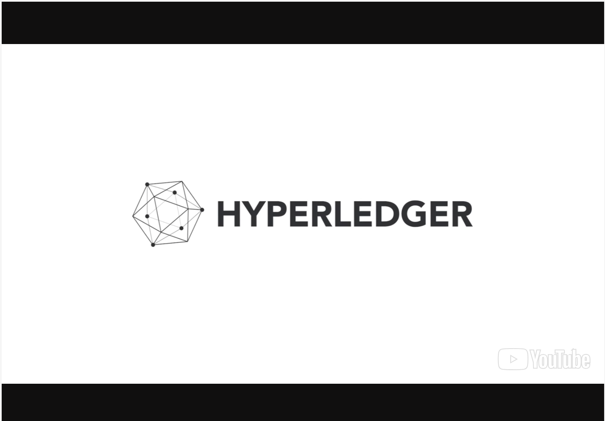
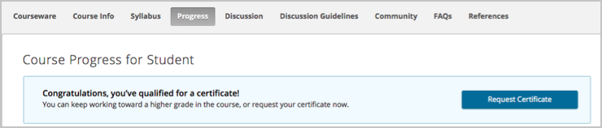
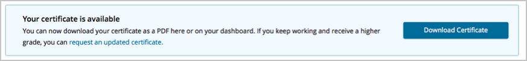
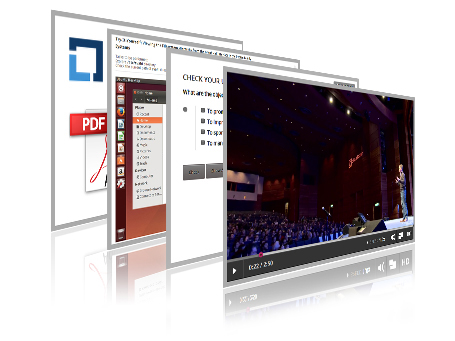

<!-- TOC depthFrom:1 depthTo:6 withLinks:1 updateOnSave:1 orderedList:0 -->

- [Welcome & Introduction](#welcome-introduction)
	- [Welcome to LFS171x](#welcome-to-lfs171x)
	- [Video: A Word from Brian Behlendorf, Executive Director at Hyperledger](#video-a-word-from-brian-behlendorf-executive-director-at-hyperledger)
	- [Course Learning Objectives](#course-learning-objectives)
	- [Before You Begin](#before-you-begin)
	- [Syllabus and Grading](#syllabus-and-grading)
	- [Course Timing](#course-timing)
	- [Course Progress & Completion](#course-progress-completion)
	- [Guidelines to Discussions](#guidelines-to-discussions)
	- [Learning Aids](#learning-aids)
	- [Video: Inspiration Behind the Course (Brian Behlendorf)](#video-inspiration-behind-the-course-brian-behlendorf)
	- [A Note from the Authors](#a-note-from-the-authors)
	- [Hyperledger](#hyperledger)
	- [The Linux Foundation](#the-linux-foundation)
	- [The Linux Foundation Events](#the-linux-foundation-events)
	- [The Linux Foundation Training](#the-linux-foundation-training)
	- [Copyright](#copyright)

<!-- /TOC -->

# Welcome & Introduction

## Welcome to LFS171x
Discover the power of business blockchains and distributed ledger technologies with an overview of Hyperledger and introductions to its key frameworks. Blockchains have quickly gained popularity in several industries. This introductory course is carefully curated for both nontechnical and technical audiences. It examines blockchains for the enterprise and a number of pertinent use cases. Hyperledger is a group of open source blockchain-based projects organized by The Linux Foundation. Industries are researching how blockchains may increase efficiency and solve business problems associated with data privacy, security, information sharing, and inclusion. What are blockchain & distributed ledger technologies and how might they impact global business?

The course covers key features of blockchain technologies and the differentiators between various types of Hyperledger blockchain frameworks. We shall start with ‘What is blockchain?’ and open the discussion on where blockchain technology is suitable for your business requirements. We then take a deep dive into the enterprise-ready Hyperledger blockchain frameworks by guiding students through a demonstrated scenario.

Students with a technical background should be able to perform clean installations of Hyperledger Sawtooth and Hyperledger Fabric, as well as, develop simple applications on top of these frameworks. They will gain an understanding of various types of blockchains and which one is most suitable for any particular project.

Students with a business background should gain an understanding of how blockchains work and how they can create value for their business through cost savings and efficiencies in terms of speed and simplicity. They will view how information is generated, stored, and shared in various blockchains, as well as, gain tools to evaluate whether or not a blockchain solution would be suitable for their particular business case.

## Video: A Word from Brian Behlendorf, Executive Director at Hyperledger

## Course Learning Objectives
By taking this course, you will be able to:

* Describe Business Blockchain and Distributed Ledger Technologies.
* Gain familiarity with current Hyperledger projects and cross-industry use cases.
* Perform clean installations of the Hyperledger Sawtooth and Hyperledger Fabric frameworks.
* Explore a sample use case/application in the context of the Hyperledger Sawtooth and Hyperledger Fabric frameworks.
* Build simple applications on top of Hyperledger Sawtooth and Hyperledger Fabric.
* Become involved in and contribute to the open source Hyperledger projects.

## Before You Begin
If you are using edX for the first time, we strongly encourage you to start by taking a free 'how to use edX' course that the team at edX has made available. [Click here](https://www.edx.org/course/edx/edx-edxdemo101-edx-demo-1038) to register and you will be on your way. You will find the edX platform simple and intuitive. You can use the *Table of Contents* under the **Course** tab to navigate between *Chapters* and *Sections*. Once you are in a chapter/section, you can use the ribbon at the top of the screen to navigate the units within that *Section* or *Chapter*. You can always go back to the *Table of Contents* by clicking on the *Course* in the ribbon.

This course is self-paced, meaning there is no structured instructor availability. However, you will find the Discussion board (see the **Discussion** tab at the top of each page) to be very helpful, as a means of asking or answering questions and interacting with your peers taking the course. The Discussion board is moderated by The Linux Foundation.

For any technical issues with the edX platform (including login problems and issues with the Verified Certificate), please use the *Support* icon located on the right side of your screen.

## Syllabus and Grading
The outline for this course can be downloaded [here](https://prod-edxapp.edx-cdn.org/assets/courseware/v1/f78e55f0cfc90346abab4ae5096007d2/asset-v1:LinuxFoundationX+LFS171x+3T2017+type@asset+block/LFS171x_-_Blockchain_for_Business_-_An_Introduction_to_Hyperledger_Technologies_Outline.pdf). Since this course is entirely self-paced, we include demos and questions to help you practice the skills as you are acquiring them. At the end of each chapter, you will have a set of graded knowledge check questions, that are meant to further check your understanding of the material presented. The grades obtained by answering these knowledge check questions will represent 20% of your final grade.

At the end of the course, you are required to pass a final exam, which consists of 30 questions. The remaining 80% of your final grade is represented by the score obtained in the final exam.

<ins>**In order to complete this course with a passing grade, you must obtain a passing score (Knowledge Check and Final Exam) of minimum 70%.**</ins>

You will have a maximum of 2 attempts to answer each knowledge check and exam question (other than true/false answers, in which case, you have only 1 attempt). The knowledge check questions and the exam questions are open book (meaning that you are free to reference your notes, screens from the course, etc.), and there is no time limit on how long you can spend on a question. You can always skip a question and come back to it later.

**Getting your Certificate of Completion**

If you are enrolled in a Verified track, Verified Certificates of completion are available once you achieve a passing score on the final exam. Once you have earned an overall grade of 70% or higher, you will be able to request your certificate directly from your Progress page. Once the request is completed (which may take up to 48 hours), you can then return to the same place and download your certificate. There are no certificates available for Audit tracks.

## Course Timing
This course is entirely self-paced; there is no fixed schedule for going through the material. You can go through the course at your own pace, and you will always be returned to exactly where you left off when you come back to start a new session. However, we still suggest you avoid long breaks in between periods of work, as learning will be faster and content retention improved.

The chapters in the course have been designed to build on one another. It is probably best to work through them in sequence; if you skip or only skim some chapters quickly, you may find there are topics being discussed you have not been exposed to yet. But this is all self-paced and you can always go back, so you can thread your own path through the material.

## Course Progress & Completion
The goal of this course is to introduce you to the concept of Hyperledger technology. In order to check your understanding of the content, you will be asked to answer the Knowledge Check questions located at the end of each chapter and participate in the Final Exam.

The Knowledge Check questions are graded, and, as such, they do count towards your final passing grade (they represent 20% of your final grade). The Final Exam represents 80% of your passing grade. Once you complete the exam, you will want to know if you have passed. You will be able to see your completion status using the *Progress* tab at the top of your screen, which will clearly indicate whether or not you have achieved a passing score. Click [here](https://prod-edxapp.edx-cdn.org/assets/courseware/v1/89830391ed822d4d3a3dfd33b4250dbc/asset-v1:LinuxFoundationX+LFS171x+3T2017+type@asset+block/LFS171x-Progress_Bar.png) to view a sample of this screen in a new tab.

Certificates of completion (Verified Certificates) are available once you achieve a passing score of 70% on your course. Once you have done so, you can request the certificate on your *Progress* page. Once the request is completed (which may take up to 48 hours), you can then return to the same place and download your certificate. The visuals below provide a guide to what this will look like.

## Guidelines to Discussions
One great way to interact with peers taking this course is via the Discussion boards. These boards can be used in the following ways:

* To discuss concepts, tools, and technologies presented in this course, or related to the topics discussed in the course material.
* To ask questions about course content.
* To share resources and ideas related to blockchain and Hyperledger technologies.

We strongly encourage you not only to ask questions, but to share with your peers opinions about the course content, as well as valuable related resources. The Discussion boards will be reviewed periodically by The Linux Foundation staff, but it is primarily a community resource, not an 'ask the instructor' service. To learn more tips about using the Discussion boards, click [here](http://blog.edx.org/getting-most-out-edx-discussion-forums).

## Learning Aids
Besides simple exposition through text and figures, this course uses several types of learning aids to enhance your learning experience.

**Videos**

There are numerous videos in which the instructors discuss concepts and tools related to Hyperledger technologies. You may want to click on the CC button to see closed captioning.

**External Resources**

You will also have many opportunities to expand your knowledge of Hyperledger by accessing the external hyperlinks we provide throughout the entire course.

**Check Your Understanding**

At the end of each chapter, you will find a series of Knowledge Check questions. These questions were designed with one main goal in mind: to help you better comprehend the course content and reinforce what you have learned. It is important to point out that the **knowledge check questions are graded and they count towards your passing grade.** We would also like to emphasize that **you will be required to take a final exam to complete this course.**

**Glossary**

We use numerous key concepts throughout the entire course. To make it easier to understand and reference them, we have compiled a list of of these concepts, along with their definitions. This list is quickly accessible from anywhere in the course, just click on the **Glossary** tab above.

**Recommended Resources & References**

On this page, we present a summary of resources and references recommended in the course. The resources and references will be quickly accessible from anywhere within the course, just click on the **Recommended Resources** tab above.

## Video: Inspiration Behind the Course (Brian Behlendorf)

## A Note from the Authors
The idea for this course blossomed from a lively conversation between Brian Behlendorf, Robert Schwentker, and Jeff Flowers at the Hackfest in San Francisco, February 2017, about creating a Hyperledger MOOC for edX.

We adopted a personalized, multi-disciplinary approach to teaching blockchain business and technical content, while bringing key people within the Hyperledger Community to the fore. There were many people who contributed to this initial release of the course. First of all, we would like to thank The Linux Foundation Hyperledger project team, especially Tracy Kuhrt, David Huseby, Flavia Cioanca, and Clyde Seepersad, for multiple reviews, detailed suggestions, and everything they did to make this course a reality.

We are grateful to Jeff Flowers, who helped curate the architecture of the course, by sharing his erudite approach to MOOC development. Jeff created a challenging level set with the technical chapters, providing mentorship, and sharing insights into the methodology for setting up and configuring Hyperledger Sawtooth.

We are equally grateful to everyone who worked behind-the-scenes, and to the experts featured in the course videos - whom you will meet in each chapter. We would like to thank Jonathan Levi for his guidance and responsiveness to our business and technical questions.

We would also like to acknowledge key contributions made by Shorouq Aljohani towards the early drafts of the technical chapter on Hyperledger Iroha. She created foundational content for the chapter, drawing from her technical expertise.

Finally, we would also like to thank the masters of the craft, Jefree Anderson and Ted Hoppe, who produced the dozens of videos featured throughout the course. Lillian Chan graciously helped with the video content, and provided fantastic support on set.

And to Brian Behlendorf himself, who believed we could make it happen.

We hope you will enjoy the course and may your learning journey be fruitful!

Sincerely,

Robert, Alexandra, Arianna, Navroop & Nathalie

## Hyperledger
Hyperledger is the umbrella open source project that The Linux Foundation has created and hosted since 2015. It aims at advancing and promoting cross-industry blockchain technologies to ensure accountability, transparency, and trust among business partners. As a result, Hyperledger makes business network and transactions more efficient.

These benefits are valued by leaders across many industries, including technology, finance, healthcare, supply chain, and automotive, among several others.

Hyperledger offers different blockchain platforms. This course will present three of them: Iroha, Sawtooth, and Fabric.

To learn more about the Hyperledger, click [here](https://www.hyperledger.org/).

## The Linux Foundation
The Linux Foundation partners with the world's leading developers and companies to solve the hardest technology problems and accelerate open technology development and commercial adoption. The Linux Foundation makes it its mission to provide experience and expertise to any initiative working to solve complex problems through open source collaboration, providing the tools to scale open source projects: security best practices, governance, operations and ecosystem development, training and certification, licensing, and promotion.

Linux is the world's largest and most pervasive open source software project in history. The Linux Foundation is home to Linux creator Linus Torvalds and lead maintainer Greg Kroah-Hartman, and provides a neutral home where Linux kernel development can be protected and accelerated for years to come. The success of Linux has catalyzed growth in the open source community, demonstrating the commercial efficacy of open source and inspiring countless new projects across all industries and levels of the technology stack.

The Linux Foundation's work today extends far beyond Linux, fostering innovation at every layer of the software stack. The Linux Foundation is the umbrella organization for many critical open source projects that power corporations today, spanning all industry sectors:

* Big data and analytics: [ODPi](https://www.odpi.org/), [R Consortium](https://www.r-consortium.org/)
* Networking: [OpenDaylight](https://www.opendaylight.org/), [OPNFV](https://www.opnfv.org/)
* Embedded: [Dronecode](https://www.dronecode.org/), [Zephyr](https://www.zephyrproject.org/)
* Web tools: [JS Foundation](https://js.foundation/), [Node.js](https://nodejs.org/en/)
* Cloud computing: [Cloud Foundry](https://www.cloudfoundry.org/), [Cloud Native Computing Foundation](https://cncf.io/), [Open Container Initiative](https://www.opencontainers.org/)
* Automotive: [Automotive Grade Linux](https://www.automotivelinux.org/)
* Security: [The Core Infrastructure Initiative](https://www.coreinfrastructure.org/)
* Blockchain: [Hyperledger](https://www.hyperledger.org/)
* And many more.

To learn more about The Linux Foundation, [click here](https://www.linuxfoundation.org/).

## The Linux Foundation Events
The Linux Foundation hosts an increasing number of events each year, including:

* Open Source Summit North America, Europe, Japan, and China
* MesosCon North America, Europe, China
* Embedded Linux Conference/ OpenIoT Summit North America, Europe
* Open Source Leadership Summit
* Automotive Linux Summit
* Apache: Big Data North America & ApacheCon
* KVM Forum
* Linux Storage Filesystem & Memory Management Summit
* Vault
* Open Networking Summit.

## The Linux Foundation Training
The Linux Foundation offers several types of training:

* Classroom
* Online
* On-Site
* Events Based.

To get more information about specific courses offered by The Linux Foundation:

* [Linux Programming & Development Training](http://training.linuxfoundation.org/linux-courses/development-training)
* [Enterprise IT & Linux System Administration Courses](http://training.linuxfoundation.org/linux-courses/system-administration-training)
* [Open Source Compliance Courses](http://training.linuxfoundation.org/linux-courses/open-source-compliance-courses)

For additional information, including technical requirements and other logistics, see [training.linuxfoundation.org](http://training.linuxfoundation.org/).

## Copyright

**Copyright 2017-2018, The Linux Foundation and Hyperledger. The course content is licensed under a [Creative Commons Attribution 4.0 International License](https://creativecommons.org/licenses/by/4.0/). The source code used in the course examples is licensed under [Apache License 2.0](https://www.apache.org/licenses/LICENSE-2.0).**
