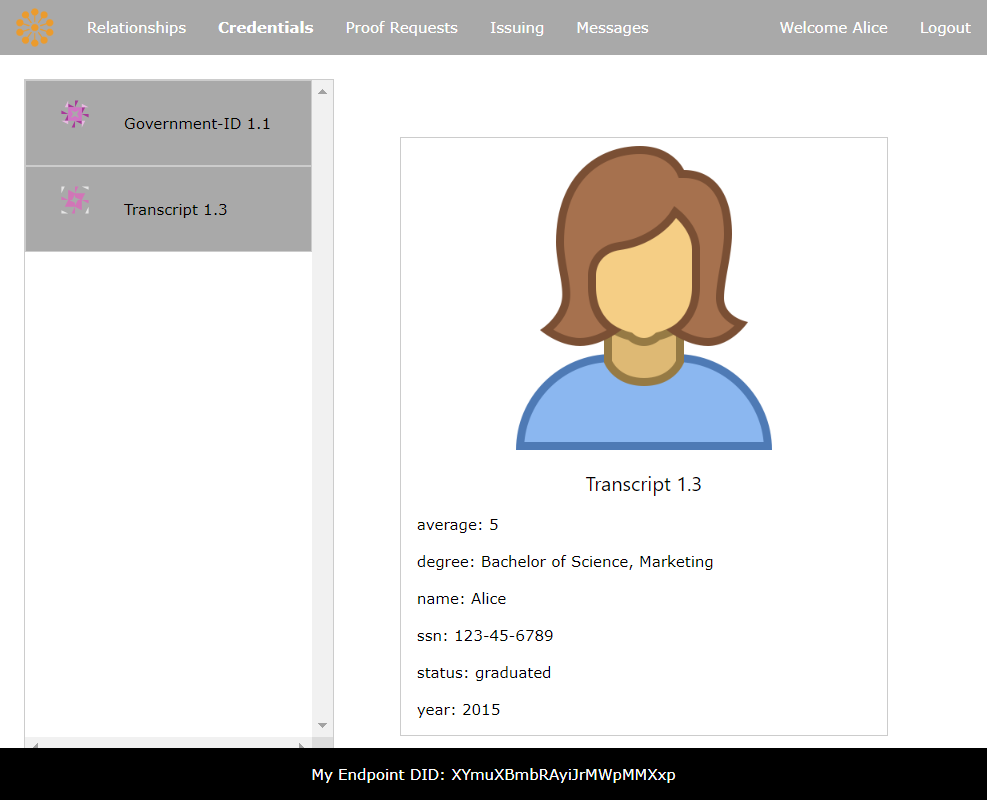

<!----- Conversion time: 5.162 seconds.

Using this Markdown file:

1. Cut and paste this output into your source file.
2. See the notes and action items below regarding this conversion run.
3. Check the rendered output (headings, lists, code blocks, tables) for proper
   formatting and use a linkchecker before you publish this page.

Conversion notes:

* GD2md-html version 1.0β11
* Sun Sep 16 2018 13:23:06 GMT-0700 (PDT)
* Source doc: https://docs.google.com/a/cloudcompass.ca/open?id=1KnM8H88REu6arFhqfBAthZttS-QaFGIAjwZwJq5KQsM

----->

# Agent Demo Guide

<!-- TOC depthFrom:1 depthTo:2 orderedList:false updateOnSave:false withLinks:true -->

- [Agent Demo Guide](#agent-demo-guide)
  - [PREFACE](#preface)
  - [INTRODUCTION](#introduction)
  - [ABOUT HYPERLEDGER INDY](#about-hyperledger-indy)
    - [Decentralized Identifiers (DIDs)](#decentralized-identifiers-dids)
    - [Verifiable Credentials](#verifiable-credentials)
    - [Agents and Wallets](#agents-and-wallets)
  - [A REAL-LIFE EXAMPLE OF INDY'S IDENTITY CAPABILITIES](#a-real-life-example-of-indys-identity-capabilities)
    - [Step 1: Looking Around](#step-1-looking-around)
    - [Step 2: Setting up Faber](#step-2-setting-up-faber)
    - [Step 3: Establishing Relationships](#step-3-establishing-relationships)
    - [Step 4: It's All About Your Credentials](#step-4-its-all-about-your-credentials)
    - [Step 5: Applying for the Job](#step-5-applying-for-the-job)

<!-- /TOC -->

## PREFACE

> **This demonstration is based on some early Indy Agent code that should *NOT* be used as the basis of new implementations or as a reference for implementing an agent. Since  this demonstration was developed the Indy (and Aries) community has evolved the notion of Agents significantly and this code base has been abandoned. It is still a good demo for understanding how agents work on a superficial level -- the concepts of agents connecting and exchanging credentials. However, if you are interested in building on the latest Indy/Aries code, you should look at the [Aries project](https://github.com/hyperledger/aries), the [Aries Cloud Agent - Python](https://github.com/hyperledger/aries-cloudagent-python) and other interoperable components. If you are a developer (or wannabe), check out this [Becoming an Indy/Aries Developer](https://github.com/hyperledger/aries-cloudagent-python/tree/master/docs/GettingStartedAriesDev) guide.**

## INTRODUCTION

The code in this folder implements some Hyperledger Indy "Getting Started" components - Agents - that users can run, use and alter to learn about the capabilities of Indy. This document provides a brief background into Hyperledger Indy and instructions on using the Agents to walk through a prototypical Indy use case.

For those that are here as part of the Hyperledger Indy Chapter of the [EdX "Blockchain for Business"](https://www.edx.org/course/blockchain-business-introduction-linuxfoundationx-lfs171x-0) course, feel free to skip the next section and jump straight to the section of this document on [using the demo software](#a-real-life-example-of-indys-identity-capabilities). For others, the next section is a brief overview of Hyperledger Indy, DIDs, Verifiable Credentials, Agents and Wallets. They all are demonstrated in this example code.

[Click here](https://youtu.be/9WZxlrGMA3s) to view a screencast of the demo.

## ABOUT HYPERLEDGER INDY

Hyperledger Indy (Indy) is a blockchain-based application that you can use to prove to others who you are while at the same time being certain about who it is you are talking to. Indy adds an Identity layer to the Internet using a mechanism that is easy to use, enables trust, and enhances privacy. It is a decentralized system that gives _you_ control over your information, not the government, a bank, or a corporation, for example. 

### Decentralized Identifiers (DIDs)

Indy uses DIDs to establish connections between two identities, such as a user and a service's website, so that they can securely communicate. DIDs are globally unique identifiers that are created by their owner, independent of any central authority. See the image below from the demo.

||
|:--:|
|*Licensed under [CC By 4.0](https://creativecommons.org/licenses/by/4.0/)*|

The expectation is that you will have many DIDs - one for each relationship you have on the Internet. Think of each DID as a userID/password pair, but one that is backed with strong cryptography in the form of public/private key pairs. As well, note that both sides of a relationship provide a DID for the other to use to communicate with them. See the figures below.

||
|:--:|
|*Licensed under [CC By 4.0](https://creativecommons.org/licenses/by/4.0/)*|

||
|:--:|
|*Licensed under [CC By 4.0](https://creativecommons.org/licenses/by/4.0/)*|

### Verifiable Credentials

Indy supports an emerging W3C standard called _Verifiable Credentials_[ (VCs)](https://www.w3.org/2017/vc/WG/) that enables a trusted way to provide identity attributes about ourselves (such as our name, age, bank account number, degree held, place of birth, etc.). 

Credentials are things such as driver's licenses, passports, or university degrees that are given to us from an issuing authority (Issuer) and that we can show when needed. VCs are digital equivalents of these paper credentials that are cryptographically processed such that when we show ("prove") the claims (data elements from the credentials), the receiver ("verifier") can be certain:

*   Who issued the claims
*   That the claims were issued to the Identity presenting them
*   That the claims have not been tampered with (forged), and
*   That the claims' credential has not been revoked by the Issuer

Users can create Decentralized Identifiers (DIDs), use those DIDs to communicate securely with others, and use Verifiable Credentials and Claims to prove things about themselves such that they can execute trusted digital transactions.

### Agents and Wallets

Indy uses the term _Agent_ to mean the software that interacts with other identities (via DIDs), and the term _Wallet_ as a data store for the DIDs and related information (including private keys). For example, a person might have a mobile Agent app on their smart device, while an organization might have an enterprise Agent running on a Cloud Server. All Agents have a secure wallet for storing identity data.

>  **NOTE:** _VCs themselves are **not** stored on the blockchain - they go in the wallet of the VC holder. However, information necessary to use the VCs, such as the schema, the DID of the Issuer and information for proving non-revocation, are all stored on the Indy blockchain._

## A REAL-LIFE EXAMPLE OF INDY'S IDENTITY CAPABILITIES

To demonstrate how Indy works, we have created a short demo involving the following agents:

*   **Alice**, who went to Faber College and wants to apply for a job at Acme
*   **Faber College**, which granted Alice's degree
*   **Acme**, who needs an official copy of Alice's transcript 

Start the demo as per the start instructions in [README.md](README.md). Notice that you should have three browser tabs open - Alice, Faber and ACME. These are the Agents, each running in a Docker container and accessed on separate localhost ports: Alice (localhost:3000), Faber College (localhost:3002) and Acme Corporation (localhost:3003). Although you are accessing them all on the same machine, imagine that they are all running independently, in different places.

> If you are running this demo using the "In Browser" instructions, the URL for the different Agents will be similar to this: `http://ip172-18-0-14-bf52ab6ac3u00082oj2g-3001.direct.labs.play-with-docker.com/#credentials`, where the "3001" before the word ".direct" is the exposed port number that you clicked on.

||
|:--:|
|*Licensed under [CC By 4.0](https://creativecommons.org/licenses/by/4.0/)*|

### Step 1: Looking Around

Apart from the colours and name in the top right, each Agent looks the same. There is a menu across the top, as shown in the screenshot below.  If you click across each menu item you will see:

*   Each has no relationships or messages
*   Each has one credential - from the Government - that has the official "Name" of the Identity (Alice, Faber, etc.)
*   Each has some things under Proof Requests and Issuing. We'll get into those later.

||
|:--:|
|*Licensed under [CC By 4.0](https://creativecommons.org/licenses/by/4.0/)*|

You will also see that at the bottom of the screen each user has a DID. Each generated their DID and published it to the instance of Hyperledger Indy ledger we started. Knowing a DID, another Agent can look up on that ledger and get back the public key and endpoint associated with that DID.  We'll use those DIDs later to connect the Agents so that they can exchange messages.

> **NOTE:** From time to time in running the demo you must refresh the Browser (Crl-R or Cmd-R) to update the screen data. This is needed when an action by one Identity (e.g. Alice) affects the data of another (e.g. Faber).

### Step 2: Setting up Faber

Before we get started, Faber has to do some one time setup that we'll do first.  Go to the Faber browser tab (localhost:3002) and click **Issuing**. We're going to do two things here:

*   First, we'll post to the Hyperledger Indy Ledger a transcript _Schema_. This is a public definition of what fields (claims) are in Transcript Credentials that Faber will issue to its graduates. Since it is public, the Schema could be published by anyone (such as the "Association of Colleges and Universities") and can be used by anyone (such as other institutions like "Port Chester University").
*   Second, we'll post to the Hyperledger Indy Ledger a "Credential Definition," an Indy component that links a particular Credential Issuer (Faber in this case), with a Schema (the Transcript Schema), an optional Revocation Registry (we're not going to use that) and a series of Keys used for encryption and signing of the Claims in the Credentials.

Together, that public data is what allows Faber to issue a Transcript Credential to Alice that she can later prove to Acme.

Back to our story.  Faber has just set up a Hyperledger Indy Agent that can issue credentials. John Academic, Faber's most awesome transcript keeper, needs to get things working. He will have to write a Schema and Credential Definition to the Indy Ledger to do this. It is a bit complicated but nothing John Academic can't handle!

1.  If you haven't already done so, go to the Faber agent tab and click **Issuing**.

  ||
  |:--:|
  |*Licensed under [CC By 4.0](https://creativecommons.org/licenses/by/4.0/)*|
2.  Give the schema a name, a version and a list of attributes. For example, _Transcript 1.3 with name, degree, status, year, average and social security number._
3.  Click **Submit**.

  This writes the Schema to the Ledger so Faber (and others) can use it. 

4.  In the Credential Definition window, select a **Schema** (Transcript 1.3), tag it and click **Submit** and wait for the action to complete (which takes a bit…).

||
|:--:|
|*Licensed under [CC By 4.0](https://creativecommons.org/licenses/by/4.0/)*|

John tags the credential as MyTranscript - for this demo, just leave it as that.

The process of creating a credential definition takes a bit of time as Indy is generating crypto keys so that the credential definition is secure and can only be used by Faber.

OK - we've done the setup work. On with the story.

### Step 3: Establishing Relationships

In order for Alice to get her transcripts from her alma mater, Faber College, Alice needs to establish a digital relationship with Faber. Alice does this by sending a connection request using the Endpoint DID for Faber. In this demo, each agent's unique DID is shown at the bottom of the agent's window.

> **Note: _The user interface for doing this in real agents will be MUCH better. For example, Alice might have been logged into Faber's website, been offered her transcripts and clicked a link to trigger establishing a connection. Or, she might have seen a QR code published by Faber and used the camera on her phone to start the connection. Maybe you will think of a better way for this to occur._**

To create a new relationship:

1.  In the Alice Agent tab, click **Send Connection Request**. 

  ||
  |:--:|
  |*Licensed under [CC By 4.0](https://creativecommons.org/licenses/by/4.0/)*|

2.  In the Faber Agent tab, highlight and copy Faber's Endpoint DID (bottom of the screen), and then go back to the Alice Agent tab and paste it into the "Send Connection Request" popup (above) and click **Send Connection Request**.

  ||
  |:--:|
  |*Licensed under [CC By 4.0](https://creativecommons.org/licenses/by/4.0/)*|

  This creates a relationship between Alice and Faber - whoohoo!  If you click the "Relationships" menu item on the two Agents you will see the relationship - if not, refresh the tab (Ctrl-R) and it will be there. You will also see that the DID is still visible.  That's not very friendly.  In the real agent world, we don't ever want to see DIDs! We could have the user type in a name for each relationship, but wouldn't it be easier if the other party just told us their name?

  But wait. There's a problem with that. What if they lied to us?  Told us they were Alice, when really they were her malicious enemy, Mallory? What we want is a trusted way to get the name of the other party. This is where Verifiable Credentials come in.

  As soon as the connection is established, both Alice and Faber automatically send each other a Proof Request that asks for the name of the other party using the "Government ID" credential both are already holding. Since that Credential is owned by its Holder, the Agent software prompts the user to confirm they want to share the requested information.

  Alice checks her messages (click refresh) and sees that she has a Proof Request from Faber requesting her name. 

  ||
  |:--:|
  |*Licensed under [CC By 4.0](https://creativecommons.org/licenses/by/4.0/)*|

3.  Click the **Messages** tab then click **Accept**.

Meanwhile, at Faber College, they too have received a message for a "Name" Proof Request (click refresh), this one from Alice, which they too accept, and resulting in Alice getting the College's official name "Faber" - per the Government ID. You'll need to refresh the browser tabs to see the latest data.

### Step 4: It's All About Your Credentials

Alice will need her transcript to apply for the job at Acme. Since Alice and Faber now have a relationship, she can go ahead and ask for her transcripts. We don't show how that happens in this demo, but let's pretend she has done that.

> **Note: _In the Indy "Credential Issuance" protocol, there are messages for Offer (Issuer to Holder), Request (Holder to Issuer) and Issue (Issuer to Holder). The latter two must be done to enable the creation of a Verifiable Credential. While Alice could have triggered the process (and it would have made more sense!), it was easier to build this demo by having Faber start the process with the Offer step._**

Faber, knowing Alice wants her transcript, starts the process. It's time for John Academic to get back to work. Go to the Faber browser tab and click on the **Issuing** menu item.

1.  In the Send Credential Offer window, select a **Relationship** (Alice) then a **Credential Definition** (MyTranscript) and click **Submit**.

  ||
  |:--:|
  |*Licensed under [CC By 4.0](https://creativecommons.org/licenses/by/4.0/)*|

  Going back to the Alice browser tab (refresh the browser tab), Alice sees that in her **Messages**, she has a new Credential Offer: her transcript from Faber (straight A's btw), which she accepts. 

  ||
  |:--:|
  |*Licensed under [CC By 4.0](https://creativecommons.org/licenses/by/4.0/)*|

2.  Click **Credentials**.

||
|:--:|
|*Licensed under [CC By 4.0](https://creativecommons.org/licenses/by/4.0/)*|

Alice now has two credentials: her government ID and her transcript. If you click on the Transcript credential you'll see just how awesome her GPA is!

||
|:--:|
|*Licensed under [CC By 4.0](https://creativecommons.org/licenses/by/4.0/)*|

### Step 5: Applying for the Job

Alice has gotten her transcript from Faber. Now all she has to do is land the job! She has interviewed successfully (or so she thinks) and it all comes down to her transcript. No pressure. Just as she did with Faber, Alice must first establish a relationship with Acme.

1.  Click **Send Connection Request**. 

  ||
  |:--:|
  |*Licensed under [CC By 4.0](https://creativecommons.org/licenses/by/4.0/)*|

2.  Copy and paste Acme's Endpoint DID and click **Send Connection Request**.

  ||
  |:--:|
  |*Licensed under [CC By 4.0](https://creativecommons.org/licenses/by/4.0/)*|

  Connection established! As with the Alice-Faber connection, immediately after the connection is established, they both send a Proof Request to the other to get information from the government credential they each hold.

  Alice checks her messages (refresh browser tab) and sees that she has a Proof Request from Acme for the "Name" attribute. 

  ||
  |:--:|
  |*Licensed under [CC By 4.0](https://creativecommons.org/licenses/by/4.0/)*|

3.  Click **Messages** and then **Accept**.

Acme does the same - checks messages, sees the Proof Request and clicks Accept.  Relationship established!

Acme then sends a Proof Request to get Alice's transcript. Here we have to use a bit of a hack for this demo to get the scenario to work.  This is NOT how this is going to work in a real app, but this is enough to get the idea across.

So far in this demo, the Proof Requests have "just happened."  That is, when a connection is made, both parties send a Proof Request to each other. In this case, we're going to walk through the steps of Acme requesting the proof.  What's the problem with the demo?  Unfortunately, in this demo, Acme doesn't know the information to construct the Proof Request for the transcripts, so they have to get that information from Faber. Worse, we're going to use copy and paste to get that information.  That's ugly! Rest assured, there are other ways for this to work in a real app, but for now, we'll just use this approach.

Start this step in the Faber browser tab.  Click on **Proof Requests**. In the **Select a Proof Request** dropdown, select "Transcript-Data." The text (a JSON structure) in the box to the right will update to begin with "name": "Transcript-Data". Highlight all of the data in that text box and copy the text (right-click and choose "copy").  Next, go over to Acme to request the Transcripts Proof.

From the Acme browser tab:

1.  Click **Proof Requests**

  ||
  |:--:|
  |*Licensed under [CC By 4.0](https://creativecommons.org/licenses/by/4.0/)*|

2.  Select the **Relationship**, in this case, **Alice**.
1.  Select the **Proof Request**, Other (Paste Proof Here).
1.  Paste the text copied from the Faber tab into the box to the right.  Wow...that's a hack!!
1.  Click **Submit**.

Jump back to the Alice browser tab and click **Messages**. Alice receives and gives consent to provide the transcript attributes ("claims") for  the Proof.

||
|:--:|
|*Licensed under [CC By 4.0](https://creativecommons.org/licenses/by/4.0/)*|

Once Alice accepts the Proof Request for her transcript, then Acme, under Relationships can click on the Alice connection, and see the new proof for Transcript-Data.

 ||
|:--:|
|*Licensed under [CC By 4.0](https://creativecommons.org/licenses/by/4.0/)*|

Acme validates the Proof of Transcript-Data to show:

*   The claims came from Faber College
*   The claims were provided by Alice
*   The claims were not tampered with

Acme knows now that Alice graduated with a Bachelor's Degree in 2015 and she gets the job!

<!-- GD2md-html version 1.0β11 -->
